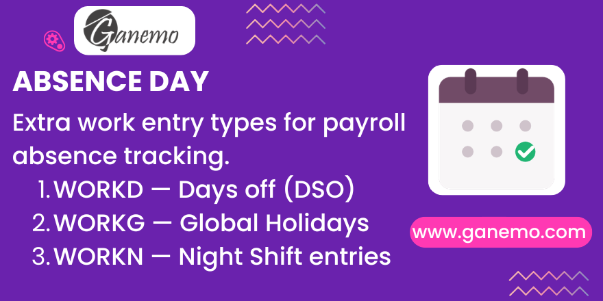

# **Absence Day**

## Overview

**Absence Day** is a lightweight foundational module that adds essential data records and fields for absence tracking and payroll integration in Odoo.

It provides:
- **3 Work Entry Types** — Days off (DSO), Global Leave, and Night shift.
- **Leave Type Code field** — A `code` field on `hr.leave.type` for programmatic identification.
- **PPD Leave Type** — A default "Pendiente por determinar" (Pending Determination) leave type.
- **Own Rule flag** — An `is_calc_own_rule` Boolean on `hr.work.entry.type` for payroll rule routing.
- **Global Time Off tab** — Extended Work Schedule form for managing public holidays.

## Work Entry Types

| Code | Name | Purpose |
|------|------|---------|
| `WORKD` | Days off | Weekly rest days (DSO). Used by *absence_manager* to skip monitoring. |
| `WORKG` | Global Leave | Public holidays. Pre-configured with `round_days=FULL`, `round_days_type=UP`. |
| `WORKN` | Night shift | Night shift entries for payroll differentiation. |

## Fields Added

| Model | Field | Type | Purpose |
|-------|-------|------|---------|
| `hr.leave.type` | `code` | Char | Short internal code (e.g., `PPD`, `20`) for payroll filters. |
| `hr.work.entry.type` | `is_calc_own_rule` | Boolean | Flags entries computed by their own payroll rule. |

## Default Data

| Record | Model | Code | Purpose |
|--------|-------|------|---------|
| PPD | `hr.leave.type` | `PPD` | Placeholder for unclassified absences. No allocation required, dual approval. |

## Dependencies

| Module | Purpose |
|--------|---------|
| `hr_work_entry` | Provides the `hr.work.entry.type` model |
| `hr_holidays` | Provides the `hr.leave.type` model |

## Installation

1. Place the `absence_day` folder in your Odoo addons path.
2. Go to **Apps**, search for **"Absence Day"**, and click **Install**.
3. Work entry types, the Code field, the Own Rule flag, and the PPD record are created automatically.

## Usage

1. **Weekly Rest Days** — Go to **Employees → Work Schedules**. Set non-working days to **"Days off" (WORKD)**.
2. **Public Holidays** — Open the **"Global Time Off"** tab in a Work Schedule and assign **"Global Leave" (WORKG)**.
3. **Leave Type Codes** — Go to **Leaves → Configuration → Leave Types** and set a code for each type.
4. **Own Rule Flag** — Go to **Payroll → Configuration → Work Entry Types** and toggle the flag as needed.

## Downstream Modules

This module is a dependency for:
- **absence_manager** — Absence monitoring CRON and PPD auto-assignment.
- **filter_payroll** — CTS/Gratification filters using `code` and `is_calc_own_rule`.
- **automatic_leave_type** — Peruvian leave type catalog using `is_calc_own_rule`.

## Compatibility

| Platform | Supported |
|----------|-----------|
| Odoo Enterprise (Odoo.SH) | ✅ |
| Ganemo Online / Ganemo.SH | ✅ |
| On-premise Enterprise | ✅ |
| Odoo Online (SaaS) | ❌ |

## FAQ

**Q: Can I uninstall this without losing data?**
The work entry types and PPD record will be removed. Uninstall dependent modules (*absence_manager*, *filter_payroll*, *automatic_leave_type*) first.

**Q: Why is this a separate module?**
It centralizes shared fields and data that multiple payroll/absence modules need, allowing modular composition without heavy dependencies.

---

**Author**: [Ganemo](https://www.ganemo.co)
