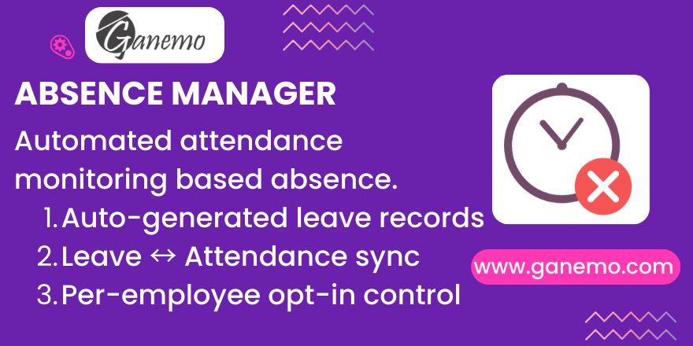

# **Absence Manager**

## Overview

**Absence Manager** automates the detection of employee absences and generates leave records when employees fail to check in for their scheduled work shifts. A daily CRON job monitors attendance, respects work schedules, weekly rest days (DSO/WORKD), and public holidays, ensuring that only genuine unexcused absences are flagged.

## Features

### 🕐 Daily Absence Detection (CRON)
A scheduled action runs every day at **04:00 AM UTC**. For each employee marked as "Required to mark attendance", it checks whether an attendance record exists for that day. If not, a leave request of type **"Pending determination" (PPD)** is automatically created.

### 📅 Smart Schedule Validation
The CRON respects your **Resource Calendar**:
- **Weekly rest days** with work entry type "Days off" (`WORKD`) are automatically skipped.
- **Public Holidays** (Global Time Off entries on the calendar) are also skipped.
- **2-week calendars** are supported — the system detects odd/even weeks.

### 🔗 Leave ↔ Attendance Synchronization
- **On Approval**: If the leave has "Report in attendance?" enabled, `hr.attendance` records are automatically created for each day of the approved leave period.
- **On Refusal**: All linked attendance records are automatically deleted.
- **On Leave Type Change**: Updating the leave type propagates to all linked attendance records.

### 👤 Per-Employee Opt-In
A boolean field **"Required to mark attendance?"** on the employee form controls who is monitored. By default, new employees are **not monitored** — HR must explicitly enable the flag.

## Dependencies

| Module | Purpose |
|--------|---------|
| `hr_attendance` | Core attendance tracking |
| `hr_holidays` | Leave types and leave management |
| `absence_day` | Provides the "Days off" (`WORKD`) work entry type for DSO detection |

## Installation

1. Place the `absence_manager` folder in your Odoo addons path.
2. Ensure the dependencies above are installed.
3. Go to **Apps**, search for "Absence Manager", and click **Install**.

## Configuration

### Step 1: Enable Employee Monitoring
1. Go to **Employees > Employee Form**.
2. In the **Private Information** tab, enable **"Required to mark attendance?"**.
3. Only employees with this flag will be monitored by the CRON.

### Step 2: Configure Work Schedule
1. Go to **Employees > Work Schedules** (Resource Calendar).
2. Ensure each day has proper working hours defined.
3. For weekly rest days (e.g., Sunday), set the **Work Entry Type** to **"Days off" (WORKD)**.

### Step 3: Configure Public Holidays
1. On the **Resource Calendar** form, go to the **Public Holidays** section.
2. Add any national or company-specific holidays as **Global Time Off** entries.
3. The CRON will skip these days automatically.

### Step 4: Verify the CRON
1. Go to **Settings > Technical > Scheduled Actions**.
2. Find **"Absence Monitor"**.
3. Ensure it is **Active** and the next execution date is correct.

## Usage

### Automatic Flow (Daily)
1. The CRON runs at 04:00 AM UTC.
2. It scans all employees with `attendance = True`.
3. For each employee with no attendance record for the day:
   - Checks the work schedule (skips rest days and holidays).
   - Creates a leave request of type "PPD" in state **To Approve**.
4. HR reviews the auto-generated absences and classifies them.

### Manual Flow (Approval/Refusal)
1. Go to **Time Off > Manager > All Time Off**.
2. Review leaves of type "Pending determination".
3. **Approve**: If "Report in attendance?" is checked, attendance records are auto-created.
4. **Refuse**: Linked attendance records are automatically deleted.

### Attendance Views
- The **Attendance list view** shows a **"Leave Type"** column.
- The **Attendance form view** displays a readonly **"Leave Type"** field.
- Changes to the leave type on the leave form propagate automatically to linked attendances.

## Technical Notes

### Models Extended

| Model | Changes |
|-------|---------|
| `hr.employee` | Added `attendance` boolean field |
| `hr.attendance` | Added `leave_id` (Many2one → hr.leave) and `holiday_status_id` (Many2one → hr.leave.type) |
| `hr.leave` | Added `hr_attendance_ids`, `report_attendance` fields. Overrides `action_approve`, `action_refuse`, `write`. Added CRON method `_action_absence_monitor`. |

### Data Records Created

| XML ID | Model | Purpose |
|--------|-------|---------|
| `absence_day.hr_leave_type_ppd` | `hr.leave.type` | "Pending determination" (PPD) leave type *(provided by `absence_day`)* |
| `absence_manager.ir_cron_absence_monitor` | `ir.cron` | Daily scheduled action |

## Compatibility

| Platform | Supported |
|----------|-----------|
| Odoo Enterprise (Odoo.SH) | ✅ |
| Ganemo Online / Ganemo.SH | ✅ |
| On-premise Enterprise | ✅ |
| Odoo Online (SaaS) | ❌ (Custom code not supported) |

## FAQ

**Q: Why wasn't an absence created for an employee?**
Check that: (1) the employee has "Required to mark attendance?" enabled, (2) the day is not a rest day (WORKD) or public holiday, (3) the CRON has run for that day.

**Q: Why aren't attendance records created when I approve a leave?**
Ensure the **"Report in attendance?"** checkbox is enabled on the leave form before approving. Auto-generated CRON absences have this field set to False by default.

**Q: Does this work with 2-week work schedules?**
Yes. The system automatically detects whether the current week is odd or even and checks the correct week's schedule.

**Q: Will updating the module reset the attendance flag on existing employees?**
No. The `default` value on the field only applies to new records created after the update. Existing employee records are not affected.

---

**Author**: [Ganemo](https://www.ganemo.com)
