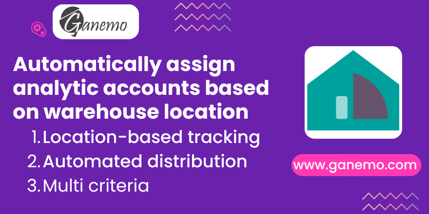

# Account Analytic Default Location

**Odoo Version**: 19.0

## Summary
It allows establishing analytical accounts by default by a warehouse.

## Overview
This module extends the Odoo Analytic Distribution Models to support warehouse-specific criteria. It adds three new key criteria to the distribution rules:
- Origin Warehouse
- Origin Location
- Destination Location

This ensures precise analytic tracking for inventory movements in multi-warehouse environments, automatically assigning the correct analytic account based on the physical flow of goods.

## Features
- **Odoo 19 Merging Logic**: Standardized alignment with Odoo 19 merging behavior. Rules for different plan roots (e.g., project vs department) will combine analytic distributions on the same line.
- **Multi-Prefix Rules**: Supports comma-separated account prefixes (e.g., `40, 60, 64`) to apply rules to multiple account branches simultaneously.
- **Warehouse & Location-based Rules**: Define analytic distribution based on origin/destination physical stock flow.
- **Invoice Dimensions**: New matching criteria for **Salesperson (Invoice)** and **Journal (Invoice)**.
- **Supreme Priority**: Safeguard that ensures manual entries or distributions from SO/PO are respected and never overwritten by default rules.

## Installation
1. Install the module normally from the Odoo Apps menu.
2. Dependencies: `stock_account`, `sale_stock`, `purchase_stock`.

## Usage
1. Go to **Accounting > Configuration > Analytic Accounting > Analytic Distribution Models**.
2. Create a rule and select your criteria: Almacén, Ubicaciones, Vendedor o Diario.
3. Use comma-separated prefixes (e.g., `60, 64`) for multi-account branch rules.
4. Rules will automatically apply to Invoices, Sale Orders, and Purchase Orders.

## Technical Details
### Matching Engine Overrides
The module overrides `_get_distribution` to:
- Collect and merge results from multiple rules according to the Odoo 19 plan-merging policy.
- Perform manual prefix cross-validation for multi-value account prefix fields.

### Override Protection
Implements "Self-Healing" logic:
- If a user manually sets a distribution, it is preserved.
- If the distribution field is cleared by the user, the system re-calculates the best default.

## Credits
**Author**: [Ganemo](https://www.ganemo.co)

## License
OPL-1

