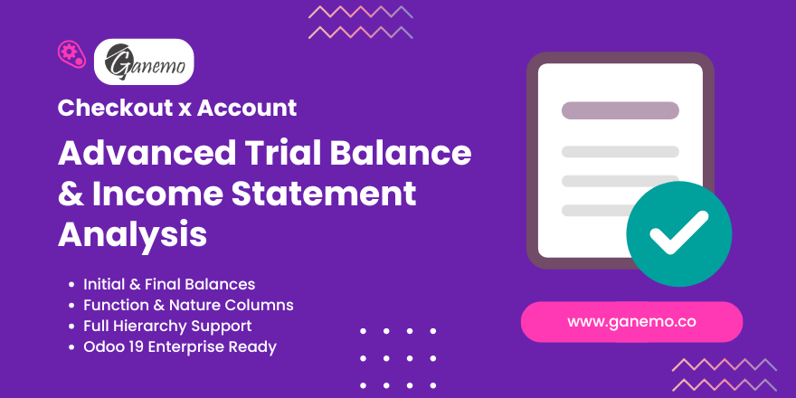

# **Checkout Balance Report**

## Overview

The **Checkout Balance Report** (Checkout x Account) is an advanced financial reporting tool for Odoo 19. It extends the standard Trial Balance to provide a comprehensive view of your accounting data, including:

*   **Initial Balance**: Opening balance for the selected period.
*   **Period Movements**: Debit and Credit movements during the period.
*   **Final Balance**: Closing balance.
*   **Income Statement Analysis**: Separate columns for results by **Function** and by **Nature**, based on Account Group configuration.

This report is essential for detailed financial auditing and meeting specific localization requirements (like in Peru, Mexico, etc.) where dual income statement analysis is needed.

## Key Features

*   **Unified View**: See Initial, Period, and Final balances in a single row per account.
*   **Dual Classification**: Automatically splits income/expense amounts into "By Function" and "By Nature" columns based on `account.group` settings.
*   **Hierarchy Support**: Full support for Odoo's account hierarchy (Groups -> Accounts). Groups are collapsible/expandable.
*   **Multi-Currency**: Fully compatible with Odoo's multi-currency features.
*   **Export Ready**: One-click export to Excel or PDF.

## Configuration

To ensure the "By Function" and "By Nature" columns populate correctly, you must configure your **Account Groups**:

1.  Navigate to **Accounting > Configuration > Account Groups**.
2.  Open an existing group or create a new one.
3.  Locate the **Group Type** field (added by this module).
4.  Select the appropriate type:
    *   **Balance**: For Balance Sheet accounts (Assets, Liabilities, Equity).
    *   **Function**: For accounts that belong to the Income Statement by Function.
    *   **Nature**: For accounts that belong to the Income Statement by Nature.
    *   **Both**: If the group applies to both (rare, but possible).
5.  Save the group. accounts belonging to this group will now report their balances in the corresponding columns.

## Usage

1.  Go to **Accounting**.
2.  Navigate to **Reporting > Audit > Checkout x Account** (or "Checkout Balance").
3.  Use the standard report filters:
    *   **Date Range**: Select the period you want to analyze.
    *   **Comparison**: Compare with previous periods if needed.
    *   **Hierarchy**: Click the "Hierarchy" button to group accounts. Use the arrow icons to expand/collapse groups.
4.  Review the columns:
    *   **Initial Balance**: Balance before the start date.
    *   **Debit/Credit**: Movements within the date range.
    *   **End Balance**: Cumulative balance at the end date.
    *   **General Balance**: Balance sheet accounts.
    *   **EERR by Function / Nature**: Results breakdown.

## Technical Requirements

*   **Odoo Version**: 19.0 Enterprise
*   **Dependencies**: `account`, `account_reports`, `account_accountant`.
*   **Permissions**: Users must belong to the "Accountant" group to view this report menu.

## Credits

**Author**: [Ganemo](https://www.ganemo.com)
