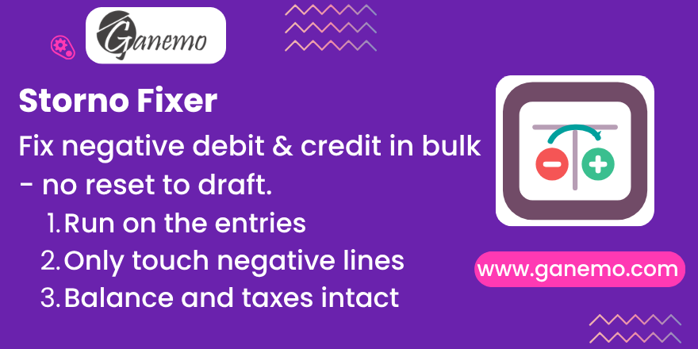

# **Fix Storno Negatives**

Bulk-fix journal entries left with **negative debit or credit** by Storno
(reversal) accounting in Odoo — re-expressing them to the standard positive
form on the entries you select, **without resetting posted entries to draft**.

**Author**: [Ganemo](https://www.ganemo.com)

---

## The problem

When **Storno accounting** is enabled (company setting *"Storno Accounting"* /
`account_storno`), reversals and credit notes post the amount as a **negative**
value in the natural debit/credit column, instead of a positive value on the
opposite side.

Several localizations — notably **Peru (SUNAT)** — do not allow negative debit
or credit. The result is legal ledgers (PLE, journal book, sales/purchase
registers) that show negative amounts and are rejected.

Disabling the setting **does not** fix the entries already posted: the move
flag `is_storno` is *sticky* (it never turns itself off), so the historical
entries keep their negative representation.

## What this module does

It adds an **Action** on Journal Entries that opens a **confirmation wizard**
and, on confirm, re-expresses only the affected lines:

- A journal item with `credit = -100` (so `balance = +100`) becomes
  `debit = 100`, `credit = 0`.
- A journal item with `debit = -100` (so `balance = -100`) becomes
  `credit = 100`, `debit = 0`.

The correct column is derived from the stored **balance** (positive debit when
`balance > 0`, positive credit when `balance < 0`), exactly like Odoo's native
computation when Storno is off. The `is_storno` flag is then cleared on the
fixed entries so a future recompute cannot re-paint the negatives.

### Why it is safe (and needs no reset to draft)

The fix is **purely representational**. `debit`/`credit` are computed from
`balance`, and `balance` already holds the correct signed value — only the
column split was wrong. Therefore:

- **Balance**, **amount in currency**, **taxes** and **reconciliations** are
  unchanged.
- The **electronic document** (e.g. the SUNAT XML/CDR) is built from the
  invoice totals, not from the internal debit/credit split — it is untouched.
- Posted entries are corrected **in place**; they are never reopened, so there
  is no need to reset credit notes or invoices to draft.

The write is performed at database level on purpose, to bypass the posted-entry
amount-edit lock; because it does not go through the ORM, no recompute is
triggered that would revert the fix.

## Installation

1. Turn **off** *Storno Accounting* in the company settings so no new negatives
   are created.
2. Install this module. No configuration is required.

> This is intended as a **temporary utility**: install it, run it over the
> affected entries, and uninstall it. Uninstalling removes the Action and the
> wizard, leaving no trace.

## Usage

1. Go to **Accounting → Accounting → Journal Entries**.
2. Filter the entries left by Storno (those with negative debit or credit) and
   **select** them. Bulk selection of thousands of records is supported; you
   can also work in batches to review results incrementally.
3. Open **Action → Fix Storno (negative debit/credit)**.
4. The **wizard** reports:
   - **Lines to Fix** — journal item lines with negative debit or credit that
     will be corrected.
   - **Entries to Fix** — journal entries that contain at least one such line.
   - **Ignored (no negatives)** — selected entries with no negatives; they are
     **neither counted nor modified**.
5. Click **Fix**. If none of the selected entries has negatives, the wizard
   simply reports that there is nothing to do.

### Only negative lines are touched

The wizard filters **line by line**, not by entry. An entry selected by mistake
that has no negative debit or credit contributes no lines: it is not counted in
the totals, it is not corrected, and its `is_storno` flag is left as-is.

## Recommendations

- Always take a **backup** and test on a **staging copy** with real data first.
- Run the action in **batches** to validate the result of each set against your
  legal ledger / PLE before processing the whole population.

## Compatibility

- Odoo **18** (Community / Enterprise, Odoo.SH, Ganemo Online).
- Multi-language: **English** and **Spanish** included.

## Support

- Commercial: [leads@ganemo.com](mailto:leads@ganemo.com)
- Technical: [ayuda@ganemo.com](mailto:ayuda@ganemo.com)

---

© 2026 [Ganemo](https://www.ganemo.com). All rights reserved.
