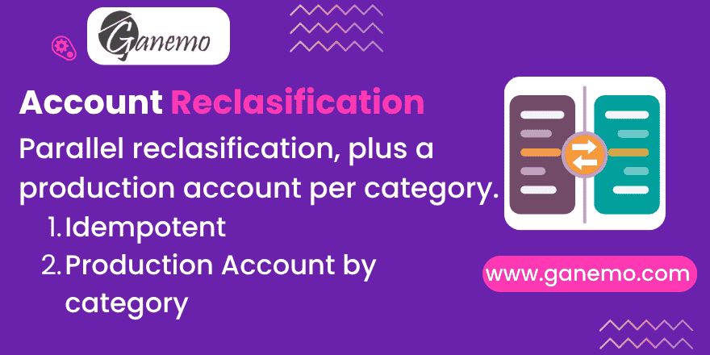

# **Account Reclassification**



Show the same operation under two account structures: post a **parallel reclassification entry** on vendor bills, and let each **product category** decide the counterpart account of the native production entry — **without touching the native inventory valuation, the stock ledger or the average cost**.

It depends on **no localization module** and works on any chart of accounts. It is inert until you configure it.

---

## What accountants ask for, and what Odoo does

Odoo posts a vendor bill against the destination account of each line (inventory, expense…). Many charts of accounts additionally require the purchase to be shown **by nature**, against a stock variation account:

```
Debit   60 Compras                      (what was bought, by nature)
Credit  61 Variación de existencias     (the movement of the stock)
```

Odoo has no native place for that second view. This module writes it as a **separate journal entry** — the *reclassification entry* — so both presentations coexist and nothing in the native flow has to change.

The example above uses the Peruvian PCGE (60 Compras / 61 Variación de existencias), but the two accounts are free: grupo 6 in Spain, classe 6 in France, or any pair your plan requires.

The same idea applies to manufacturing: Odoo takes the counterpart account of a consumption from the **production location**, one single account for every family of products. Cost accounting usually needs it **per family**. This module lets the **product category** provide that account, and the **native** entry books against it.

---

## Block 1 — Production / consumption account on the product category

### The field

On **Inventory > Configuration > Product Categories**, in the accounting group — and on the product itself, in **Invoicing > Reclassification**:

| Field | Meaning |
|---|---|
| **Production/Consumption Account** | Cost of production / direct consumption account for the products of this category (e.g. 60211, 61211, 65), or for one single product when set on the product. Company dependent, like the native valuation accounts. |
| **Effective Production/Consumption Account** | Read-only. Shows which account is actually being used when the account is inherited from an ancestor. |

### How it is resolved

```
the product  →  its category  →  parent  →  grandparent  →  …  →  native location account
```

Set it on the **product** to single out one item without creating a category for it; set it on the **category** for a whole family.

The first ancestor that defines the account wins. If **no** ancestor defines it, nothing changes: the native `location.valuation_account_id` stands exactly as always. The resolution never raises and never interrupts a flow.

### Where it applies

**Manufacturing only**: movements going in or out of a **production location**, that is component consumptions and finished goods coming back.

| Flow | Behaviour |
|---|---|
| Production (`usage = production`) | Category → parent → grandparent → … → location account |
| Purchase receipts | Strictly native (no entry) |
| Sale deliveries | Strictly native (no entry) |
| Internal transfers | Strictly native (no entry) |
| Scrap and inventory adjustments | Strictly native |

> **Why scrap is left out.** Odoo 19 gives no way to tell a scrap location from an inventory adjustment one: both are `usage='inventory'`, the old `scrap_location` flag no longer exists and scrap simply defaults to the first such location. Covering that usage would silently drag inventory adjustments into a reclassification they were never meant for, so the whole usage stays native. If you ever define a criterion, the only method to override is `_reclass_location_uses_category_account()`.

### What exactly changes in the entry

**Nothing but the account.** The native entry keeps its two lines, its amount and its direction. Each movement resolves **its own** category, so one transfer whose moves belong to different categories produces a single native entry with **several different counterpart accounts** — components against 61211, finished goods against 711, for example.

Both directions use the same resolution, so a consumption and its return offset each other exactly.

### One thing to know before you configure

Natively, **a location without `valuation_account_id` produces no entry at all**. The category account is therefore resolved *before* that decision is taken: a production movement that would have gone unrecorded is booked against the category account instead.

Every other native guard is kept as is. There is still **no entry** when the product is not storable, the move is not valued, the quantity is zero, or the valuation is **periodic** (in periodic mode Odoo books at closing, not per movement).

---

## Block 2 — Reclassification entry on vendor bills

### Configuration lives on the account

**Accounting > Configuration > Chart of Accounts**, open the account used by your bill lines, tab **Reclassification**:

| **Reclassification Entry** | Effect |
|---|---|
| **Do not create** *(default)* | This account never produces a reclassification entry. |
| **Create if the journal allows it** | The journal of the bill must have **Generate Reclassification Entry** ticked. |
| **Always create** | The entry is generated whatever the journal setting. |

Choosing either of the last two reveals:

| Field | Meaning |
|---|---|
| **Target Account** | Account replacing this one on the reclassification entry (e.g. 60 Compras). |
| **Counterpart Account** | Account balancing the entry (e.g. 61 Variación de existencias). |
| **Reclassification Journal** | Journal for the reclassification entries of this account. Optional. |

A validation prevents saving an active mode without both accounts, or with the same account on both sides (the entry would have no effect).

> **Tip:** the four fields are also available as **optional columns in the chart of accounts list**, so a whole plan can be configured in bulk with the list editor.

### Journal, from the most specific to the most general

```
account.reclass_mirror_journal_id
   → journal of the bill .reclass_mirror_journal_id
      → company default (Accounting Settings > Reclassification Journal)
```

Nothing is guessed beyond that: with none of the three, no reclassification entry is generated, the bill still posts natively, and the manual button explains where to configure it.

### The entry it generates

For every product line whose account is in an active mode:

```
Target        (e.g. 60)   amount   ← same side as the mirrored line
Counterpart   (e.g. 61)   amount   ← always the opposite side
```

* **Sign rule.** The **Target** keeps the side of the mirrored line: debit on a bill, **credit on a vendor credit note**. The **Counterpart** always takes the opposite side, so the entry balances. This is why the fields are named target/counterpart and not debit/credit.
* `product_id` and `quantity` are copied to the reclassification lines.
* Amounts come from the line **balance**, i.e. **already converted to the company currency**; the reclassification lines are booked in company currency.
* The **analytic distribution** of the source line is copied to **both** reclassification lines: the reclassification is visible per analytic account and its net analytic impact is **zero**, so the cost already recorded by the native flow is not double counted. Management accounting keeps relying 100% on native analytic accounts — neither element 9 nor account 79 are used.
* Vendor **credit notes** are covered too (`in_refund`): a returned purchase reverses its own reclassification. Leaving them out would keep a reclassification the books no longer support.

### Using it

| Where | What it does |
|---|---|
| **Smart button "Reclassification"** on the bill | Opens the reclassification entry. Visible only when one exists. |
| **Header button "Generate/Regenerate Reclassification"** | Regenerates on demand with the current setup, for a posted bill. Anything preventing it is raised as an error: you aimed at that bill. |
| **List view > Actions > "Generate/Regenerate Reclassification"** | Mass regeneration. Whatever does not apply is skipped instead of aborting the batch, **locked periods are respected and skipped**, and a notification reports `N generated / N skipped / N locked`. Nothing is skipped silently. |

### Guarantees

* **Fail-safe.** A line without configuration, a journal without the tick (when required) or no journal available means the line is skipped and the bill posts **100% natively**, with no error.
* **Idempotent.** Regenerating always drops the previous entry first: a bill can never end up with two active reclassification entries. The one that was never posted is deleted; a posted one is reset to draft and **cancelled**, keeping the audit trail.
* **Lock dates.** Every create/cancel is validated against the native fiscal year, purchase and hard lock dates and raises the native error message.
* **Automatic path never blocks a posting.** The entry is built inside its own savepoint: a broken setup (an account of another company, an unusable journal…) is logged and the bill posts natively anyway. Use the manual button once the setup is fixed.

---

## Step-by-step setup

1. **Accounting > Configuration > Journals**, open your purchase journal:
   * tick **Generate Reclassification Entry**,
   * set the **Reclassification Journal** (create a misc journal such as "Accounting Reclassification" if you do not have one).
2. **Accounting > Configuration > Chart of Accounts**, open each account used by purchase lines:
   * **Reclassification Entry** = *Create if the journal allows it* (or *Always create* to ignore the journal),
   * **Target Account** = 60…, **Counterpart Account** = 61….
3. *(Optional)* **Accounting > Configuration > Settings > Reclassification Journal**: a company-wide default journal.
4. *(Manufacturing)* **Inventory > Configuration > Product Categories**: set the **Production/Consumption Account** on the highest category that makes sense — children inherit it.
5. Confirm a vendor bill and check the **Reclassification** smart button.

---

## Frequently asked questions

**The bill posted but there is no reclassification entry.**
By design the module never blocks a posting. Press **Generate/Regenerate Reclassification** on the bill: the error message states exactly what is missing (the mode on the account, the tick on the journal, or the journal itself).

**Does this change my inventory valuation, kardex or average cost?**
No. On purchases the reclassification is a **separate** journal entry. On stock movements only the counterpart account changes — no extra move, no extra entry, no change to quantities or values.

**"You cannot add/modify entries prior to…"**
The date of the bill sits in a period closed by the native lock dates. That is expected: the module never writes into a closed period. From the list view those bills are skipped and reported instead.

**Do purchase receipts and sale deliveries start generating entries?**
No. They keep the native behaviour, including booking nothing at all. Only production movements are involved.

**I set the category account but the consumption still books nothing.**
The product must be valued in **real time** (perpetual). In **periodic** valuation Odoo books at closing and there is no per-movement entry to redirect.

**Can I reset a bill to draft when its reclassification entry is in a hashed journal?**
No, and that is deliberate: leaving a posted reclassification entry against a draft bill would unbalance the books. It is the same rule Odoo applies to its own hash-protected entries.

---

## Resilience

The module is built so that, in the worst case, **the native behaviour stands**:

| Risk | Behaviour |
|---|---|
| `stock.location.valuation_account_id` renamed, or `_get_product_accounts` gone | The whole stock layer switches off: strictly native |
| The native entry is built with a different shape | The account is only rewritten when exactly one line is identifiable; otherwise the native result is returned untouched |
| Any exception inside our resolution | Caught in both `stock.move` hooks: native decision and native accounts kept |
| The reclassification entry cannot be built | Savepoint: the bill posts natively |
| The native lock date API is renamed | Degrades to "no pre-check"; the native `_check_fiscal_lock_dates` still blocks closed periods |
| `_post()` gains a parameter | The override uses `*args, **kwargs` |

Verified by running the **native** test suites with the module installed and unconfigured: `stock_account` **189/189** and `account` **976/976** green, plus **38/38** of the module's own tests.

---

## Technical notes

* **Depends on**: `stock_account`.
* **Hooks**: `account.move._post()`, `button_draft()`, `unlink()`; `stock.move._get_account_move_line_vals()` and `_should_create_account_move()`. All of them call `super()` first.
* `_post()` is hooked instead of `action_post()` because it is the single funnel of every posting path: the button, the abnormal-amount confirmation wizard and the auto-post cron.
* **Extension point**: `stock.move._reclass_counterpart_lines(counterpart_vals, account)` returns the lines replacing the counterpart of the native entry — a single line here. Override it to break that counterpart down; `account_reclassification_mrp` does exactly that, by cost origin of a manufacturing order.
* **New fields**: `product.template.reclass_production_account_id` / `reclass_effective_production_account_id`, `product.category.reclass_production_account_id`, `account.account.reclass_mirror_mode` / `reclass_target_account_id` / `reclass_counterpart_account_id` / `reclass_mirror_journal_id`, `account.journal.generate_reclass_mirror` / `reclass_mirror_journal_id`, `res.company.reclass_mirror_journal_id`, `account.move.reclass_mirror_move_id` / `reclass_source_move_id`.
* **No new models**, no new menus, no new security groups.

### Running the tests

```bash
docker exec odoo19_app bash /odoo_dev/logs/direct_test.sh account_reclassification
# Non-regression over the native suites:
docker exec odoo19_app bash /odoo_dev/logs/direct_test.sh account_reclassification stock_account
docker exec odoo19_app bash /odoo_dev/logs/direct_test.sh account_reclassification account
```

---

## Compatibility

* Odoo **19** — Enterprise, Odoo.SH, Ganemo Online / Ganemo.SH.
* **Not** supported on Odoo Online (custom code restrictions).
* Languages: English and Spanish (`es`).

---

**Author**: [Ganemo](https://www.ganemo.com)

**License**: OPL-1
