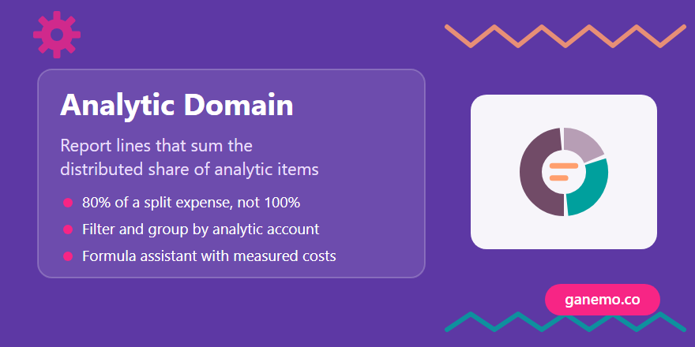

**Analytic Domain Report Engine**



Build report lines from **analytic items**, so a line shows the share of a journal item
that was distributed to the analytic accounts you care about — 80% of an expense split
20/30/50 — instead of its full balance.

**Author**: [Ganemo](https://www.ganemo.com)
**License**: OPL-1 · **Odoo version**: 19.0

---

## Producer product

Odoo module produced and maintained by **Ganemo** for the `odoopartners` module catalog.
It is developed in the `odoo-many-automations` workspace, validated on the shared Odoo.SH
staging project `GanemoCorp/newmodule20`, and promoted to this repository only after that
build installs it and runs its tests clean.

## Manifest

`__manifest__.py` is the source of truth for name, version, dependencies and license.
At a glance:

| Key | Value |
| --- | --- |
| `name` | Analytic Domain Report Engine |
| `version` | 19.0.1.0.0 |
| `category` | Accounting/Accounting |
| `license` | OPL-1 |
| `depends` | `account_reports` (Enterprise), `analytic` |
| `demo` | a learning report, see **Demo data** below |

## Install

```bash
# the module folder must sit on the addons path under this exact name
git clone git@github.com:odoopartners/account_report_analytic_domain.git     <addons-path>/account_report_analytic_domain
odoo-bin -u account_report_analytic_domain -d <database>
```

Then: **Accounting → Configuration → Reports**, open a report line's expression and set
**Computation Engine** to *Analytic Domain*. The form explains the rest — see
**Assistance while writing the formula**.

## Branch convention

| Branch | Meaning |
| --- | --- |
| `19-dev` | default branch; receives the code that already passed local and Odoo.SH tests |
| `19.0` | stable line, fast-forwarded from `19-dev` right after the push |

`main`/`master` are not used in this repository.

---

## The problem it solves

A report line built with the **Odoo Domain** engine can *filter* on an analytic
distribution, but it always brings the **full** balance of the journal item. If a 1000
expense is distributed 20% Marketing / 30% Administration / 50% Management, a line meant
to show "Administrative expenses" gets 1000, not 800.

Odoo does know how to prorate — its analytic *group by* columns read
`account.analytic.line`, whose `amount` already holds each account's share — but that is
only exposed as extra **columns**, one per analytic account or plan. There is no way to
get a prorated figure into a **line** of your own report.

This engine does exactly that, and nothing else:

```
Computation Engine: Analytic Domain
Formula: [('auto_account_id', 'in', [30, 50]), ('general_account_id.account_type', '=', 'expense')]
Subformula: sum
```

→ 800.

No distribution arithmetic is performed by this module: `account.analytic.line.amount` is
already the distributed share, computed and rounded by Odoo itself.

## Writing the formula

The domain is written in **analytic item** fields — the same ones you see in
*Accounting → Analytic Items*:

| Purpose | Field | Cost |
| --- | --- | --- |
| Analytic account of one plan | the plan's own column (`x_plan..._id`) | cheapest |
| Group of analytic accounts | traverse it: `x_plan..._id.<field>` | cheapest |
| Analytic account, any plan | `auto_account_id` | see below |
| General (P&L / balance sheet) account | `general_account_id` | cheap |
| Journal, partner, product, date | native column of the analytic item | cheap |
| Anything only on the journal item | `move_line_id.<field>` | expensive |

**Prefer the plan's own column to `auto_account_id`.** `auto_account_id` is a convenience
field that means "the analytic account of any plan": its search expands into one subquery
per plan column, OR-ed together, which stops PostgreSQL from using the partial index of
any single plan column. Measured on a production database, over the same period:
`x_plan6_id` 4.1 ms versus `auto_account_id` 16.1 ms.

### Grouping several analytic accounts

Instead of listing account ids by hand, categorise the accounts and traverse into them:

```
[('x_plan6_id.plan_id', 'child_of', 12)]
```

A **sub-plan** is the native categoriser: `plan._column_name()` resolves to the *root*
plan's column, so a sub-plan groups accounts *inside* one dimension rather than adding a
new one. Any other field of `account.analytic.account` works the same way, a Studio field
included: `[('x_plan6_id.x_studio_category', '=', 'admin')]`.

This is not a performance trade-off — it is **faster** than an explicit id list (1.6 ms
versus 4.1 ms measured): the analytic account table is small, so PostgreSQL joins it and
uses it to drive the scan.

### Filtering on the general account

`general_account_id` is a real, indexed column of the analytic item, so the whole
`account.account` domain vocabulary is available and cheap:

```
[('general_account_id.account_type', '=', 'expense')]
[('general_account_id.code', '=like', '60%')]
[('general_account_id.tag_ids', 'in', [7])]
```

Two things are worth knowing about `code`:

- **It is not a column.** Since Odoo 17 it is a company-dependent value inside the
  `code_store` jsonb, computed per company from `env.company.root_id`. A condition on it
  therefore costs a sequential scan of the whole chart of accounts — 22.8 ms on a
  7 600-account chart. The engine resolves such conditions to account ids **once per
  batch of formulas** and reuses them across every line of the report, which took a
  measured line from 31 ms to 5 ms. The native `account_codes` engine solves the same
  problem the same way, except it reads the computed field record by record in Python.
- **Archived accounts are included**, deliberately: an amount booked on an account that
  was archived later still belongs in the report. This matches the `account_codes`
  engine, which resolves accounts with `active_test=False`.

`group_id` cannot be used: it is not stored in Odoo 19 and has no search method, so the
ORM raises *"Cannot convert account.account.group_id to SQL"*. Use a code prefix or
`tag_ids` instead.

Supported subformulas, identical to the `domain` engine: `sum`, `sum_if_pos`,
`sum_if_neg`, `count_rows`. They can be signed, e.g. `-sum`.

## Sign

`account.analytic.line.amount` is the **opposite** of the accounting balance. This engine
sums `-amount`, so an expense comes out positive, exactly like a `domain` engine line.
That keeps analytic lines aggregatable with regular ones through the `aggregation` engine.

## What the engine takes from the report's context

Automatically, with no configuration:

- **Dates**, including every `date_scope` (`from_beginning`, `from_fiscalyear`,
  `to_beginning_of_period`…). `date` on an analytic item is the accounting date of the
  journal item it came from.
- **Every filter the report itself applies**: the engine translates the whole
  journal-item domain Odoo builds, rather than picking the filters it thinks matter, so a
  filter added by another module is honoured instead of silently ignored. Companies,
  partners and journals are read from the analytic item's own columns (`journal_id` is a
  stored related field); `account_id` is renamed to `general_account_id` — the analytic
  item has an `account_id` of its own and it is a different thing; whatever is left goes
  through `move_line_id`.
- **Currency conversion**, through the same currency table the `domain` engine uses, so a
  consolidated multi-company report converts analytic and accounting lines identically.

## Limitations, by design

- **Draft entries are never included.** Analytic items only exist for posted entries:
  Odoo unlinks them on `button_draft`, and `button_cancel` resets to draft first. The
  "Include unposted entries" filter therefore cannot widen an Analytic Domain line, and
  the report shows a warning when that filter is on, rather than silently disagreeing
  with the rest of the report.
- **Analytic items without a general account are excluded** (timesheets, manually encoded
  analytic entries). They carry no accounting amount; Odoo excludes them from its own
  analytic queries too.
- **Cash-basis reports are not supported** for these lines: the analytic item carries the
  accrual amount.

## Assistance while writing the formula

Picking this engine in an expression reveals two banners under the formula, computed in
the form and costing nothing at report time.

The first says what the formula filters, lists **this database's** analytic plans with the
column name each one answers to — nobody can guess that the plan called "Departments" is
`x_plan6_id` — and offers ready-to-copy examples built from them.

The second reviews the formula as it is typed, keeping two things apart:

- **What will not work**: a field that does not exist on the analytic item, a field of
  `account.account` that Odoo cannot search, an invalid domain or subformula, and the
  name collision below.
- **What will be slow**: `auto_account_id` instead of a plan column, a term travelling
  through `move_line_id`, or a formula that restricts no analytic account at all.

Each remark carries the measured cost of that shape rather than an invented score.

The collision is worth calling out: the project plan's column is literally named
`account_id`, so `[('account_id.account_type', '=', 'expense')]` reads the **analytic**
account of that plan, not the accounting account, and would quietly return nothing. The
review catches it and gives the working spelling.

## Auditing

Clicking the amount opens the matching analytic items. The formula already *is* an
`account.analytic.line` domain, so no translation is involved.

## Grouping

The **Group By** of the report *line* (not of the expression) keeps working, but not for
free: the base report builder resolves group-by fields against `account.move.line` in
three places, and a line fed by this engine groups analytic items instead. This module
overrides all three — the `_validate_groupby` constraint, which otherwise refuses to even
save the line; `_parse_groupby`, which otherwise raises a `KeyError`; and the engine's own
SQL.

The rule is then simple: **any stored field of `account.analytic.line`**, one or several
separated by commas.

| Group by | Field |
| --- | --- |
| Cost centre / analytic account | the plan's column (`x_plan..._id`) |
| Accounting account | `general_account_id` |
| Partner, product, date, journal | `partner_id`, `product_id`, `date`, `journal_id` |
| Two levels | `general_account_id,x_plan..._id` |

`auto_account_id` is the exception: it can be filtered on but never grouped by, because it
is computed and there is no column to `GROUP BY`. The module answers that with a message
saying to group by an analytic plan's column instead, rather than with a raw `ValueError`.

## Performance

Measured with `EXPLAIN (ANALYZE, BUFFERS)` on a production database (218k journal items,
43k analytic items), for the same accounting question:

| Query shape | Time | Buffers |
| --- | --- | --- |
| This engine, over analytic items | 3.4 ms | 297 |
| `domain` engine over journal items, by account type | 204.7 ms | 13 602 |
| `domain` engine filtering `analytic_distribution` (GIN index) | 4.1 ms | 151 |

Why it stays cheap:

- **It reads a smaller table.** Analytic items are fewer than journal items, and the
  engine's always-on `general_account_id != False` condition removed a further 62% of
  them on the measured database — while matching the *partial* index PostgreSQL has on
  that column (`WHERE general_account_id IS NOT NULL`).
- **Every predicate it uses is indexed**: `date`, `general_account_id` (partial), each
  analytic plan column (partial), `move_line_id`.
- **Nothing is read into Python.** One aggregate query returns one row per group; the
  distribution arithmetic was already done when the analytic items were created.
- **`COUNT(*)` instead of `COUNT(DISTINCT id)`** when there is no sub-group-by. `id` is
  the primary key so the two are identical, but the `DISTINCT` makes PostgreSQL sort and
  pushes it to scan by primary key rather than the selective partial indexes: 60 ms vs
  16 ms on the measured database. The native `domain` engine always asks for the
  `DISTINCT`.

Two things worth knowing:

- **No extra index is shipped.** `account_move_line` carries a composite `(account_id,
  date)` index added for reports; the analytic table has no equivalent. It was measured
  and it is not needed: PostgreSQL combines the separate `date` and `general_account_id`
  indexes with a `BitmapAnd` and answers a narrow-period query in 2.8 ms — faster than
  the journal-item equivalent that does have the composite index (8.5 ms).
- **A domain term that has to travel through `move_line_id`** costs a nested loop into
  `account_move_line`: 58 ms against 3.4 ms for a purely analytic domain. Fewer terms
  need it than one would think — the journal, the partner and the product are all on the
  analytic item already, so a journal filter costs 11 ms, not 58.

One optimisation of the `domain` engine is deliberately **not** reproduced: it batches
several formulas into a single query when every term of each traverses the same stored
many2one. It cannot be applied as-is here — `auto_account_id`, the field most formulas
filter on, is a non-stored computed field, so it cannot be grouped by in SQL — and the
measured per-query cost (~3 ms) makes it unprofitable for now.

## Demo data

Installing with demo data builds a report named **Expenses by cost centre (analytic)**,
meant to be read as a lesson: one line per way of writing the formula, each named after
what it demonstrates — the plan's column, a sub-plan, a single analytic account, the
account type, a code prefix, a grouped line, and an `aggregation` line proving an analytic
line adds up with the rest of a report. Opening any expression shows the assistant
explaining that particular formula.

The scenario behind it is one 1 000 and one 500 expense, each split 20 Marketing /
30 Administration / 50 Management, so the report shows 1 200 where a journal-item line
would show 1 500.

It is built in Python (`account.report._load_learning_demo`) rather than in XML, because
the field holding an analytic account is the *column of its plan* and its name depends on
the plan's database id — it can only be asked for at load time. The loader is idempotent
and recognises itself by the `ANDEMO1` line code, never by the report name, which is
translated.

## Tests

`odoo-bin -i account_report_analytic_domain --test-enable`

19 tests cover the prorated share, the sign, every subformula, date scopes, draft and
cancelled entries, the warning, items with no general account, group-by, auditing, and
multi-company currency conversion parity with the `domain` engine.


---

## Cross-references

- Producer stack and repo inventory: [`odoopartners/agent-stack`](https://github.com/odoopartners/agent-stack) — `agent-stack/awac.yml#repos`
- Odoo.SH validation project: `GanemoCorp/newmodule20`, branch `account-report-analytic-domain-19.0.1.0.0`
- Governance: [product-structure.md](https://github.com/getGanemo/docs-company/blob/main/governance/product-structure.md)

---

**Author**: [Ganemo](https://www.ganemo.com) — the world's leading Odoo App
developer and multi-award-winning Gold Partner.
