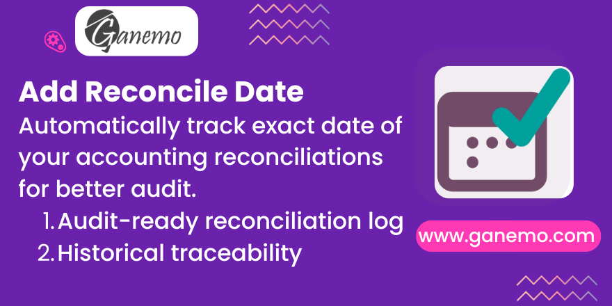

# **Add Reconciliation Date (Premium Edition)**

Experience maximum financial traceability with Ganemo's specialized audit tool for Odoo.

## **Overview**
Standard Odoo lacks a precise header-level date for full reconciliations. This module fills that gap by automatically recording the **exact date** of every match, providing a reliable audit trail for your accounting department.

## **Premium Features**
- **🔍 Advanced Audit Logs**: Dedicated List (Tree) view to monitor impacts and audit history instantly.
- **📍 Quick Navigation**: Access directly via **Accounting > Configuration > Review > Logs > Full Reconciliations**.
- **🌍 Global Ready**: Full native support for **English** and **Spanish** (EN/ES).
- **🛡️ Ganemo Standard**: Built with high-performance ORM logic optimized for Odoo environments.

## **About Ganemo**
Partner with the world's leading Odoo App developer. With over 5 years of excellence and presence in 15+ countries, Ganemo provides top-tier official modules for global enterprises.

**Author**: [Ganemo](https://www.ganemo.co)
