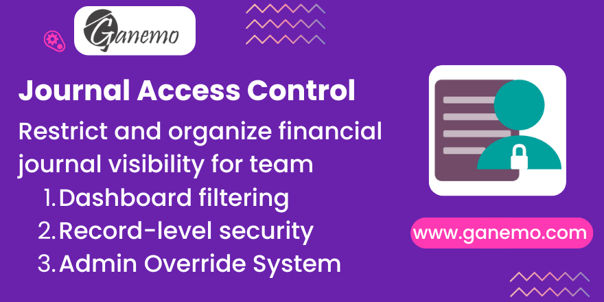

# **Journal Access Control**

## Overview

In Odoo, the Accounting Dashboard often displays all cash and bank journals to every user. For companies with multiple points of sale, cashiers, or offices, this lack of restriction can lead to errors and data exposure. 

**Journal Access Control** provides a robust security layer by allowing administrators to define exactly who can see and use each internal journal.

## Key Features

-   **User-Journal Assignment**: Easily link users to their designated journals.
-   **Hybrid Access Control**: Assign Users AND/OR Groups. Access is granted if the user is explicitly assigned OR belongs to an allowed group.
-   **Smart Public Access**: Leave assignments empty to make the journal **Public** (visible to all accounting users). Restrict it by assigning at least one user or group.
-   **Dashboard Filtering**: The Accounting Dashboard will only show journals assigned to the current user (or public ones).
-   **Bulletproof Record Rules**: Sophisticated record rules (`ir.rule`) prevent users from accessing Moves, Invoices, or **Journal Items** (Lines) in restricted journals.
-   **Intelligent Interoperability**:
    -   **Payments**: Users can see payments made from restricted journals (e.g., Hidden Bank) on their invoices.
    -   **Commercial Data**: Manual entries affecting Customer/Vendor balances (AR/AP) are visible to allow credit application, while purely internal secret entries remain hidden.
-   **"My Journals" Filter**: A specialized search filter in the journal view for quick navigation.
-   **Bypass Access**: A dedicated security group allows managers to keep full visibility across all journals.
-   **Multi-Module Compatibility**: Fully compatible with `cashier_journal_control` for advanced payment wizard logic.
-   **Smart Explainer**: A dynamic help message on the journal form explains exactly who has access in real-time.

## Configuration

1.  Go to **Accounting > Configuration > Journals**.
2.  Select a journal and find the **"Accounting Security"** section (or Assignment tab).
3.  **To Restrict Access**:
    *   **Assigned Users**: Select specific individuals.
    *   **Allowed Groups**: Select user groups (e.g., "Sales Team").
    *   *Note*: Access is granted if the user is listed **OR** belongs to one of the groups.
4.  **To Make Public**:
    *   Leave both "Assigned Users" and "Allowed Groups" **EMPTY**.
    *   The "Access Policy" message will turn blue and confirm it is Public.
5.  (Optional) Assign managers to the **"Journal Access Admin"** group to grant them global visibility.

---

**Author**: [Ganemo](https://www.ganemo.co)
