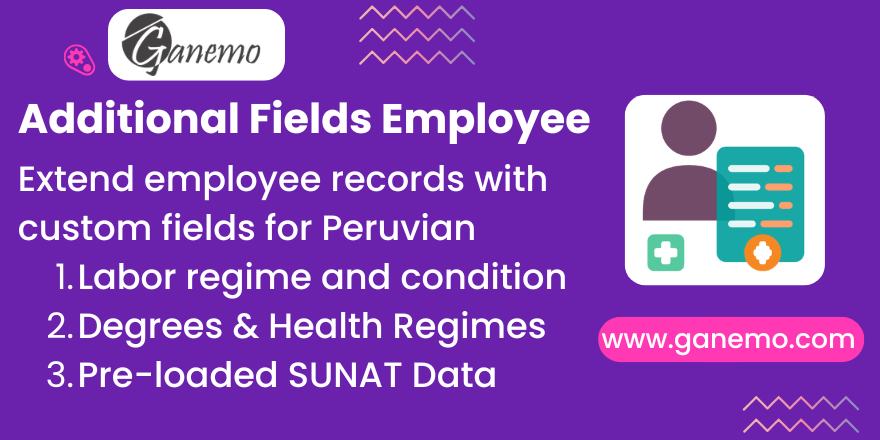

# **Additional Fields Employee**

## Overview

This module extends Odoo's employee records (`hr.employee`) with additional fields required for Peruvian payroll compliance (SUNAT). It adds structured data points for academic background, health coverage, labor regimes, contract types, and work occupations — all versioned through the `hr.version` delegation pattern.

## Features

### Reference Data Catalogs (Pre-loaded with SUNAT codes)

| Catalog | Model | Fields |
|---------|-------|--------|
| **Academic Degree** | `academic.degree` | Code, Description, Abbreviation |
| **Health Regime** | `health.regime` | Code, Description, Abbreviation |
| **Labor Regime** | `employee.regime` | Code, Description, Abbreviation, Private/Public/Other/MYPE flags |
| **Contract Type** | `type.contract` | Code, Contract Type, Abbreviation |
| **Work Occupation** | `work.occupation` | Code, Name, Executive/Employee/Worker flags |

### Employee Form Extensions

- **Academic Degree** (`academic_degree_id`): Links the employee to their educational level.
- **Health Regime** (`health_regime_id`): Tracks the employee's health coverage type (e.g., EsSalud, EPS).

### Labor Information Fields

- **Labor Regime** (`labor_regime_id`): Employment regime (e.g., General Private, MYPE, Public).
- **Labor Condition** (`labor_condition_id`): Contract classification.
- **Work Occupation** (`work_occupation_id`): Job category (executive, employee, worker).
- **Maximum Working Day** (`maximum_working_day`): Boolean flag for max work hours.
- **Atypical/Cumulative Day** (`atypical_cumulative_day`): Boolean flag for non-standard schedules.
- **Nocturnal Schedule** (`nocturnal_schedule`): Boolean flag for night shift employees.
- **Unionized** (`unionized`): Boolean flag for union membership.
- **Is Practitioner** (`is_practitioner`): Boolean flag for intern/trainee status.

## Configuration

### 1. Reference Data

All catalogs are pre-loaded during installation. To manage them:

- **Academic Degrees**: *Peruvian Localization > Configuration > Academic Degrees*
- **Health Regimes**: *Peruvian Localization > Configuration > Health Regimes*
- **Labor Regimes**: *Peruvian Localization > Configuration > Labor Regimes*
- **Contract Types**: *Peruvian Localization > Configuration > Contract Types*
- **Work Occupations**: *Peruvian Localization > Configuration > Work Occupations*

You can add, edit, or deactivate entries as needed. All entries include official SUNAT codes.

### 2. Employee Form

1. Navigate to **Employees > Employees** and open any employee record.
2. Fill in the **Academic Degree** and **Health Regime** dropdowns.
3. Set the **Labor Regime**, **Labor Condition**, and **Work Occupation**.
4. Toggle the boolean flags (Nocturnal, Maximum Day, Atypical, Unionized, Practitioner) as applicable.

### 3. Version Tracking

All fields use the `hr.version` delegation pattern, meaning every change is automatically versioned and traceable in the employee's history.

## Dependencies

| Module | Purpose |
|--------|---------|
| `hr` | Base employee management |
| `hr_payroll` | Payroll engine for salary rules |
| `l10n_pe_localization_menu` | Peruvian localization menu structure |
| `payroll_field` | Extended payroll field architecture (`hr.version`) |

## Compatibility

- **Odoo Version**: 19.0
- **Editions**: Enterprise (Odoo.SH, Ganemo Online, Ganemo.SH)
- **Multi-company**: Yes
- **Languages**: English & Spanish (en_US, es_ES, es_PE, es_MX)

> **Note**: This module is NOT compatible with Odoo Online due to custom code restrictions.

## Technical Details

- **Models Created**: `academic.degree`, `employee.regime`, `health.regime`, `type.contract`, `work.occupation`
- **Models Extended**: `hr.employee`, `hr.version`
- **Security**: All fields restricted to `hr.group_hr_user` (HR Officer) group
- **Data Files**: Pre-loaded academic degrees, health regimes, contract types, and work occupations (CSV/XML)

## License

OPL-1 (Odoo Proprietary License v1.0)

**Author**: [Ganemo](https://www.ganemo.co)
