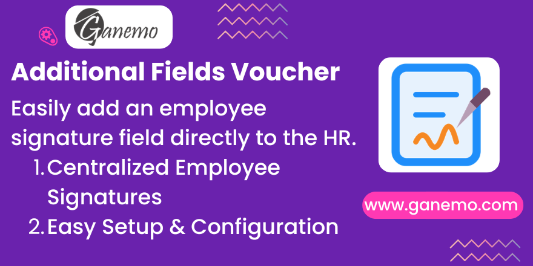

**Additional Fields Voucher**

**Author**: [Ganemo](https://www.ganemo.com)

## Description
This Odoo module extends the `hr.employee` configuration to centrally manage employee or representative signatures. It adds a direct field within the **HR Settings** tab.
These signatures can be automatically integrated and printed onto automated payroll vouchers or any other HR-related reports, speeding up administrative operations and document validation.

Additionally, this module provides a 'Law/Decrees' field on the `hr.payroll.structure` model to store the legal text justifying the voucher structure format.

## Configuration & Usage
1. Navigate to the **Employees** app.
2. Select any Employee profile you want to define.
3. Access the **HR Settings** tab.
4. Check the **Is Employer** box to reveal the **Employer Signature** field.
5. Upload the signature image.
6. To configure Laws on structures, navigate to **Payroll > Configuration > Payroll Structures**, select a structure, and enter the details in the **Law/Decrees** field.

## Multi-Language Support
English and Spanish forms and validations are seamlessly integrated into the module.
