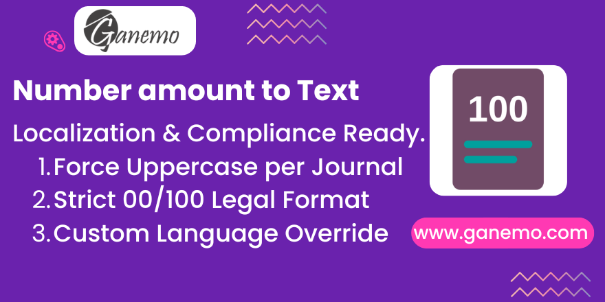

# **Amount To Text**

Extends standard Odoo functionality to fully control how invoice amounts are converted to text.
Ideal for companies operating in countries with strict invoicing regulations (like LATAM) or international businesses that need multi-language billing.

## Key Features
1.  **Force Uppercase**: Optionally convert the text to UPPERCASE (e.g., "One Hundred" -> "ONE HUNDRED") automatically.
2.  **Custom Strict Format (00/100)**: Optional strict decimal formatting required by some legal authorities (e.g., "AND 00/100 DOLLARS").
3.  **Language Override**: Force the invoice text to be in a specific language (e.g., English) regardless of the Customer's language setting.

## Configuration
Go to **Accounting > Configuration > Journals**.
Open any Journal (e.g., *Customer Invoices*) and navigate to the **Advanced Settings** tab.
You will find a new section **Amount to Text Configuration**:

*   **Amount Text Format**:
    *   `Odoo Native`: Uses the standard Odoo behavior.
    *   `Custom (00/100)`: Uses the strict "Numbers + Connector + Decimals/100 + Currency" format.
*   **Amount in Uppercase**: Check this box to force the result to be ALL CAPS.
*   **Amount Text Language**: Select a language here to force the text output to be in that language. If left empty, it follows standard Odoo rules (Customer's language).

## Usage
Simply create and validate an invoice.
The field `Amount in Words` (standard Odoo field) will be automatically computed based on the settings of the Journal selected for the invoice.
This works with all standard Invoice PDF reports as it overrides the native field computation.

## Installation
- Depends on `account` (Standard Odoo).
- No external Python libraries required (uses `num2words` which is standard in Odoo).

## Credits
**Author**: [Ganemo](https://www.ganemo.co)
