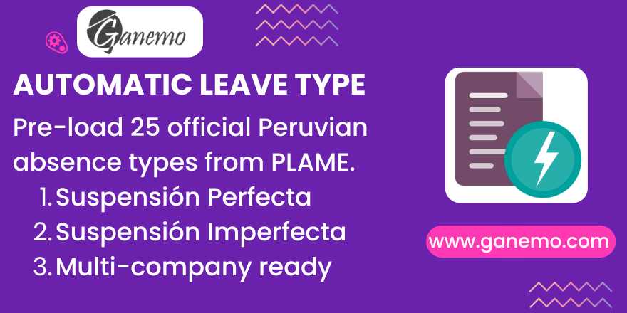

# **Automatic Leave Type**

## Overview

**Automatic Leave Type** pre-loads all **25 official Peruvian absence types** from the **Planilla Electrónica (T-Registro / PLAME)** directly into your Odoo payroll system upon installation. No manual data entry required.

The module creates both the **Work Entry Types** (`hr.work.entry.type`) and the corresponding **Leave Types** (`hr.leave.type`), properly linked and classified according to Peruvian labor regulations.

---

## Features

| Feature | Description |
|---|---|
| **Complete PLAME Catalog** | 25 absence codes covering all legal scenarios defined by Peru's Electronic Form |
| **Automatic Linkage** | Each Leave Type is linked 1:1 to its corresponding Work Entry Type |
| **Paid/Unpaid Classification** | Suspensión Perfecta (unpaid) vs. Suspensión Imperfecta (paid) correctly flagged |
| **Subsidy Flag** | `is_calc_own_rule` enabled on codes 20, 21, 22 for differentiated payroll calculation |
| **Multi-Company** | All types created with empty `company_id` — shared across companies |
| **Zero Configuration** | Install and go — everything is ready for payroll immediately |

---

## Absence Categories

### Suspensión Perfecta (S.P.) — Codes 01–12

The employment contract is **suspended without pay**. These are marked as `unpaid = True`.

| Code | Name |
|------|------|
| 01 | S.P. Sanción Disciplinaria |
| 02 | S.P. Ejercicio Derecho Huelga |
| 03 | S.P. Detención Del Trabajador |
| 04 | S.P. Inhabilitación Administrativa O Judicial |
| 05 | S.P. Permiso O Licencia Sin Goce De Haber |
| 06 | S.P. Caso Fortuito O Fuerza Mayor |
| 07 | S.P. Falta No Justificada |
| 08 | S.P. Por Temporada O Intermitente |
| 09 | S.P Maternidad - Pre Y Post Natal |
| 10 | S.P Sentencia terr / narc / corrup y violac. |
| 11 | S.P Imposición de medida cautelar |
| 12 | S.P Enferm. Padre / Cónyuge o conviviente |

### Suspensión Imperfecta (S.I.) — Codes 20–35

The employment contract continues **with pay or subsidy**. These are marked as `unpaid = False`.

| Code | Name | Subsidy Flag |
|------|------|:---:|
| 20 | S.I. Enferm/Accidente (20 Primeros Días) | ✅ |
| 21 | S.I. Incap Temporal (Subsidiado) | ✅ |
| 22 | S.I. Maternidad - Pre Y Post Natal | ✅ |
| 24 | S.I. Lic Desemp Cargo Cívico | — |
| 25 | S.I. Lic Desempeño Cargos Sindicales | — |
| 26 | S.I. Licencia Con Goce De Haber | — |
| 27 | S.I. Días Compens Por Horas De Sobretiempo | — |
| 28 | S.I. Días Licencia Por Paternidad | — |
| 29 | S.I. Días Licencia Por Adopción | — |
| 30 | S.I Imposición de medida cautelar | — |
| 31 | S.I Citac. judicial / Militar / policial o administ. | — |
| 32 | S.I Fallecimiento Padres / Cónyuge e hijos | — |
| 33 | S.I Represent. del estado en eventos | — |
| 34 | S.I Des vacac / Lic por asiste médica o terap rehab | — |
| 35 | S.I Emfermedad grave o terminal o accidente grave de Fam. Directo | — |

> **Note:** The ✅ subsidy flag (`is_calc_own_rule = True`) indicates that these absence types require a **separate payroll salary rule** for subsidy calculation (e.g., EsSalud). All other codes have `is_calc_own_rule = False`.

---

## Installation

1. Install the module from **Apps**.
2. All 25 Work Entry Types and 25 Leave Types are created **automatically**.
3. No further configuration is needed — start using them in payroll immediately.

### Prerequisites

The following modules must be installed:

- `hr_payroll` — Payroll engine
- `hr_work_entry_holidays` — Work entry type linkage on leave types
- `absence_day` — Provides `is_calc_own_rule` field and base absence data

---

## Configuration

### Leave Type Defaults

All leave types are created with the following defaults:

| Setting | Value |
|---|---|
| **Approval** | Manager approval required |
| **Allocation** | No allocation required (unlimited) |
| **Request Unit** | Day |
| **Company** | Empty (available to all companies) |

### Customization

You can modify the leave type names and settings after installation. **However, avoid changing the `code` field**, as it maps to the official PLAME code used for electronic reporting to SUNAT.

---

## Technical Details

### Models

| Model | Type | Purpose |
|---|---|---|
| `hr.work.entry.type` | `_inherit` | Empty extension (field provided by `absence_day`) |

### Key Field: `is_calc_own_rule`

This Boolean field on `hr.work.entry.type` (provided by the `absence_day` module) flags absence types that require a **differentiated payroll salary rule** for subsidy computation. Only codes **20**, **21**, and **22** have this flag enabled.

### Data Files

| File | Records | Description |
|---|---|---|
| `hr_work_entry_type_data.xml` | 25 | Peruvian work entry types with PLAME codes |
| `hr_leave_type_data.xml` | 25 | Leave types linked to work entry types |

---

## Compatibility

| Platform | Supported |
|---|---|
| Odoo Enterprise (Odoo.SH) | ✅ |
| Ganemo Online / Ganemo.SH | ✅ |
| Odoo Online | ❌ (custom code restriction) |

---

## Support

- **WhatsApp**: [+1 (828) 672-6150](https://wa.me/18286726150)
- **Sales Email**: [leads@ganemo.com](mailto:leads@ganemo.com)
- **Technical Support**: [ayuda@ganemo.com](mailto:ayuda@ganemo.com)
- **Book a Demo**: [ganemo.co/appointment/5](https://www.ganemo.co/appointment/5)

---

**Author**: [Ganemo](https://www.ganemo.com)