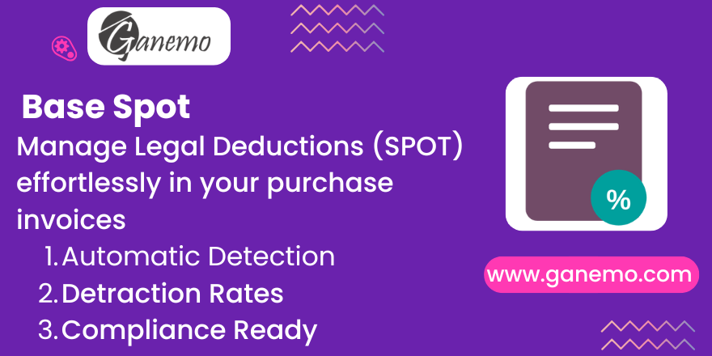

# **Base Spot**

**Author**: [Ganemo](https://www.ganemo.com)

## Description
Create additional fields on purchase invoices that allow you to identify if an invoice is affected by legal deductions, the type of deduction and the payment operation code.

## Features
- **Detraction Fields**: Adds `Detraction`, `Retention`, and `Operation Type` to invoices.
- **Compliance**: Helps meet Peruvian SUNAT requirements for SPOT.
- **Integration**: Seamlessly integrates with the Accounting vendor bill form.

## Usage
1.  Install the module.
2.  Go to Accounting > Vendors > Bills.
3.  Create or open a bill.
4.  Locate the SPOT/Detraction fields and fill them as needed.
