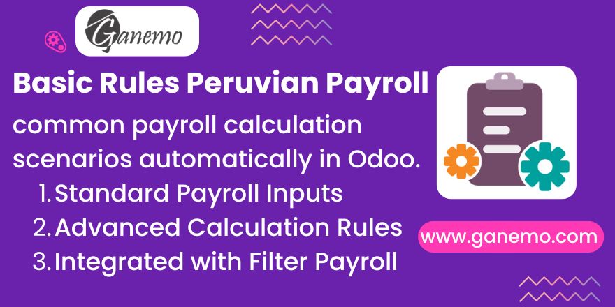

# **Basic Rules**

## Overview

**Basic Rules** is an Odoo 19 module that provides a comprehensive set of foundational payroll salary rules for the Peruvian labor regime. It automates the most common payroll computation scenarios — from vacation provisions and AFP/ONP deductions to advance payroll control — allowing HR experts to operate Odoo Payroll without building complex rule configurations from scratch.

---

## Features

- **Pre-built Salary Rules**: Ready-to-use `hr.salary.rule` records covering AFP, ONP, vacation provision (PRO_VAC), CTS, gratification, income tax, and more.
- **AFP Premium Exemption**: Automatically detects employees over 65 years old (via `age` from `payroll_field`) and prevents AFP premium deduction via `no_apply_afp_premium` and `indicator` fields.
- **Pension Exemption Flag**: `no_provide_pension` field on `hr.employee` to exempt specific employees from AFP/ONP deductions.
- **Microenterprise Conductor**: `l10n_pe_microenterprise_manager` field marks income as "Conductor de Microempresa" for PLAME payroll reporting.
- **Safe Python Evaluation**: All salary rule Python snippets are audited for robustness in high-workload scenarios.
- **Payroll Context Injection**: Exposes `slip_id` in the salary rule evaluation context for advanced cross-record lookups.

---

## Dependencies

| Module | Purpose |
|---|---|
| `partner_concept` | Partner classification base |
| `payroll_field` | Extended payroll fields on `hr.payslip` |
| `filter_payroll` | Payroll filtering utilities |
| `various_data` | Shared configuration records |
| `judicial_retention_fields` | Judicial retention deduction fields |
| `types_system_pension` | AFP / ONP pension system types |
| `life_insurance_management` | Life insurance deduction integration |
| `payment_conditions` | Payment condition fields |
| `eps_process` | EPS health contribution process |
| `holiday_process` | Provides `holidays_per_year` field on `hr.employee`, consumed by the PRO_VAC salary rule |

---

## Installation

1. Copy the `basic_rule` folder to your Odoo `addons` directory.
2. Update the Apps list: **Settings > Apps > Update Apps List**.
3. Search for **Basic Rules** and click **Install**.
4. The module automatically populates `hr.salary.rule` records in the active payroll structures.

---

## Configuration

No manual configuration is required after installation. After installing:

- Navigate to **Payroll > Configuration > Salary Rules** to review the pre-loaded rules.
- Ensure `holiday_process` is installed and each employee has a valid `holidays_per_year` value set for PRO_VAC to calculate correctly.

---

## Technical Reference

### Models Extended

| Model | Extension |
|---|---|
| `hr.employee` | Adds `no_provide_pension`, `l10n_pe_microenterprise_manager`, `no_apply_afp_premium`, `indicator` fields. Consumes `age` (defined by `payroll_field`) to trigger AFP premium exemption at 65. |
| `hr.salary.rule` | Consumes `apply_advance_payroll` boolean (defined by `payroll_field`) to filter rules in advance payroll runs. |
| `hr.payslip` | Injects `slip_id` into evaluation context; adds period-range utility methods. |
| `hr.work.entry` | Overrides `_get_duration_is_valid` to return `False`. |

### Key Fields on `hr.employee`

| Field | Type | Description |
|---|---|---|
| `no_provide_pension` | Boolean | Exempts the employee from AFP/ONP deduction in all pension-related rules. |
| `l10n_pe_microenterprise_manager` | Boolean | Marks income as "Conductor de Microempresa" for PLAME reporting. |
| `no_apply_afp_premium` | Boolean | Auto-set to `True` when employee is ≥ 65 years old; skips AFP premium. |
| `indicator` | Boolean (Technical) | Prevents the AFP exemption from re-triggering once already applied. |

> **Note:** `age` is defined by `payroll_field` and consumed here by AFP premium logic: `age >= 65.0`.

> **Note:** `holidays_per_year` is defined by `holiday_process` and only consumed here by the PRO_VAC salary rule formula: `result = (INA_001 / 30 × holidays_per_year) / 12`.

---

## Compatibility

| Environment | Supported |
|---|---|
| Odoo 19 Enterprise | ✅ Yes |
| Odoo.SH | ✅ Yes |
| Ganemo Online / Ganemo.SH | ✅ Yes |
| Odoo Online (SaaS) | ❌ No (custom code restrictions) |

---

## Multi-Language Support

Fully translated into **English** and **Spanish** (es, es_PE, es_ES, es_MX).

---

## License

This module is distributed under the **Odoo Proprietary License v1.0 (OPL-1)**.
See `LICENSE.txt` for full terms.

---

**Author**: [Ganemo](https://www.ganemo.co)
