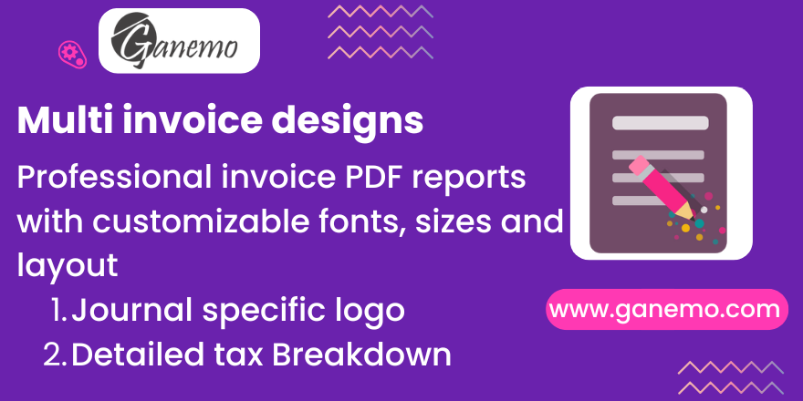

# **Classic Format Invoice**

## Overview

This module adds a classic-style PDF invoice format to Odoo. It is designed for businesses that require a highly detailed, traditional invoice layout often compliant with specific local requirements (e.g., Peru, Latam).

The layout includes detailed sections for:
- Company and Customer Information (Address, RUC/VAT, Contact)
- Detailed Invoice Lines with sequence numbers
- Tax breakdown and totals
- Amounts in words (e.g., "ONE HUNDRED DOLLARS")
- Payment terms and detractions/retentions tables

## Features

- **Classic PDF Design**: A structured, grid-like layout for invoices.
- **Customizable Appearance**: Configure fonts, sizes, and logos directly from the Journal.
- **Dynamic Content**: Shows amounts in words, currency details, and specific legal requirements.
- **Flexible Configuration**: Each Journal can have its own "Classic" styling.

## Configuration

To customize the report:
1. Go to **Accounting > Configuration > Journals**.
2. Select the Journal you want to configure (e.g., Customer Invoices).
3. Open the **"Classic Format Config"** tab.
4. **Visual Settings**:
    - **Logo**: Upload a specific logo for this invoice format.
    - **Font Family**: Select a font (Roboto, Arial, etc.).
    - **Round Quantity**: Toggle integer rounding for quantities.
5. **Font Sizes**: Adjust the font size (in px) for every section of the report (Header, Body, Footer) to perfectly fit your pre-printed paper or design preferences.

## Usage

Once configured, simply print an invoice using the **"Facturas Clasicas"** (Classic Invoice) report action.

## Credits

**Author**: [Ganemo](https://www.ganemo.co)
