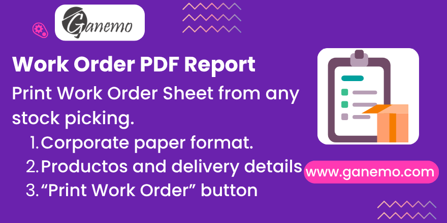

# **Custom Work Order Report**

Generate a professional, corporate-branded **Work Order** (*"Orden de Trabajo"*)
PDF directly from any Odoo **stock picking** (delivery, receipt or internal
transfer). The report reuses the exact header, footer and paper format defined
in your corporate quotation, so every document your company prints looks
consistent — with no re-typing.

**Author**: [Ganemo](https://www.ganemo.com)

---

## Table of Contents

1. [Key Features](#key-features)
2. [Requirements & Dependencies](#requirements--dependencies)
3. [Installation](#installation)
4. [Configuration](#configuration)
5. [How to Use](#how-to-use)
6. [What the Report Contains](#what-the-report-contains)
7. [Data Sources (Where Each Value Comes From)](#data-sources-where-each-value-comes-from)
8. [New Field Added](#new-field-added)
9. [Frequently Asked Questions](#frequently-asked-questions)
10. [Languages](#languages)
11. [License & Credits](#license--credits)

---

## Key Features

- **One-click printing** — a *Print Work Order* button on the stock picking form,
  right next to *Validate*. The report is also available from the standard print
  menu of the picking.
- **Corporate branding** — reuses the header (logos, RUC, address, phone, fixed
  document code `PR-VE-FT-012 Rev. 0`, page numbers), footer slogan and paper
  format from the `sale_corporate_quotation` module.
- **Automatic Work Order number** — built as `Sales Order - Picking`
  (e.g. `S00021 - WH/OUT/00010`), tying the document back to its origin.
- **Part 1 – Products** — item number, product and line description, source
  location, quantity, line weight and an automatic **Total Work Order Weight**.
- **Smart source location** — shows the real reserved location, or intelligently
  prints *Manufacturing*, *Purchase* or *Pending* when stock is not yet reserved,
  based on the move origin.
- **Part 2 – Observations** — a free-text block fed by the sales order.
- **Part 3 – Shipping details** — delivery place, address, contact (name + phone)
  and notes, ready for whoever picks up or receives the goods.
- **Minimal footprint** — only **one** new field is added to the database
  (`delivery_contact_name` on contacts); everything else is derived from existing
  records.
- **Multi-language** — English interface with a complete Spanish translation.

---

## Requirements & Dependencies

This module depends on, and will automatically install:

| Module | Purpose |
|---|---|
| `stock` | Stock pickings (the model the report is printed from). |
| `sale_stock` | Links pickings to their sales order. |
| `sale_corporate_quotation` | Provides the corporate header/footer and paper format reused by the report. |
| `sale_custom_fields` | Provides the `work_order_observations` and `customer_purchase_order` fields on the sales order. |

Compatible with **Odoo 19** (Enterprise, Odoo.SH, Ganemo Online / Ganemo.SH).

---

## Installation

1. Copy the `custom_work_order` folder into your Odoo `addons` path.
2. Activate **Developer Mode**.
3. Go to **Apps**, click *Update Apps List*.
4. Search for **Custom Work Order Report** and click **Install**
   (the dependencies listed above are installed automatically).

---

## Configuration

No technical configuration is required. To get the most complete document,
make sure the following standard data is filled in:

1. **Company data** — the report header reads the logo, RUC (VAT), address and
   phone from the company. Set them in **Settings → Companies**.
2. **Delivery contact** — on a delivery-type contact, fill the new
   **Delivery Contact** field (the name of who receives the goods). See
   [New Field Added](#new-field-added).
3. **Observations** — type any special instructions in the **Work Order
   Observations** field of the sales order (provided by `sale_custom_fields`).

---

## How to Use

1. Confirm a **Sales Order** and open its **Delivery** (or open any picking from
   **Inventory → Operations**).
2. Click the **Print Work Order** button in the picking header (or use the
   print menu).
3. Odoo generates the **Orden de Trabajo** PDF, ready to print or sign.

---

## What the Report Contains

| Block | Content |
|---|---|
| **Header** (every page) | Company logo + certification logo, RUC, address, phone, fixed document code `PR-VE-FT-012 Rev. 0`, page numbering and the **No. Orden de Trabajo** box. |
| **General data** | Creation date, contractual delivery date, customer, RUC, customer purchase order (OC), PPI (the sale order's delivery quality profile when `sale_quality_profile` is installed, otherwise *No Aplica*) and project. |
| **Part 1 – Products** | Item, product + line description, source location, quantity, weight per line and the total Work Order weight. |
| **Part 2 – Observations** | Free text from the sales order. |
| **Part 3 – Shipping details** | Delivery place, address, contact (name + phone) and notes. |
| **Footer** (every page) | Corporate slogan *"Un lugar para cada cosa y cada cosa en su lugar"*. |

---

## Data Sources (Where Each Value Comes From)

The report **does not duplicate data** — every value is read live from existing
records:

- **Work Order number** → `sale.order.name` + `stock.picking.name`.
- **Creation / delivery dates** → picking `create_date` and `scheduled_date`.
- **Customer / RUC** → picking partner (commercial entity) and its VAT.
- **OC** → `customer_purchase_order` on the sales order (`sale_custom_fields`).
- **Project** → `client_order_ref` (Customer Reference) on the sales order.
- **Products / quantities / weights** → the picking stock moves; weight = product
  weight × quantity.
- **Source location** → reserved move lines, or the move origin (Manufacturing /
  Purchase / Pending).
- **Observations** → `work_order_observations` on the sales order.
- **Shipping details** → the sales order's shipping address, including the new
  **Delivery Contact** field.

> If a picking has no related sales order, the sales-related cells simply show
> `-`, and the document still prints correctly.

---

## New Field Added

This module adds a **single** field to the database:

| Model | Field | Label | Description |
|---|---|---|---|
| `res.partner` | `delivery_contact_name` | **Delivery Contact** | Name of the person who picks up or receives the goods at a delivery address. Printed in Part 3 of the Work Order. |

The field is shown only on **delivery-type** addresses, both on the main contact
form (*Internal Notes* tab) and on the inline child-contact form inside the
*Contacts* tab.

No new field is added to `stock.picking`. The `sale.order` model is only inherited
to document the fields the report relies on (`work_order_observations`,
`customer_purchase_order`, `client_order_ref`).

---

## Frequently Asked Questions

**The header has no logo or RUC — why?**
The header reads this data from the company record. Set the logo, RUC (VAT),
address and phone in *Settings → Companies*.

**Customer, OC or Project shows "-" — why?**
These come from the linked sales order. Print from a picking created from a sales
order, and fill the Purchase Order and Customer Reference (Project) fields on it.

**Where is the Print Work Order button?**
On the stock picking form header, next to *Validate*. It is also available from
the picking's print menu.

**Does it work for any picking type?**
Yes. The report is bound to `stock.picking`, so it works on deliveries, receipts
and internal transfers. Sales-related fields show `-` when there is no sales order.

**What does the source location column show when stock is not reserved?**
*Manufacturing* if the move comes from production, *Purchase* if it comes from a
vendor, or *Pending* if there is no origin yet.

---

## Languages

This module is fully translated into:

- **English** (`en_US`) — base language.
- **Spanish** (`es` / `es_ES`, `es_PE`, `es_MX`).

---

## License & Credits

- **License**: Odoo Proprietary License v1.0 (OPL-1).
- **Author / Maintainer**: [Ganemo](https://www.ganemo.com)

© 2026 Ganemo. All rights reserved.
