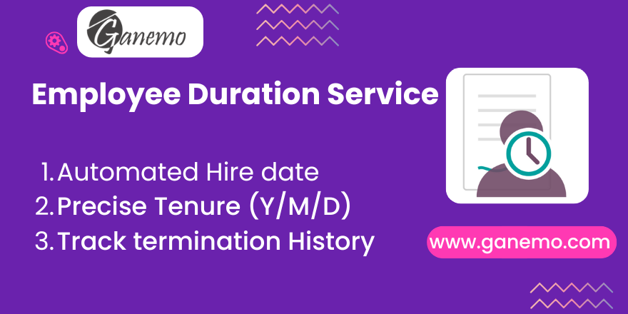

# **Employee Service**

## Overview
**Employee Service** is a comprehensive solution designed to automate the tracking of employee tenure and service duration in Odoo. By directly integrating with the **Contract History (history of versions)**, it ensures that your HR data remains accurate, consistent, and tamper-proof.

This module is essential for organizations that need precise calculations for seniority-based benefits, vacation accruals, and compliance reporting.

## Key Features
- **Automated Hire Date Calculation:** The system identifies the *real* hire date by analyzing the employee's entire contract history (`hr.version`) and selecting the start date of the oldest *active* version.
- **Read-Only Integrity:** The "Hire Date" field is set to **Read-Only** to prevent manual errors and ensure it always serves as a "Single Source of Truth" derived from contracts.
- **Real-Time Duration Tracking:** Automatically computes and displays service duration in **Years, Months, and Days** (e.g., "5 Years 2 Months 10 Days").
- **Termination Handling:** The module leverages the native **Contract End Date** (`contract_date_end`). If a contract ends, the service duration calculation freezes at that specific date, ensuring historical accuracy without manual data duplication.
- **Smart Data Entry:** For new employees, identifying a new contract start date automatically populates the service start date (if empty) to streamline onboarding.

## Configuration & Setup
No complex technical configuration is required. The module works out-of-the-box, relying on Odoo's native Contract structure.

### 1. Verification of Dependencies
Ensure that your Odoo environment has the employee contracts/versions correctly set up. This module relies on the native `hr.version` records and their dates.

### 2. Initial Usage
1.  Navigate to **Employees** and open an Employee Profile.
2.  Go to the **HR Settings** tab.
3.  Locate the **Service Information** group.
4.  You will see the computed fields: `Hire Date`, `Start Date`, and the `Service Duration` counters. Note that "Termination Date" is now managed via the Contract form.

## Detailed Operating Manual

### How "Hire Date" works (The Logic)
Users often ask: *"Why can't I edit the Hire Date?"*
*   **Answer:** The Hire Date field is locked (Read-Only) by design.
*   **Logic:** The system looks at all **Contract Versions** linked to the employee. It filters out any *Archived* versions (to ignore draft or invalid data) and picks the one with the earliest start date.
*   **How to Change it:** If the Hire Date is wrong, **do not** try to edit the employee profile. Instead, go to the employee's **Contract/Version History** and correct the start date of their first contract. The profile will update automatically.

### Handling New Hires
When you create a new employee and add their first contract version:
*   The system detects this is a new record.
*   It automatically copies the computed **Hire Date** into the **Start Date** field (which is editable).
*   This "Smart Onchange" feature saves you from typing the date twice.

### Handling Terminations
When an employee leaves the company:
1.  Go to the **Contract/Version** associated with the employee.
2.  Set the **Contract End Date** (`contract_date_end`).
3.  **Result:** The "Service Duration" calculation automatically detects this end date and stops increasing. It will permanently show the exact tenure the employee had on their last day of contract.

### Archived Versions
*   **Scenario:** You have old data migration records or "test" contracts that you archived.
*   **Behavior:** The module explicitely **ignores** any version where `Active = False`. This ensures that only valid, active historical data contributes to the seniority calculation.

## FAQ & Troubleshooting

### Q: I created a contract but the Hire Date is empty. Why?
**A:** Ensure the contract version is **Active**. If the version is archived, the system ignores it. Also, verify that the version is correctly linked to the employee.

### Q: Can I manually override the Hire Date?
**A:** No. Allowing manual overrides would create a discrepancy between the Employee Profile and the Contract History. Always correct the source data (the Contract Version).

### Q: Does this support multi-company environments?
**A:** Yes. The calculation is based on the records accessible to the current user and the employee's associated records, following standard Odoo multi-company rules.

## Requirements
*   **Odoo Version:** 19.0
*   **Dependencies:** `hr` (Employees) module.

## Credits
**Author**: [Ganemo](https://www.ganemo.com)
