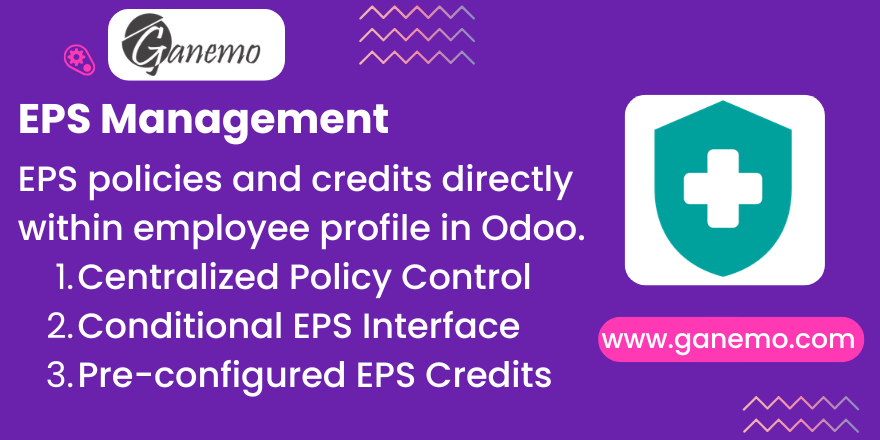

# Employee EPS Management

**Author**: [Ganemo](https://www.ganemo.com)

## Description
Optimize your HR processes by managing EPS (Health Service Provider) affiliations and credits directly within the employee profile in Odoo. This module provides a centralized place to track employee health policies without leaving the employee file.

It adds two new fields to your HR structure: EPS Credit (`eps_credit`) and EPS Policy Management (`management_eps`). 
Inside the Employee form (Private Information / Health area), the system introduces a conditional interface. The "EPS Policy" selection field is hidden by default and only appears when the "Exists EPS" checkbox is activated.

## Features
- **Centralized Policy Control**: Manage EPS Master Data directly from Employee Configurations. 
- **Conditional Interface**: The employee view remains clean; EPS Policy is only editable for employees who are effectively enrolled.
- **Pre-configured EPS Credits**: Connect policies with standard EPS credit amounts for seamless payroll calculations.

## Configuration & Usage
1. Go to **Employees > Configuration > EPS Management**.
2. Create the list of available health plans/policies and define any necessary parameters.
3. Open an Employee Profile. Go to the Private Information tab (or HR Settings).
4. Locate the Health section and check the "Exists EPS" box.
5. Select the corresponding "EPS Policy" from the newly revealed dropdown.

No further manual configurations are required. The module is fully translated in English and Spanish.