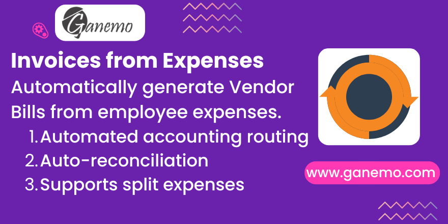

# Expense to Invoice Automation

## Overview
Automates Vendor Bill creation from HR Expenses for legal reporting compliance, eliminating manual data entry and ensuring perfect accounting synchronization in Odoo 19.

## Features
* **Automated Vendor Bills:** Creating a vendor bill (in_invoice) immediately upon posting HR Expenses.
* **Smart Payment Modes:** Fully supports both Company Account and Own Account payment modes.
* **Split Expenses Grouping:** Intelligently groups separated (split) expenses into a single cohesive vendor bill.
* **Auto-Reconciliation:** Automatically reconciles vendor payables with their corresponding receipts or payments.

## Author 
**Author**: [Ganemo](https://www.ganemo.com)
