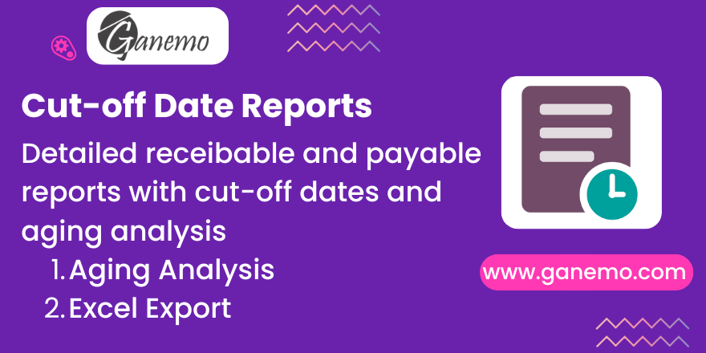

# Financial Statement Annexes

**Author**: [Ganemo](https://www.ganemo.com)

## Overview

Financial Statement Annexes adds a dedicated menu in accounting reports to generate Excel reports for accounts receivable and payable. It allows users to define a cut-off date to view balances exactly as they were at that time. Additionally, it offers optional aging buckets (1-30, 31-60, etc.) to analyze the maturity of debts.

## Key Features

*   **Cut-off Date Reporting**: Generate reports reflecting the exact state of accounts at any past date.
*   **Aging Analysis**: Optional columns to categorize debts by age (1-30 days, 31-60 days, etc.).
*   **Payable & Receivable**: Supports both account types.
*   **Excel Export**: Native Excel generation for easy manipulation and sharing.

## Usage

1.  Navigate to **Accounting > Reporting > Informes Financieros > Notas y Anexos (excel)**.
2.  Select the **Start Date** and **End Date** for the report period.
3.  Choose the specific **Accounts** you want to analyze.
4.  Toggle **Reporte de Antiguedad** if you need aging columns.
5.  Click **Descargar en Excel**.
