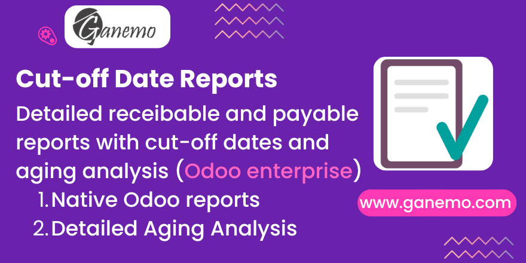

# Financial Statement Annexes (Enterprise)

**Author**: [Ganemo](https://www.ganemo.co)

## Overview
This module acts as an Enterprise-tier bridge for the **Financial Statement Annexes** solution. It seamlessly integrates the functionality of the base module into the Odoo Enterprise Interface.

## Key Features
*   **Enterprise Integration**: Adds dedicated menu items ("Financial Annexes" and "Aging") directly within the *Accounting > Reporting* section of Odoo Enterprise.
*   **Wizard Launcher**: Provides immediate access to the Excel Report Wizard, allowing users to generate detailed financial annexes and aging reports without navigating to custom menus.
*   **Clean Architecture**: Leverages the robust logic of the base `financial_statement_annexes` module, ensuring consistency and reliability across editions.

## Dependencies
*   `financial_statement_annexes` (Base Module)
*   `account_reports` (Odoo Enterprise)

---
*For support or further information, please visit [ganemo.co](https://www.ganemo.co).*
