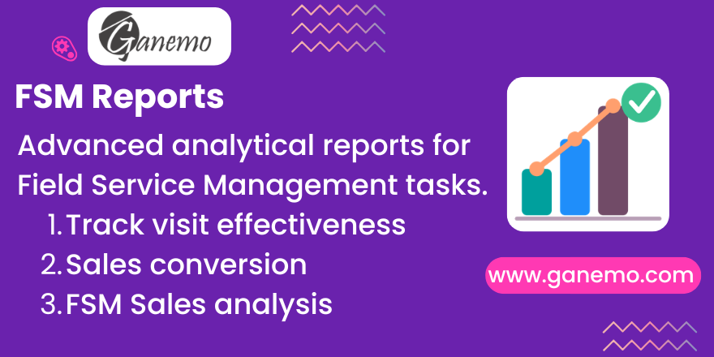

# **FSM Reports**



## Overview

Advanced SQL-based analytical reports for Odoo 19 Field Service Management. Know exactly how many visits your field team executed, how many were converted into sales, and how much revenue was generated — all broken down by salesperson, customer, and month.

This module adds three dedicated reports under the native **Field Service → Reporting** menu, powered by a performant PostgreSQL view model (`report.fsm.task.visit`).

---

## Features

### 📊 Report 1 — Efectividad de Visitas (Visit Effectiveness)
- Shows executed vs. not-executed visits for all tasks in state `1_done`
- Default pivot: Rows = Salesperson · Columns = Month
- Measures: Executed, Not Executed (from `not_executed` field of `auto_cancel_fsm_task`)
- Bar chart with stacked view
- **Access:** FSM User + FSM Manager

### 🔄 Report 2 — Conversión → Venta (Visit-to-Sale Conversion)
- Of executed visits, shows how many generated a confirmed Sale Order
- Includes `lost_reason_id` (from `fsm_sale_lost_reason`) for visits without a sale
- Default pivot: Rows = Salesperson · Columns = Month
- Measures: Executed, With Sale, Total Sales Amount
- Quick filter: "Sin Venta" → group by Lost Reason to diagnose conversion failures
- **Access:** FSM User + FSM Manager

### 💰 Report 3 — Análisis de Ventas (Sales Analysis)
- Revenue amounts, order count, and average ticket by customer and salesperson
- Default pivot: Rows = Customer + Salesperson · Columns = Month
- Measures: # Orders, Net Amount (untaxed), Total Sales
- Only shows tasks with confirmed (`sale`, `done`) Sale Orders
- **Access:** FSM Manager only (sensitive monetary data)

### 🔍 Shared Search View (all 3 reports)
| Type | Options |
|---|---|
| **Quick Filters** | Ejecutadas · No Ejecutadas · Con Venta · Sin Venta · Este Mes · Mes Anterior |
| **Group By** | Vendedor · Cliente · Proyecto · Motivo No Venta · Mes · Semana · Fecha |

---

## Row-Level Security

| Group | What they see |
|---|---|
| `group_fsm_user` | Only rows where **they are the assigned salesperson** |
| `group_fsm_manager` | All rows across all salespersons |

Security is implemented using standard Odoo **Record Rules** on the SQL view model. The JOIN on `project_task_user_rel` (M2M) generates one row per `(task, user)`, which enables the `user_id = uid` filter to work transparently without custom Python code.

---

## Technical Architecture

### SQL Model: `report.fsm.task.visit` (`_auto = False`)

**Key design decisions:**
- **JOIN on M2M table** — enables native Record Rules to filter by `user_id`
- **Pre-aggregated Sale subquery** — avoids cartesian product when multiple SOs exist per task
- **Pre-truncated date columns** (`planned_date`, `planned_week`, `planned_month`) — instant GROUP BY without runtime computation
- **`COALESCE` on all nullables** — prevents NULL aggregate issues in pivot views
- **`WHERE is_fsm = TRUE AND active = TRUE AND parent_id IS NULL`** — excludes non-FSM tasks and subtasks

### Fields

| Field | Source | Type |
|---|---|---|
| `task_id` | `project.task` | Many2one |
| `user_id` | M2M `project_task_user_rel` | Many2one |
| `partner_id` | `project.task.partner_id` | Many2one |
| `project_id` | `project.task.project_id` | Many2one |
| `planned_date_begin` | `project.task` | Datetime |
| `planned_date / planned_week / planned_month` | Computed in SQL | Date |
| `not_executed` | `auto_cancel_fsm_task` | Boolean |
| `executed` | `NOT not_executed` | Boolean |
| `lost_reason_id` | `fsm_sale_lost_reason` | Many2one |
| `has_sale` | Subquery on `sale.order` | Boolean |
| `sale_order_count` | Subquery SUM | Integer |
| `sale_amount_untaxed / sale_amount_total` | Subquery SUM | Monetary |

---

## Installation

### Dependencies (must be installed first)
1. `industry_fsm` — Native Odoo Field Service
2. `industry_fsm_sale` — FSM + Sales integration
3. `auto_cancel_fsm_task` — Adds `not_executed` flag
4. `fsm_sale_lost_reason` — Adds `lost_reason_id` field

### Install command
```bash
./odoo-bin -u fsm_reports -d <your_database>
```

Or install via the **Apps** menu in Odoo Settings.

---

## Configuration

No additional configuration is needed after installation. The reports are immediately available under **Field Service → Reporting**.

> **Note:** Report data is auto-refreshed on every page load since it queries the underlying PostgreSQL view directly.

---

## FAQ

**Q: The report shows duplicate rows for a task?**  
A: By design — a task assigned to multiple users generates one row per user, enabling row-level security per salesperson. Group by Task to de-duplicate in pivot view.

**Q: Sale amounts seem too high?**  
A: When a task has multiple assigned salespersons, sale amounts repeat per user row. Always group by both Task and Salesperson when analyzing revenue per visit.

**Q: Why can't I see the "Análisis de Ventas" menu?**  
A: This report is restricted to FSM Managers (`group_fsm_manager`). Ask your administrator for access.

**Q: Report shows no data after installation?**  
A: Ensure the project has FSM mode enabled (`is_fsm = True`) and tasks are assigned to users via the `user_ids` field.

---

## Compatibility

| Version | Status |
|---|---|
| Odoo 19 Enterprise | ✅ Supported |
| Odoo.SH | ✅ Supported |
| Ganemo Online | ✅ Supported |
| Odoo Community | ❌ Not supported |
| Odoo Online (SaaS) | ❌ Not supported (custom code restriction) |

---

**Author**: [Ganemo](https://www.ganemo.co)  
**License**: OPL-1  
**Version**: 19.0.1.0.0
