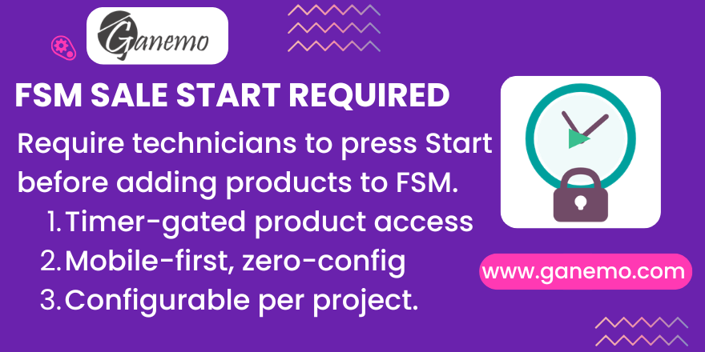

# **FSM Sale Start Required**

## Overview

This module enforces a simple but effective workflow control for Field Service teams: technicians **must press the Start button** on a task before they can access the product catalog (add materials or create a sale order line).

The restriction is activated at the **project level** with a single checkbox, visible under the *Products on Tasks* setting. It works independently of geolocation — it is purely a workflow control based on the FSM timer.

---

## The Problem

In standard Odoo FSM, a technician can add products to a task **without ever pressing Start**. This allows sales to be registered without the technician ever logging any presence on-site. If your business requires that work begins before billing is initiated, standard Odoo provides no way to enforce this.

---

## Features

- 📋 **Project-level configuration** — Enable or disable per project with a single checkbox.
- 🔒 **Timer-gated access** — Blocks the product catalog until a timer is started OR at least one timesheet entry exists.
- 📱 **Mobile-first** — Works identically on the Odoo mobile app and desktop. No separate config needed.
- 🔗 **Universal coverage** — Protects ALL product entry points:
  - Native FSM smart button (⚡ Products)
  - `fsm_quick_products` header button (fa-cubes)
  - Project sharing (portal) view
- ✅ **Non-invasive** — Uses a clean `super()` override chain. Zero risk of breaking other module flows.

---

## Configuration

### Step 1 — Enable in Project Settings

1. Go to **Field Service → Your Project → (⚙ Settings tab)**
2. Ensure **Products on Tasks** is checked.
3. A new sub-option **Require Start to Sell** will appear below it.
4. Check **Require Start to Sell** and save.

> **Note:** The field is only visible when *Products on Tasks* is enabled. It has no effect on non-FSM projects.

---

## Usage

### Without Start (Blocked)

When a technician tries to access the product catalog on a task where:
- No timer is currently running (`Start` not pressed), **AND**
- No timesheet entries exist yet on the task

They will see:

> ⚠ *"You must start the task timer (Start button) before adding products or materials to this task."*

### After Start (Allowed)

Once the technician presses **Start**, the product catalog opens normally. After **Stop** is pressed and the timesheet is saved, the catalog remains accessible on future visits.

---

## Technical Notes

### How the Condition Works

The restriction checks two fields on `project.task` via `sudo()`:

| Field | Meaning |
|---|---|
| `user_timer_id` | An active timer is currently running (Start pressed, Stop not yet done) |
| `timesheet_ids` | At least one timesheet entry has been saved (Start+Stop completed at least once) |

If **either** condition is `True`, access is granted. `sudo()` is used for read-only checks only — technicians with the `project_user` group may not have direct read access to all analytic lines.

### Compatibility with fsm_quick_products

`fsm_quick_products` adds an additional Products button (`fa-cubes`) in the task header via XML only — it has no Python override. Both buttons call the same method `action_fsm_view_material` on `project.task`, so **the single Python override in this module covers all entry points automatically**.

### Dependency

This module depends only on `industry_fsm_sale`. It does **not** require or depend on:
- `fsm_geofencing_control`
- `fsm_sale_lost_reason`
- `fsm_quick_products`

---

## Requirements

- Odoo 19 (Enterprise, Odoo.SH, or Ganemo Online)
- `industry_fsm_sale` must be installed

---

## Changelog

### v19.0.1.0.0
- Initial release
- `require_start_to_sell` field on `project.project`
- Override of `action_fsm_view_material` on `project.task`
- Spanish translation included

---

**Author**: [Ganemo](https://www.ganemo.co)
