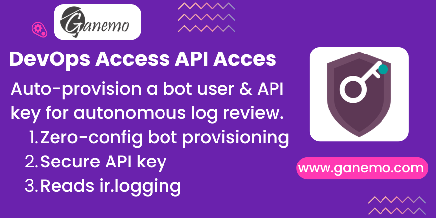

# **Ganemo DevOps Access**



## Overview

**Ganemo DevOps Access** is a technical Odoo 19 Enterprise module that automatically provisions a dedicated DevOps bot user (`agent@ganemo.co`) with a generated API key during module installation. This enables the [Antigravity AI agent](https://www.ganemo.co) to autonomously inspect `ir.logging` entries after a failed Odoo.SH deployment — without any manual developer intervention.

> ⚠️ **FOR STAGING / TESTING ENVIRONMENTS ONLY.** Do NOT install on production databases.

---

## Features

- 🤖 **Automatic Bot User Provisioning** — Creates `agent@ganemo.co` on install (or reuses if it already exists). Assigns the user to the `ERP Manager` group (`base.group_erp_manager`).
- 🔑 **Secure API Key Generation** — Generates an Odoo 19 `ir.api.key` and stores the key value in `ir.config_parameter` under `ganemo_devops.api_key`.
- 🔍 **Autonomous Log Inspection** — The Antigravity agent reads `ganemo_devops.api_key` via JSON-RPC 2.0, authenticates as the bot user, and queries `ir.logging` for `ERROR`-level entries to extract root-cause tracebacks.
- 🧹 **Clean Uninstall** — The `uninstall_hook` removes the bot user and deletes the `ganemo_devops.api_key` config parameter, leaving no orphaned data.

---

## Requirements

| Requirement | Detail |
|---|---|
| Odoo Version | 19.0 (Enterprise) |
| Environment | Odoo.SH, Ganemo Online, or Ganemo.SH |
| Dependencies | `base` only |
| Enterprise Module Required | `ir.api.key` (part of Odoo 19 Enterprise `base_setup`) |

---

## Installation

1. Place the module in your Odoo addons path.
2. Update the module list (`Apps > Update Apps List`).
3. Search for **Ganemo DevOps Access** and click **Install**.
4. The `post_init_hook` runs automatically and:
   - Creates (or reuses) the bot user `agent@ganemo.co`.
   - Generates an API key and stores it in system parameters.

---

## Configuration

No manual configuration is required. The module is self-configuring via hooks.

### Verify the setup

After installation, confirm:

1. **Settings → Users** — A user named **Ganemo DevOps Bot** (`agent@ganemo.co`) is present and active.
2. **Settings → Technical → Parameters → System Parameters** — A record with key `ganemo_devops.api_key` exists and has a non-empty value.
3. The bot user belongs to the **ERP Manager** group.

---

## How It Works — Agent Workflow

```
1. Antigravity agent deploys modules to Odoo.SH
2. Build completes (success or failure)
3. Agent reads ganemo_devops.api_key from ir.config_parameter via JSON-RPC 2.0
4. Agent authenticates as agent@ganemo.co using the API key
5. Agent queries ir.logging for ERROR-level entries
6. Agent extracts tracebacks and applies targeted code fixes
7. Agent re-deploys automatically (closes the CI/CD feedback loop)
```

---

## QA / Testing Scenarios

### Scenario 1 — Bot User Auto-Provisioning

1. Install `ganemo_devops_access` on a staging Odoo.SH instance.
2. Go to **Settings → Users**.
3. **Expected:** A user `agent@ganemo.co` (Ganemo DevOps Bot) is present and active.
4. **Expected:** The user belongs to the **ERP Manager** group.

### Scenario 2 — API Key Generation & Storage

1. After installation, go to **Settings → Technical → Parameters → System Parameters**.
2. Search for `ganemo_devops.api_key`.
3. **Expected:** The parameter exists with a non-empty API key value.
4. Authenticate via JSON-RPC 2.0 using the bot user and the API key. Read `ir.logging`.
5. **Expected:** Authentication succeeds and log records are returned.

### Scenario 3 — Clean Uninstall

1. Uninstall `ganemo_devops_access`.
2. **Expected:** The bot user `agent@ganemo.co` is removed (or archived).
3. **Expected:** The `ganemo_devops.api_key` system parameter is deleted.
4. **Expected:** No orphaned API keys remain in `ir.api.key`.

---

## Troubleshooting

| Issue | Cause | Fix |
|---|---|---|
| Bot user was not created after install | `post_init_hook` failed — may require Enterprise `ir.api.key` | Ensure this is an Odoo 19 **Enterprise** environment. Check `ir.logging` for hook errors. |
| API key is empty or authentication fails | Key was not generated correctly | Uninstall and reinstall. The `uninstall_hook` will clean up and the fresh `post_init_hook` will regenerate the key. |
| Can I install on production? | This module grants ERP Manager access to the bot | **Not recommended.** This module is designed for staging environments only. |
| Multi-company compatible? | Bot user operates at ERP Manager level | Yes. The bot can read `ir.logging` across all companies in the database. |

---

## Technical Reference

| Element | Value |
|---|---|
| Bot user email | `agent@ganemo.co` |
| Bot user name | `Ganemo DevOps Bot` |
| API key param key | `ganemo_devops.api_key` |
| Group assigned | `base.group_erp_manager` |
| Hook: install | `post_init_hook` in `hooks.py` |
| Hook: uninstall | `uninstall_hook` in `hooks.py` |
| License | OPL-1 |

---

## Changelog

### 19.0.1.0.3
- Fixed API key retrieval for Odoo 19 `ir.api.key` model.
- Improved `uninstall_hook` to properly clean up bot user and config parameter.

### 19.0.1.0.0
- Initial release.

---

**Author**: [Ganemo](https://www.ganemo.co)
