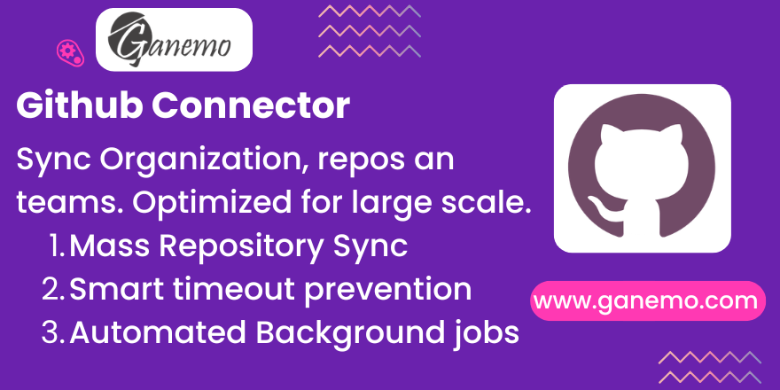

# Github Connector



**Author**: [Ganemo](https://www.ganemo.co)

## Overview

The **Github Connector** module provides a seamless integration between Odoo and GitHub. It allows you to synchronize your GitHub Organizations, Repositories, Branches, and Teams directly into Odoo.

Designed for performance and scalability, this module includes smart optimization features to handle large accounts with hundreds of repositories without timing out.

## Key Features

*   **Mass Synchronization:** fetch all your organizations and repositories with a single click.
*   **Smart Optimization:** The system checks the `last_update` date on GitHub. If a repository hasn't changed since the last sync, it overrides the heavy branch verification process, reducing sync time drastically.
*   **Batch Processing:** Configurable limits prevent server timeouts by processing repositories in manageable batches.
*   **Team Management:** Sync GitHub Teams and Members, mapping them to Odoo Partners.
*   **Branch Filtering:** Use "Organization Series" to filter which branches to sync (e.g., only "16.0", "17.0", "master").
*   **Automated Updates:** Scheduled actions (Crons) keep your data fresh in the background.

## Configuration

### 0. Dependencies

This module requires external Python libraries. If dependecies are not installed, the module will fail to load.

**For Odoo.sh:**
The `requirements.txt` file in the root of your repository is automatically detected and processed.

**For On-Premise / VPS:**
You must install them manually:

```bash
pip3 install -r requirements.txt
```

Required libraries:
*   `GitPython`
*   `pygount`
*   `pathspec`
*   `PyGithub`
*   `responses` (for tests)

### 1. GitHub Token

You need a **Classic Personal Access Token (PAT)** from GitHub to use this module.

1.  Go to your GitHub Settings > Developer settings > Personal access tokens > Tokens (classic).
2.  Generate a new token with the following scopes:
    *   `repo` (Full control of private repositories)
    *   `read:org` (Read organization data)
    *   `read:user` (Read user profile data)
3.  **SSO Note:** If your organization uses Single Sign-On (SSO), you must **Authorize** the token for your organization after creating it.

### 2. Odoo Settings

1.  Navigate to **Settings**.
2.  Select **Github Connector** from the settings sidebar.
3.  Paste your token into the **Github Token** field.
4.  Click **Save**.

## Usage

### Syncing Organizations

1.  Go to **GitHub > Organizations**.
2.  Create a new record.
3.  Enter your **Organization Name** (exactly as it appears in the URL, e.g., `ganemo`).
4.  Enter your **GitHub Token**.
5.  Click **Sync Repositories**.
    *   *First Run:* This might take some time. The system will process repositories in batches.
    *   *Subsequent Runs:* The system uses the "Smart Optimization" to skip unchanged repositories.

### Configuring Sync Limits

To prevent timeouts when syncing 400+ repositories:

1.  On the Organization form, look for the **Synchronization Settings** group.
2.  Adjust the **Branch Sync Limit per Batch**.
    *   **Default:** `20`.
    *   **Recommendation:** Keep it between 20-50 depending on your server's capacity.
    *   **How it works:** In every execution (manual or Cron), the system will deeply sync branches for up to X updated repositories.

### Filtering by Topic

You can filter which repositories are synchronized based on GitHub Topics:

1.  On the Organization form, in **Synchronization Settings**, fill in the **Sync Filter Topics** field.
2.  **Empty:** Syncs all repositories (no topic filter applied).
3.  **One topic** (e.g., `odoo-sync`): Only repositories tagged with that topic are synced.
4.  **Multiple topics** (comma-separated, e.g., `odoo-sync, odoo-module, priority`):
    *   The **first topic** is required (AND logic, filtered server-side by GitHub).
    *   The remaining topics use **OR logic** (filtered client-side): the repo must have at least one of them.
    *   **Result:** `odoo-sync AND (odoo-module OR priority)`.

> **Note:** Topics must match the ones configured in your GitHub repositories (Settings > Topics).

### Syncing Teams

1.  On the Organization form, click **Sync Teams**.
2.  This will fetch all teams and their members.
3.  Members are matched with Odoo Partners by email or login.

## Reports and Analysis

The module provides views to analyze your repositories:

*   **Repositories:** List view with filters for specific branches or series.
*   **Teams:** View team hierarchy and membership.

## Automated Synchronization

The module installs a **Scheduled Action** (Cron): `Github: Synchronize All Organizations`.

*   **Frequency:** Every 4 hours (Default).
*   **Behavior:** It iterates through all configured organizations and performs an incremental sync, respecting the batch limits.

## Troubleshooting

*   **Timeout / 504 Gateway Time-out:**
    *   Reduce the "Branch Sync Limit per Batch" in the Organization settings.
*   **Private Repos not showing:**
    *   Verify your Token has the `repo` scope.
    *   If using SSO, ensure the token is authorized for the specific organization.
*   **Missing Branches:**
    *   Check your "Organization Series" configuration. If you haven't defined any series, check if the module is filtering by default. Add "main" or "master" to your allowed series.

## Credits

**Author**: [Ganemo](https://www.ganemo.co)
**Maintainer**: Ganemo
