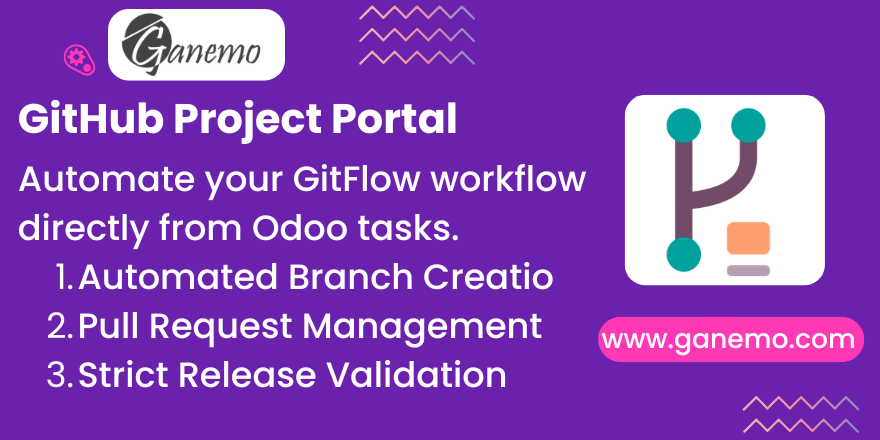

# **GitHub Project Portal**

Integrate Odoo Projects with GitHub to automate your development lifecycle. This module enforces a strict GitFlow workflow managed directly from your Odoo tasks, ensuring code quality and process compliance.

## Features

*   **Automated GitFlow**: Automatically creates branches (Feature/Fix) when tasks move to "Doing".
*   **PR Management**: Automatically creates and updates Pull Requests when tasks move to "Review".
*   **Module Validation**: Enforces `__manifest__.py` version updates before allowing merges.
*   **Release Automation**: Tags and Releases are generated automatically upon deployment to Production.
*   **Traceability**: Every task is linked to its specific GitHub branch and PRs.

## Configuration

1.  **GitHub Token**: Go to *System Parameters* and set your GitHub Access Token.
2.  **Organization & Repositories**: Configure your GitHub Organization and link your Repositories in Odoo.
3.  **Project Settings**: Enable "GitHub Project" on your Odoo Project tasks to activate the workflow.
4.  **Review Teams**: Assign default review teams for Pull Requests.

## Usage

Follow the GitFlow stages in your Kanban board:

1.  **Backlog**: Plan your task.
2.  **Doing**: Move here to start work. The system creates a branch (e.g., `FIX_123_MODULE`).
3.  **Review**: Move here when code is ready. The system creates a PR to the development branch.
4.  **Testing**: Move here after approval. The PR is merged, and a Release Candidate (RC) tag is created.
5.  **Prod**: Move here to deploy. The system merges to the main branch, creates a final Release, and deletes temporary branches.

## Authors

*   **Author**: [Ganemo](https://www.ganemo.com)
