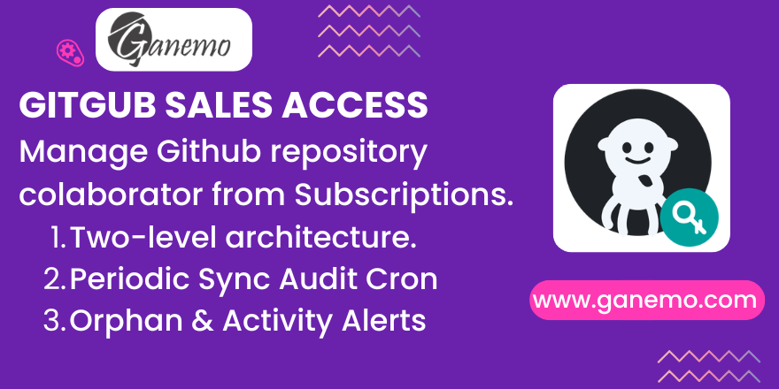

# **GitHub Sales Access**



## Overview

**GitHub Sales Access** bridges your Odoo sales subscriptions and GitHub repository collaborator management. When a customer purchases a GitHub Connector product, this module automatically tracks, syncs, and audits their GitHub repository access — directly from the sale order.

No more manually managing GitHub collaborators spreadsheets. No more forgotten access from expired subscriptions.

---

## Features

- **Two-Level Architecture** — `github.sales.access` (parent: one per user/subscription) → `github.sales.access.repo` (child: one per repository), cleanly separating the user grant from per-repository permissions.
- **Smart Button on Sale Orders** — See the number of GitHub access records linked to any sale order at a glance, and navigate to them with a single click.
- **Granular Sync & Revoke** — Sync or revoke repository access on a per-repository basis or all-at-once using the parent record's action buttons.
- **Monthly Sync Cron** — Automatically re-invites all active collaborators every month to ensure GitHub invitation validity.
- **Weekly Orphan Detection Cron** — Compares GitHub collaborators against active Odoo subscriptions. Users present on GitHub but without active subscriptions are flagged as **Orphans** and an admin activity alert is created.
- **Discrepancy Filters** — Predefined filters in the GitHub Access menu to surface anomalies: *Active in GitHub but subscription expired* and *Subscription active but no GitHub user set*.
- **Error Handling & Activity Alerts** — When a GitHub API call fails (seat limit, 403, invalid token, etc.), the status is set to *Error* and an Odoo activity is created for the responsible salesperson.
- **Full Chatter & Activity Support** — `mail.thread` and `mail.activity.mixin` on the parent model for complete auditability.
- **Multi-Language** — English and Spanish (es_ES, es_PE, es_MX) translations included.

---

## Architecture

```
github.sales.access (parent)
├── order_line_id     → sale.order.line (GitHub Connector product line)
├── github_partner_id → res.partner (with github_name filled)
├── github_username   → Char (auto-filled; editable for orphans)
├── github_status     → Selection (computed from worst child status)
└── repo_ids [One2many]
    └── github.sales.access.repo (child)
        ├── repository_id → github.repository
        ├── github_status → Selection (draft/pending/active/inactive/error/orphan)
        ├── last_sync_date
        └── sync_message  → API response or error detail
```

**Status priority (worst propagates to parent):**
`orphan < error < inactive < pending < draft < active`

---

## Prerequisites

1. **GitHub Product Document** module must be installed (provides `github.repository` model and the *Is GitHub Connector* product flag).
2. At least one **GitHub Repository** configured with a valid API token under *Sales → GitHub Repositories*.
3. Odoo partners must have the **GitHub Login** (`github_name`) field filled in.

---

## Installation

Install via the Odoo App Store or upload the module ZIP. All dependencies are automatically resolved.

---

## Configuration

### 1. Mark the Product as GitHub Connector
Go to **Sales → Products**, open the connector product, and enable **Is GitHub Connector** on the product form.

### 2. Configure GitHub Repositories
Go to **Sales → GitHub Repositories** and ensure each repository has a connected GitHub API token with collaborator management scope (`admin:org` or `write:org`).

### 3. Set GitHub Login on Partners
For each customer that will receive GitHub access, open their contact card and fill in the **GitHub Login** field with their exact GitHub username.

---

## Usage

### Granting Access
1. Create and confirm a Sale Order with the GitHub Connector product line.
2. Click the **GitHub Access** Smart Button on the sale order.
3. Create a new access record: select the GitHub partner.
4. In the **Repositories** tab, add the repositories, then click **Sync** per row or **Sync All** on the parent.

### Revoking Access
- Use the **Revoke** button on a specific repository row to immediately remove the collaborator.
- Use **Revoke All** on the parent record to revoke all repository access at once.

### Cron Jobs
| Cron | Frequency | Action |
|---|---|---|
| GitHub Access — Sync Active Accesses | Monthly | Re-invites all active collaborators |
| GitHub Access — Check Discrepancies | Weekly | Detects orphan collaborators and raises activity alerts |

---

## Status Values

| Status | Meaning |
|---|---|
| Draft | Record created, sync not yet performed |
| Pending | Invitation sent, awaiting acceptance |
| Active | Collaborator confirmed in GitHub |
| Revoked | Access removed |
| Error | GitHub API error — check Sync Result field |
| Orphan ⚠️ | GitHub collaborator with no active Odoo subscription |

---

## Technical Notes

- Models: `github.sales.access`, `github.sales.access.repo`
- Depends on: `github_product_document`, `sale`, `sale_management`
- License: OPL-1

---

## Author

**Author**: [Ganemo](https://www.ganemo.com)

Ganemo is a multi-award-winning Odoo Gold Partner, trusted across USA, Mexico, Chile, Spain, Colombia, Ecuador, and Peru for high-quality Odoo apps and implementations.

📧 Sales: leads@ganemo.com  
📧 Support: help@ganemo.com  
🌐 Website: https://www.ganemo.co  
💬 WhatsApp: +1 (828) 672-6150
