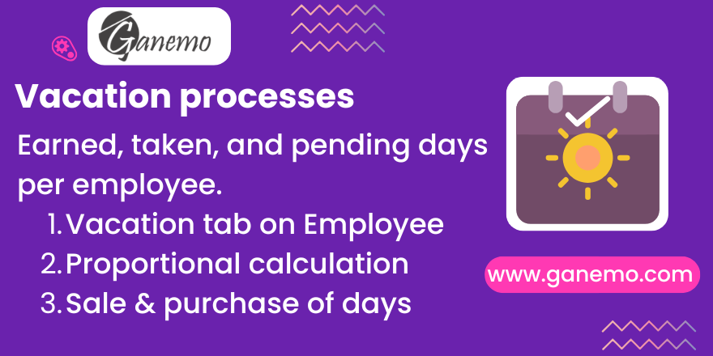

# **Holiday Process**

## Overview

**Holiday Process** is an Odoo 19 module that manages the complete employee vacation lifecycle. It adds a dedicated **Vacation & Allowances** tab to the employee form, providing a real-time summary of earned, taken, and pending vacation days. Through wizard-based tools, HR managers can mass-generate vacation allocations with proportional calculation and process vacation sale and purchase petitions integrated with payroll.

---

## Features

- **Vacation & Allowances Tab**: Added directly on the `hr.employee` form. Shows all leave allocations with computed days, days taken (enjoyed or paid), and pending balance — updated in real time.
- **Holiday Generator Wizard**: Mass-generate `hr.leave.allocation` records for all or selected employees. Uses each employee's work calendar (`resource.calendar`) to calculate proportional vacation days for the selected period.
- **Holiday Petition Wizard**: Structured wizard for employee vacation sale or purchase requests. Linked to payroll for automatic settlement in the next payslip.
- **Holiday Update Wizard**: Recalculate and update existing vacation allocations when contract or salary conditions change.
- **Payroll Integration**: Vacation data flows directly into payroll computations. Settlement amounts appear automatically in payslip processing.
- **Deletion Protection**: Allocations with linked absences cannot be deleted — a `ValidationError` is raised to protect data integrity.

---

## Dependencies

This module requires the following Odoo modules:

| Module | Purpose |
|---|---|
| `employee_service` | Employee service date / seniority calculation |
| `holidays_accrual_advanced` | Advanced accrual rules for leave allocations |
| `hr_payroll` | Payroll integration for vacation settlements |
| `hr_work_entry_holidays` | Work entry types for vacation-related absences |

---

## Installation

1. Copy the `holiday_process` folder to your Odoo `addons` directory.
2. Update the Apps list: **Settings > Apps > Update Apps List**.
3. Search for **Holiday Process** and click **Install**.
4. No additional configuration is required after installation.

---

## Configuration

### Step 1: Verify Leave Types
After installation, the module automatically creates the required leave types via `data/hr_leave_type_data.xml`. No manual setup is needed.

### Step 2: Set Employee Work Schedules
Ensure every employee has a valid **Work Schedule** (resource.calendar) assigned:
- Go to **Employees > Employee > Work Information tab**.
- Select the appropriate work schedule.

> Employees without a work schedule will produce zero or incorrect vacation day calculations.

### Step 3: Generate Vacation Allocations
- Go to **Payroll > Holidays > Holiday Generator**.
- Select the target period (From / To dates).
- Optionally filter by specific employees.
- Click **Generate** — allocations are created automatically with proportional calculations.

---

## Usage

### Vacation & Allowances Tab
- Open any employee: **Employees > [Employee Name]**.
- Navigate to the **Vacation & Allowances** tab.
- The tab displays:
  - **Computed Days** (`computed_holiday`): Total earned vacation days for the allocation.
  - **Days Taken** (`used_holiday`): Days already enjoyed or paid out.
  - **Pending Days** (`pending_holiday`): Remaining balance (Computed − Taken).

### Creating a Vacation Absence (Sale/Purchase)
1. Open a validated vacation allocation on the employee tab.
2. Click **Create Holiday Absence**.
3. A new `hr.leave` record is created referencing the allocation.
4. Once the absence is validated, `Pending Days` decreases accordingly.

### Deleting an Allocation
- If an allocation has linked absences, a `ValidationError` will be raised.
- First delete or cancel all related absences, then delete the allocation.

### Payroll Settlement
- Vacation petitions (sale) processed via the wizard are linked to payroll.
- When computing the employee's payslip for the corresponding period, the settlement amount is included automatically.

---

## Technical Reference

### Models Extended

| Model | Extension |
|---|---|
| `hr.employee` | Adds `has_holidays`, `holidays_per_year`, `additional_days`, `hr_allocation_ids` fields and work-day calculation batch method. |
| `hr.leave.allocation` | Adds `to_date`, `from_date`, `deadline`, `is_holiday`, `computed_holiday`, `used_holiday`, `pending_holiday` fields. |
| `hr.leave` | Adds `hr_leave_id`, `from_date`, `from_to` fields. `hr_leave_id` links absence to its parent allocation. Visibility of `hr_leave_id` is controlled by the `show_in_time_off_request` boolean on the selected leave type. |
| `hr.payslip` | Integrates vacation settlement data in payslip computation. |
| `resource.calendar` | Extends proportional work-day calculation for vacation periods. |
| `hr.leave.type` | Adds `show_in_time_off_request` boolean. When enabled, the **Allocation** field appears on time off request forms for that leave type. |

### Key Fields on `hr.leave.allocation`

| Field | Type | Description |
|---|---|---|
| `computed_holiday` | Float | Total earned vacation days (stored, computed from accrual). |
| `used_holiday` | Float | Days taken or paid out (sum of linked non-refused absences). |
| `pending_holiday` | Float | Balance: `computed_holiday − used_holiday`. |
| `is_holiday` | Boolean | True if the allocation is of the "Vacation" leave type. |
| `deadline` | Date | Maximum date by which vacations must be enjoyed. |

---

## Compatibility

| Environment | Supported |
|---|---|
| Odoo 19 Enterprise | ✅ Yes |
| Odoo.SH | ✅ Yes |
| Ganemo Online / Ganemo.SH | ✅ Yes |
| Odoo Online (SaaS) | ❌ No (custom code restrictions) |

---

## Multi-Language Support

Fully translated into **English** and **Spanish** (es_PE, es_ES, es_MX).

---

## License

This module is distributed under the **Odoo Proprietary License v1.0 (OPL-1)**.
See `LICENSE.txt` for full terms.

---

**Author**: [Ganemo](https://www.ganemo.co)
