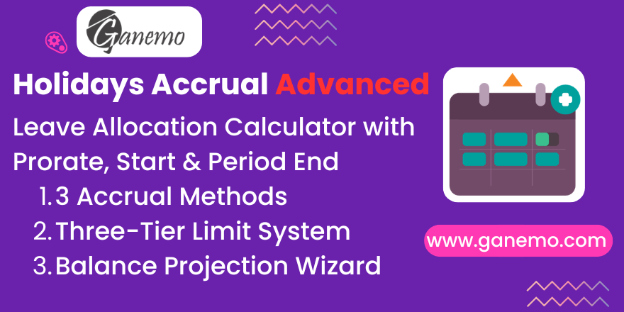

# **Holidays Accrual Advanced**

## Overview

This module replaces Odoo's standard accrual allocation engine with a **fully customizable leave allocation calculator**. It gives HR managers fine-grained control over how, when, and how much vacation time is accrued per employee — with built-in limits and a complete audit trail.

## Key Features

### 🔄 Three Accrual Methods

| Method | Behavior |
|--------|----------|
| **Prorate** | Days accrued proportionally: `(worked days / workable days) × allocation per period`. Employees with unpaid leaves get proportionally less. |
| **Period Start** | Full allocation granted at the **beginning** of each period. |
| **Period End** | Full allocation granted at the **end** of each completed period. |

### 🛡️ Three-Tier Limit System

1. **Accrual per Period Limit** — Caps the maximum days earned in a single period. If exceeded, the excess is recorded as a loss entry.
2. **Carryover Limit** — Caps how many days can roll over from one period to the next. Excess balance is trimmed at period start.
3. **Total Balance Limit** — Sets an absolute ceiling on accumulated days. Once reached, no further accrual is added.

Each limit is independently togglable with its own threshold value.

### 📋 Accruement Audit Ledger

Every allocation maintains a detailed history of all balance changes via the `hr.leave.allocation.accruement` model:

- **Gains**: "Start-of-period accruement", "End-of-period accruement", "Prorate accruement for X of Y days"
- **Losses**: "Loss due to period carry-over limit", "Loss due to accrued amount limit", "Loss due to accumulation limit"

Each entry records the date, amount (positive or negative), and descriptive reason.

### 🔮 Balance Projection Wizard

The **"Calculate as of Date"** button on validated allocations opens a wizard that:

1. Accepts any target date (past or future)
2. Runs the full period-by-period calculation
3. Shows the projected balance and a complete accruement breakdown

This is useful for projecting future balances or auditing historical calculations.

## Configuration

### Creating an Accrual Allocation

1. Go to **Time Off → Managers → Allocation**.
2. Create a new allocation and set **Type = Accrual Allocation**.
3. Configure:
   - **Allocation per Accrual Period**: How many days/hours to accrue per period (default: 20 days).
   - **Unit of time**: Days or Hours (hours are auto-converted using the employee's calendar).
   - **Accrual Period Duration**: The length of each period (e.g., 1 month, 1 year).
   - **Accrual Method**: Prorate, Period Start, or Period End.
4. Optionally enable limits:
   - **Limit Number of Days Accrued**: Max per single period.
   - **Limit Number of Days to Carryover**: Max balance carried to next period.
   - **Limit Total Balance**: Absolute maximum accumulated.
5. Validate the allocation.

### Recalculating Allocations

- **Individual**: Select allocations → Action menu → "Recalculate Accrual Allocations"
- **Bulk**: Go to Time Off → Configuration → "Recalculate Accrual Allocations" menu item
- **Automatic**: The Odoo cron job (`_update_accrual`) runs periodically

### Using the Balance Projection Wizard

1. Open a validated accrual allocation.
2. Click the **"Calculate as of Date"** button in the header.
3. Select a date → The wizard displays the projected balance and full accruement history.

## Dependencies

| Module | Purpose |
|--------|---------|
| `hr_holidays` | Core time-off management |
| `hr` | Employee records |

## Security

- **Employees** can view only their own accruement history (read-only).
- **Time Off Officers** have full read/write access to all accruements.
- **Managers** have full access without restrictions.

## Technical Notes

- The module overrides `resource.mixin.get_work_days_data()` to support custom domain filtering and consistent 1/16th day rounding.
- Fields `time_type` and `unpaid` are stored on `hr.leave` and `resource.calendar.leaves` for efficient interval filtering.
- The calculation engine uses `dateutil.relativedelta` for accurate period arithmetic across months and years.
- Recalculation is **idempotent** — it replaces all previous accruement entries with freshly computed ones.

## Compatibility

| Platform | Supported |
|----------|-----------|
| Odoo.SH | ✅ |
| Ganemo Online | ✅ |
| On-Premise (Enterprise) | ✅ |
| Odoo Online | ❌ (custom code not allowed) |

## License

This module is licensed under **OPL-1** (Odoo Proprietary License v1.0).

**Author**: [Ganemo](https://www.ganemo.com)