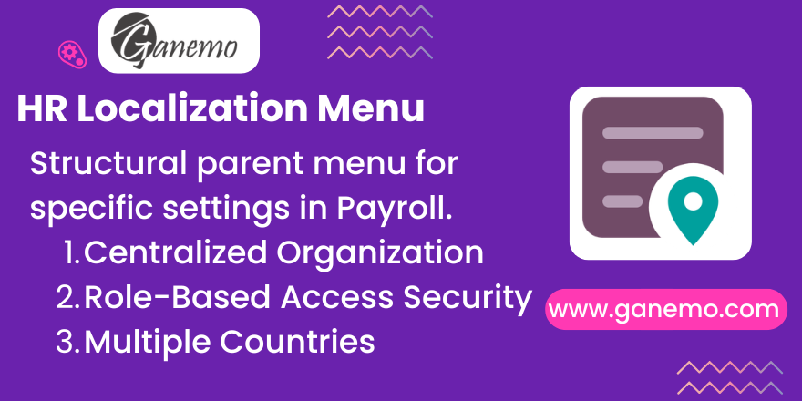

# **HR Localization Menu**



**Author**: [Ganemo](https://www.ganemo.com)

---

## Description

**HR Localization Menu** adds a dedicated **Localización** parent menu item to the Odoo Payroll application. It serves as the structural foundation for all region-specific payroll sub-modules (EPS, AFP, Pension System, Work Occupation, Life Insurance, etc.), consolidating configuration, reports, and settings into a single, clean navigation entry — exclusively accessible to **Payroll Managers**.

---

## The Problem It Solves

Without a unified parent menu, each localization sub-module adds its own top-level entry to the Payroll navigation, resulting in a cluttered, hard-to-manage interface. This module solves that by providing one consistent entry point that:

- Keeps the Payroll navbar clean and organized.
- Puts sensitive localization settings behind role-based access control.
- Allows any number of sub-modules to attach their menus in a structured hierarchy.

---

## Features

| Feature | Details |
|---|---|
| **Centralized Navigation** | Single `Localización` menu in the Payroll app (sequence: 75) |
| **Role-Based Access** | Visible only to `Payroll > Manager` group |
| **Sub-Module Ready** | Acts as the parent for all localization sub-modules |
| **Country Agnostic** | Works for any region-specific payroll extension |
| **Multi-Company Support** | Works across multiple companies in the same Odoo instance |

---

## Quick Setup

1. Install the module `hr_localization_menu` from the Odoo Apps menu.
2. Ensure your user belongs to the **Payroll > Manager** group (Settings → Users & Companies → Users → select user → Payroll section).
3. Navigate to the **Payroll** application.
4. The **Localización** menu will appear in the top navigation bar.

> **Note:** The menu will appear **empty** until at least one localization sub-module is installed (e.g., `eps_process`, `life_insurance_management`).

---

## How Sub-Modules Hook In

To add a menu entry under **Localización**, declare the following in your sub-module's menu XML:

```xml
<menuitem
    id="your_submenu_id"
    name="Your Feature"
    parent="hr_localization_menu.hr_localization_menu_root"
    sequence="10"
    groups="hr_payroll.group_hr_payroll_manager"
/>
```

And add `hr_localization_menu` to your module's `depends` list in `__manifest__.py`.

---

## Menu Reference

| Menu XML ID | Label | Parent | Group | Sequence |
|---|---|---|---|---|
| `hr_localization_menu_root` | Localization | Payroll Root | Payroll Manager | 75 |

---

## Dependencies

- `hr_payroll` (Odoo Enterprise)

---

## Compatibility

| Platform | Supported |
|---|---|
| Odoo 19 Enterprise | ✅ |
| Odoo.SH | ✅ |
| Ganemo Online | ✅ |
| Odoo Online (SaaS) | ❌ (custom code restriction) |

---

## Translations Provided

- English (Base)
- Spanish (`es`, `es_PE`, `es_MX`)

---

## FAQ

**Q: I am a Payroll Manager but I don't see the Localización menu.**
> A: Verify your user really belongs to the **Payroll > Manager** group in Settings → Users & Companies → Users. After assigning the group, log out and back in.

**Q: The Localización menu is visible but empty.**
> A: No localization sub-module has been installed yet. Install a module such as `eps_process` or `life_insurance_management` and its items will appear automatically under Localización.

**Q: Can I use this for non-Peruvian payroll localizations?**
> A: Yes. The menu is country-agnostic. Any payroll sub-module can register its items under `hr_localization_menu_root` regardless of the country.

---

## Support

| Channel | Contact |
|---|---|
| **Sales / Quotes** | [leads@ganemo.com](mailto:leads@ganemo.com) |
| **Technical Support** | [help@ganemo.com](mailto:help@ganemo.com) |
| **WhatsApp** | +1 (828) 672-6150 |
| **Book a Demo** | [ganemo.co/appointment/5](https://www.ganemo.co/appointment/5) |
