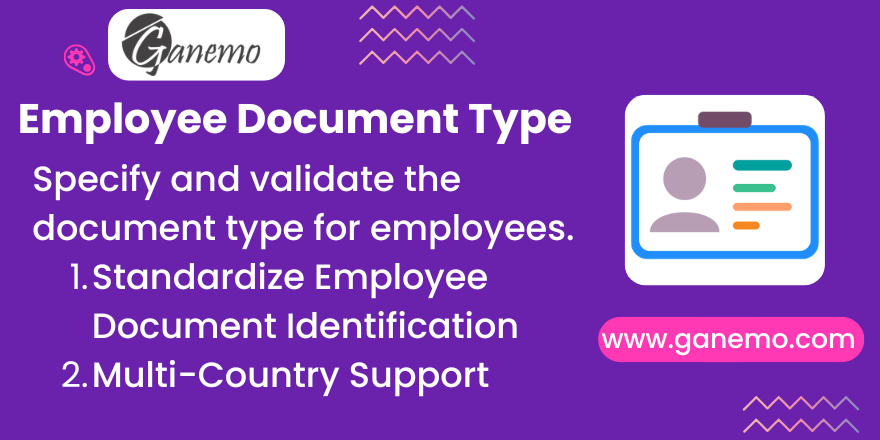

# Employee Document Type

**Author**: [Ganemo](https://www.ganemo.com)

## Overview
The **Employee Document Type** module enhances Odoo's Human Resources application by introducing proper categorization for employee identifications. Instead of a single, generic ID Number field, this module allows administrators and HR personnel to specify the exact *Type* of document (e.g., National ID, Passport, Driver's License) an employee holds.

Furthermore, built upon Odoo's Latin American localization base (`l10n_latam_base`), this module smartly handles international employees by dynamically prompting for the document's issuing **Country** when a foreign document type is selected.

## Features
* **Specific Document Types:** Replaces generic identification logic with categorized, structured document types (e.g. DNI, Passport, Foreign Resident Card).
* **Dynamic Country Selection:** Automatically reveals an 'Issuing Country' field only when the selected document type is flagged as international or foreign.
* **Seamless HR Integration:** Plugs directly into the standard `hr.employee` form without cluttering the interface.
* **Standards Compliant:** Utilizes Odoo's core `l10n_latam.document.type` configuration, ensuring compatibility with accounting and contact management standards.

## Configuration & Usage

### 1. Defining Document Types
Before assigning document types to employees, ensure your system has them configured:
1. Since the module uses standard Odoo structure, Document Types are managed centrally.
2. If necessary, navigate to the general Contacts or Invoicing configuration to review existing `l10n_latam.document.type` records.

### 2. Assigning to Employees
1. Navigate to the **Employees** dashboard (`hr.employee`).
2. Open an existing employee or create a new one.
3. Switch to the **Personal Information** tab.
4. Locate the Identification section. You will now see a **Document Type** dropdown.
5. Select the appropriate document type from the predefined list.

### 3. Handling International Documents
1. If you select a document type that is designated for foreign use (e.g., Passport), a new **Document Country** field will dynamically appear below it.
2. Select the country that issued the document.
3. If the document type is national, this field will remain hidden to keep the interface clean.

## Troubleshooting & FAQ

**Q: I don't see the "Document Country" field on the employee form. Is the module broken?**
A: No, this is by design. The `document_country_id` field is dynamically hidden if the associated document type is considered "national" to your company's localized setup. It will only appear when a foreign/international document type is selected.

**Q: Where do I add a new Document Type if the one I need isn't in the dropdown?**
A: Since this module integrates with `l10n_latam_base`, the document types are shared across the system (Contacts, Accounting, etc.). You can create new types from the standard Accounting Localization configuration menus.

**Q: Why does this rely on `l10n_latam_base` if I'm not in Latin America?**
A: Odoo's `l10n_latam_base` provides an excellent, robust architectural foundation for standardizing Document Types (`l10n_latam.document.type`) that works perfectly globally. Relying on it prevents recreating redundant data structures.
