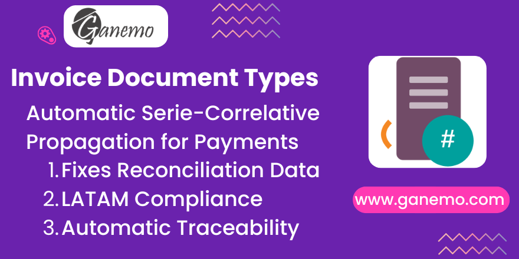

# Invoice Document Types & Series (Propagation)

## Overview
This module facilitates the automatic propagation of **LATAM Document Types** (`l10n_latam_document_type_id`) and **Document Series/Correlatives** (Number) from Invoices to their related Payments and Journal Entries.
In Odoo's standard accounting, when a payment is reconciled with an invoice, the generated accounting lines for the payment often lack the specific reference to the official document type and number (e.g., "Factura F001-123"). This module solves this by copying that data, ensuring full traceability in your accounting ledgers and reports.

## Features
- **Automatic Propagation:** Instantly copies Document Type and Number from Invoices (Customer/Vendor) to Payment Journal Entries upon reconciliation.
- **LATAM Localization Support:** Fully compatible with `l10n_latam_invoice_document`, prioritizing standard localization fields.
- **Refund Support:** Works with Invoices, Bills, and Refunds (Credit Notes).
- **Space Sanitization:** Automatically removes empty spaces from document numbers to ensure data consistency.

## Configuration
No complex configuration is required.
1.  **Install** the module.
2.  Ensure your **Journals** (Sales/Purchase) are configured to "Use Documents" if required by your localization.
    - Go to *Accounting > Configuration > Journals*.
    - Enable *Use Documents* (LATAM setting).

## Usage
### 1. Create an Invoice
- Create a Customer Invoice or Vendor Bill.
- Select the **Document Type** (e.g., Factura, Boleta).
- Enter the **Document Number** (e.g., F001-00045).
- **Post** the invoice.

### 2. Register Payment
- Click *Register Payment* on the invoice.
- Validate the payment.

### 3. Verify Journal Entry
- Go to the Journal Entry created by the payment.
- Inspect the **Journal Items** (tab).
- You will see two populated columns:
    - **Document Type**: The type from the invoice.
    - **Serie-Correlativo**: The number from the invoice (e.g., F001-00045).

## Technical Notes
- **Dependencies:** `account`, `l10n_latam_invoice_document`.
- **Odoo Version:** 19.0.
- **Logic:**
    - For Vendor Bills, checks `l10n_latam_document_number` first, then falls back to `ref`.
    - Removes all spaces from the resulting number string.

## Credits
**Author**: [Ganemo](https://www.ganemo.com)
