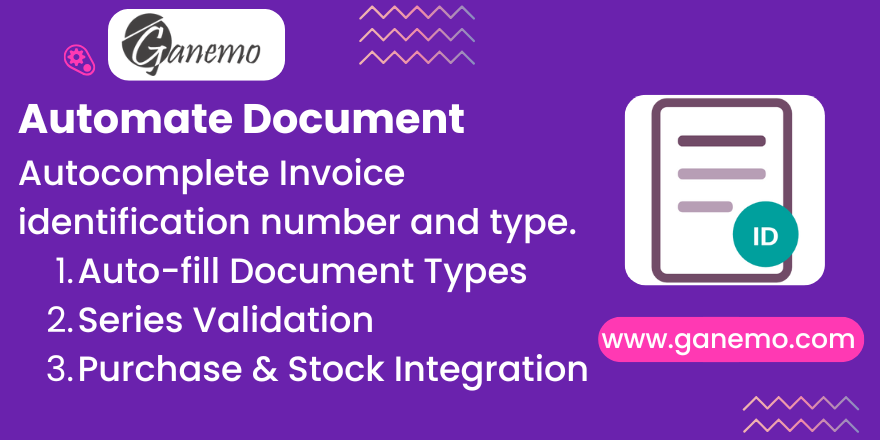

# **Kardex PLE 13.1 - Transfer Document Capture**

**Author**: [Ganemo](https://www.ganemo.com)

## Description

For the Peruvian **PLE 13.1** (*Registro de Inventario Permanente Valorizado* / Kardex), SUNAT requires each inventory movement to declare the **document** that supports it: its **type**, **series** and **number**.

The native Kardex report builds the series/number from the invoice's `name`. In journals that **do not "use documents"** (`l10n_latam_use_documents = False`, common in legacy journals), that `name` is an **internal sequence**, not the real fiscal number — so the PLE reports the wrong series/folio to SUNAT.

This module fixes that by **capturing the real fiscal document on every stock movement**. The three fields (`Transfer Doc Type`, `Series`, `Number`) live on the **stock movement** (`stock.move`), not on the picking, because a single transfer very often involves **several documents** (multi-invoice receipts and deliveries).

> **Important:** capturing the fields alone does not change any report. To make the Kardex actually *read* these fields, also install the companion bridge module **`l10n_pe_reports_stock_transfer_document`**. This module only captures the data.

## Key Features

- **Per-movement capture**: type + series + number are stored on each `stock.move`, so multi-document pickings are handled correctly.
- **Invoice-first, guide-second priority**: for each movement the document is taken from its own line's invoice (purchase/sale), using `l10n_latam_document_number → ref → name`; if there is no invoice, it falls back to the picking's **remission guide** (SUNAT type `09`) so the field is always visible.
- **Event-driven population**: fields are filled automatically when the invoice is **posted** and when the stock movement is **done** — no manual step for the common case.
- **Manual-edit protection (`manual_override`)**: any value you type by hand is flagged and is **never** overwritten by automatic population or by the "force" mass action.
- **Mass correction (historical records)**: two server actions on the movements list — *fill empty* and *force re-derive (keeps manual)* — plus a safe "anti-empty" guard that never wipes a good value.
- **Quick-set**: a one-click action on the picking to stamp a single document onto all its movements (respecting manual edits).
- **SUNAT format validation**: series/number are constrained to ≤ 20 characters and a positive/`0` number, at the model level.

## Requirements & Compatibility

- Odoo **19** (Enterprise / Odoo.SH / Ganemo Online).
- Depends on: `stock`, `l10n_latam_invoice_document`, `purchase_stock`, `sale_stock`.
- The **remission guide** fallback additionally requires the guide field on the picking (provided by `l10n_pe_edi_stock`). Where that module is absent, the guide fallback simply does not trigger and the movement is left to the native report behaviour.
- To feed the captured data into the Kardex report, install **`l10n_pe_reports_stock_transfer_document`**.

## Installation

1. Copy the module into your `addons` path.
2. Update the apps list and install **Kardex PLE 13.1 - Transfer Document Capture**.
3. (Recommended) Install the bridge **`l10n_pe_reports_stock_transfer_document`** so the Kardex uses the captured data.

## Where to see the fields

The three fields are added to `stock.move` and are **hidden by default** in the movement lists (Inventory ▸ Reporting ▸ *Product Moves*, and the picking's operations list). Use the **optional columns** selector (the ⚙️ toggle on the top-right of the list) to show *Transfer Doc Type*, *Transfer Doc Series*, *Transfer Doc Number* and *Transfer Doc Manually Set*.

## Usage

### Purchases

1. Create and confirm a **Purchase Order** and validate the **receipt**.
2. Register the **Vendor Bill** with its fiscal document (type + `l10n_latam_document_number`) and **post** it.
3. On posting, the receipt movement's *Transfer Doc* fields are filled automatically from the bill (type, series, number). Posting the bill takes priority over any remission-guide value.

### Sales

1. Confirm a **Sales Order** and validate the **delivery**.
2. Create and **post** the customer invoice with its fiscal document.
3. The delivery movement is populated from the invoice (via the sale order line linkage).

### Transfers / Remission Guides (no invoice)

- When a movement has **no** sale/purchase invoice but the picking carries a **remission guide number**, the fields are filled with document type **`09`** (Guía de Remisión) and the guide's series/number, so the column is never empty. This mirrors what the native Kardex already emits, so the report result is unchanged — only more visible.

### Manual editing & Quick-set

- You can type the type/series/number directly on any movement. That value is flagged as **manual** and will not be overwritten automatically.
- For the frequent "one picking = one document" case, use the **Set PLE Document** button on the picking to stamp one document onto every movement at once (manual movements are skipped).

### Historical / bulk correction

- Select movements in the *Product Moves* list and run:
  - **PLE: Fill empty transfer documents** — only fills movements that are still empty.
  - **PLE: Force transfer documents (keep manual)** — re-derives and overwrites non-manual movements; your manual entries are preserved.
- Correcting a document on an already-posted invoice does **not** re-trigger automatically; run the *force* action before generating the PLE for the period. It is recommended to schedule this monthly.

## How it decides the document (summary)

| Situation | Captured document |
|---|---|
| Movement's line has a posted invoice | Invoice's type + series + number (`l10n_latam_document_number → ref → name`) |
| No invoice, picking has a remission guide | Type `09` + the guide's series/number |
| Neither | Left empty → native Kardex behaviour |

The capture uses **only** native stock/account signals; it never reads the picking's transfer reason (`l10n_pe_operation_type` / *motivo de traslado*).

## Support

For commercial inquiries: [leads@ganemo.com](mailto:leads@ganemo.com).
For technical support and bug reports: [ayuda@ganemo.com](mailto:ayuda@ganemo.com) or visit [ganemo.co](https://www.ganemo.co).
