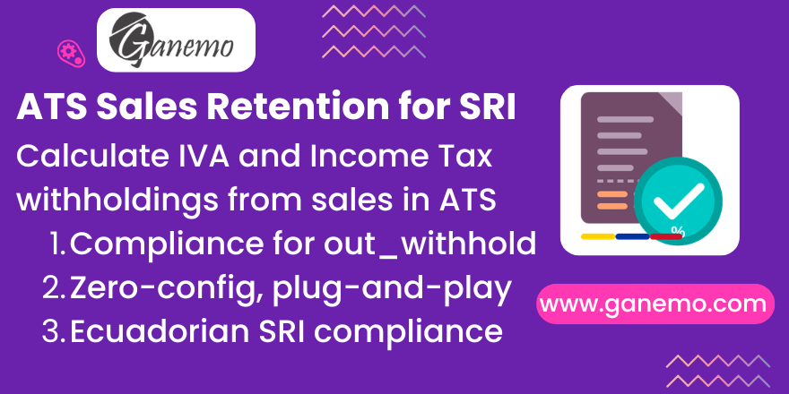

# **Ecuador - ATS Sales Retention**



## Overview

This module fixes a critical gap in Odoo's Ecuadorian ATS (Anexo Transaccional Simplificado) report: the **sales withholding fields** `<valorRetIva>` and `<valorRetRenta>` are always reported as `0.00`, even when customer withholdings (`out_withhold`) have been registered and posted against sale invoices.

After installing this module, the ATS report will correctly calculate and include the actual IVA and Income Tax retention amounts received from customers, ensuring full **SRI compliance**.

## The Problem

In Odoo's standard `l10n_ec_reports_ats` module, the method `_get_sales_info_by_partner` initializes `valorRetIva` and `valorRetRenta` to `0.0` but never populates them with actual data from customer withholdings. This means:

- ❌ `<valorRetIva>` always shows `0.00`
- ❌ `<valorRetRenta>` always shows `0.00`
- ❌ The ATS XML does not reflect real withholding amounts received from customers

## The Solution

This module **overrides** `_get_sales_info_by_partner` to:

1. Call the original method (preserving all existing behavior)
2. Query `account.move.line` for **posted** `out_withhold` tax lines linked to the sale invoices
3. Filter by tax group types:
   - `withhold_vat_sale` → accumulated into `valorRetIva`
   - `withhold_income_sale` → accumulated into `valorRetRenta`
4. Sum the amounts per commercial partner group key

After installation:

- ✅ `<valorRetIva>` reflects actual IVA withholding amounts
- ✅ `<valorRetRenta>` reflects actual Income Tax withholding amounts
- ✅ Only **posted** withholdings are included (cancelled/draft are ignored)
- ✅ Values are correctly grouped by commercial partner, document type, and emission type

## Dependencies

| Module | Description |
|--------|-------------|
| `l10n_ec_reports_ats` | Ecuador ATS Report (Odoo Enterprise) |

This module implicitly depends on `l10n_ec_edi` (provides the withholding infrastructure) and `account_reports` (provides the tax report handler).

## Installation

1. Place `l10n_ec_ats_sales_retention` in your custom addons path.
2. Update the apps list: **Apps → Update Apps List**.
3. Search for **"ATS Sales Retention"** and click **Install**.

> **No additional configuration is required.** The fix is applied automatically.

## Usage

### Standard Workflow

1. **Create and post a sale invoice** (`out_invoice`) as usual.
2. **Register a customer withholding** (`out_withhold`) using Odoo's standard withholding wizard. Select the appropriate IVA retention and/or Income Tax retention taxes.
3. **Post the withholding**.
4. **Generate the ATS report**: Go to **Accounting → Reports → Tax Report → ⚙️ → ATS**.
5. The generated XML will now contain the **correct, non-zero values** for `<valorRetIva>` and `<valorRetRenta>`.

### Verification

Open the generated ATS XML file and look for the `<ventas>` → `<detalleVentas>` section. For each partner with posted withholdings, you should see:

```xml
<valorRetIva>12.50</valorRetIva>
<valorRetRenta>3.75</valorRetRenta>
```

Instead of the previous:

```xml
<valorRetIva>0.00</valorRetIva>
<valorRetRenta>0.00</valorRetRenta>
```

## Technical Details

- **Override point**: `_get_sales_info_by_partner` on `account.tax.report.handler`
- **Data source**: `account.move.line` records where:
  - `l10n_ec_withhold_invoice_id` links to a sale invoice
  - `tax_line_id` is set (tax line, not base line)
  - `parent_state` = `posted`
  - `tax_line_id.tax_group_id.l10n_ec_type` ∈ `['withhold_vat_sale', 'withhold_income_sale']`
- **Grouping**: Uses the same `(commercial_partner, latam_document_type_code, tipoEmision)` key as the original method
- **Amount**: `abs(balance)` is used to ensure positive values

## FAQ

**Q: Will this module affect purchase withholdings in the ATS?**
A: No. This module only modifies the **sales** section (`<ventas>`) of the ATS report. Purchase withholdings (`in_withhold`) remain unchanged.

**Q: What happens if a withholding is cancelled?**
A: Cancelled withholdings are excluded. Only withholdings in **posted** state are included in the calculation.

**Q: Is this compatible with multi-company?**
A: Yes. The module uses the existing Odoo infrastructure and respects company boundaries.

**Q: Which Odoo version is supported?**
A: Odoo 18 Enterprise.

## Compatibility

| Platform | Supported |
|----------|-----------|
| Odoo Enterprise (Odoo.SH) | ✅ |
| Ganemo Online / Ganemo.SH | ✅ |
| Odoo Online | ❌ (Custom code not allowed) |
| Odoo Community | ❌ (Requires Enterprise modules) |

## License

OPL-1 (Odoo Proprietary License v1.0)

**Author**: [Ganemo](https://www.ganemo.co)
