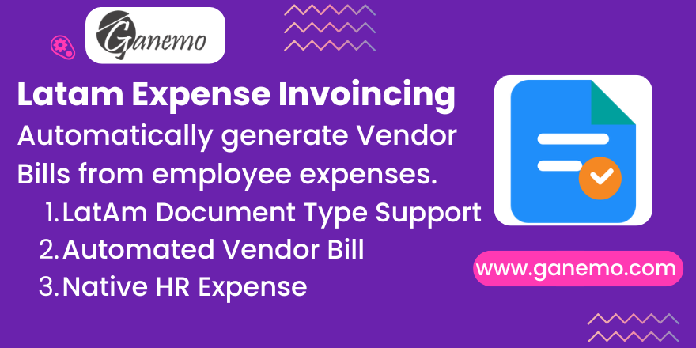

# LatAm Expense Invoice Automation

Bridge module to include LatAm document types in automated expense vendor bills seamlessly.

## Features
- **LatAm Document Type Support**: Employees can specify the legal document type and number directly on their expense receipts.
- **Automated Vendor Bill Propagation**: The document information is automatically transferred to the generated vendor bill.
- **Strict Compliance**: Configure mandatory document types for expenses to ensure no tax-deductible receipt is missed.

## Configuration
1. Go to **Accounting > Configuration > Settings**.
2. Locate the **Expenses** section.
3. Configure **Allowed Document Types**, **Force Document Type**, and **Default Document Type** according to your company's tax requirements.

## Usage
1. Go to **Expenses** and create a new expense.
2. Fill in the **Document Type** and **Document Number** fields.
3. Submit and approve the expense. 
4. Check the generated Vendor Bill; the document type and number will be mapped automatically.

**Author**: [Ganemo](https://www.ganemo.com)
