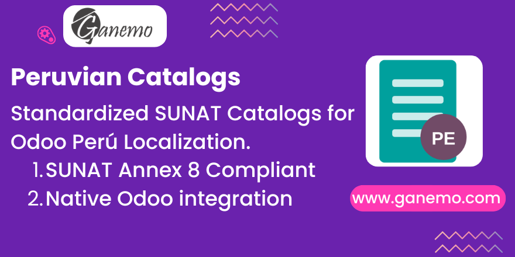

# **Catálogos SUNAT / Peruvian SUNAT Catalogs**

## Description / Descripción

This module integrates the official catalogs required by SUNAT (Peruvian Tax Authority) for Electronic Invoicing and Accounting into Odoo. It standardizes the identification types, document types, payment methods, and service classifications according to SUNAT Annex 8.

Este módulo integra los catálogos oficiales requeridos por la SUNAT para la Facturación Electrónica y Contabilidad en Odoo. Estandariza los tipos de identificación, tipos de documentos, medios de pago y clasificaciones de servicios según el Anexo 8 de SUNAT.

## Features / Características

*   **Catalog 01 (Document Types)**: Adds special document types like Guía de Remisión (09, 31) and others not present in standard Odoo.
*   **Catalog 06 (Identity Types)**: Extends standard identification types with SUNAT codes.
*   **Catalog 53 (Charge/Discount Codes)**: Standard codes for discounts and charges on invoices.
*   **Catalog 54 (Item Classification)**: Official codes for goods and services (UNSPSC alternative).
*   **Catalog 59 (Payment Methods)**: Full list of payment means (Transfer, Cash, Check, etc.).

## Installation / Instalación

1.  Install the app from the Odoo Apps dashboard.
2.  The data is loaded automatically upon installation.
3.  **Dependencies**: This module depends on `l10n_pe` (Peru - Accounting) to ensure compatibility.

## Configuration / Configuración

No manual configuration is needed. The catalogs are available immediately after installation.
No se requiere configuración manual. Los catálogos están disponibles inmediatamente después de la instalación.

## Usage / Uso

*   **Document Types (Cat. 01)**: Provides the complete list of SUNAT document types (Annex 8) ready to be used by the localization.
*   **Master Data**: Loads standardized tables for Identity Types (Cat. 06), Service Classifications (Cat. 30), Charge/Discounts (Cat. 53), and Payment Methods (Cat. 59).
*   **Developers**: Extends `product.template` to include SUNAT Catalog 53 (Charge/Discount Codes), serving as a base for advanced localization features.

## Author

**Author**: [Ganemo](https://www.ganemo.co)
