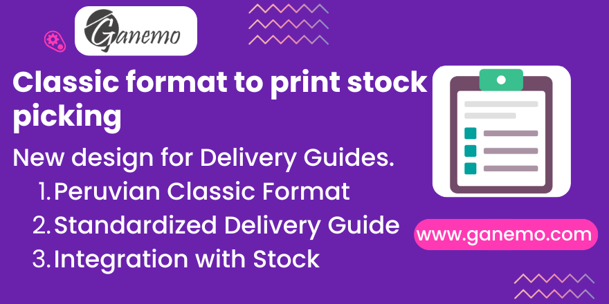

**Classic Peruvian Format for Delivery Guides**

## Summary
Add an additional, classic-style stock picking peruvian format.

## Description
This module allows you to print the **Delivery Guide (Guía de Remisión)** using the classic format widely used in Peru. It ensures compliance with SUNAT requirements, including the display of:
*   QR Code (from localized EDI module).
*   Transport details (Driver, Vehicle, Carrier).
*   Total Gross Weight.
*   Origin and Destination addresses.

## Requirements
*   `l10n_pe_edi_stock` (Peruvian Localization - Stock)
*   `stock_picking_print_note`

## Usage
1.  Go to **Inventory > Transfers**.
2.  Open a transfer that has been validated / done.
3.  Click on the **Print** (Imprimir) button.
4.  Select **e-Guía de Remisión** (Electronic Delivery Guide).
5.  The PDF will be generated in the classic format.

## Authors
*   **Author**: [Ganemo](https://www.ganemo.com)

## Maintainers
This module is maintained by **Ganemo**.

For support or bug reports, please contact us at [leads@ganemo.com](mailto:leads@ganemo.com).
