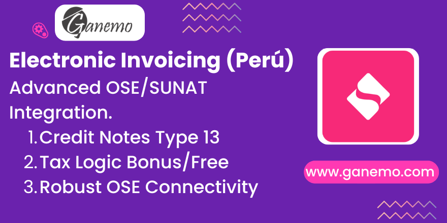

# **Electronic Invoicing Peru**

## Description

This module extends the capabilities of Odoo's localization for Peru, adding advanced features for Electronic Invoicing (CPE). It enables direct integration with OSE (Electronic Service Operators) and SUNAT, implements specific flows for Credit Notes (Type 13), and automates validations for Detractions (SPOT).

## Features

*   **OSE/SUNAT Integration**: Allows configuration of specific WSDL URLs for production and test environments, facilitating connection with providers like Digiflow or directly with SUNAT.
*   **Correction Credit Notes (Type 13)**: Implements the workflow to correct pending payment amounts or due dates without annulling the original invoice, compliant with SUNAT regulations.
*   **Payment Methods**: Incorporates the 'Payment Method' field in invoices, required for the XML structure of the electronic document.
*   **SPOT (Detractions) Validation**: Automatically validates operations subject to detraction (amounts >= 700 PEN), ensuring the correct 'Operation Type' is selected before posting.
*   **Related Documents**: managing various related document types (Debit Notes, Anticipated Invoices, etc.) with their respective SUNAT codes (01, 02, 03, etc.).

## Configuration

No advanced technical configuration is required, but you must set up your connection endpoints:

1.  Go to **Accounting > Configuration > Settings**.
2.  Locate the **Peruvian Electronic Invoicing** section.
3.  Enter the **OSE WSDL** URLs for both **Test** and **Production** environments.
    *   These URLs are provided by your OSE (e.g., Digiflow) or SUNAT.

## Usage

### 1. Electronic Invoicing (General)
*   Create a Customer Invoice as usual.
*   In the **Other Info** tab (or where configured in your view), ensure the **Payment Method** field is set. This is mapped to the `payment.methods.codes` catalog.
*   Upon posting, the module helps generate the correct XML UBL 2.1 tags required by SUNAT.

### 2. Correction Credit Notes (Type 13)
This feature allows you to issue a Credit Note specifically to correct the *Net Amount Pending Payment* of an existing invoice, denoted by SUNAT Catalog 09 Code 13.

1.  Open the posted Invoice you need to correct.
2.  Click **Add Credit Note**.
3.  Select **Reason**: *Correction of the net amount pending payment and/or due dates (Type 13)*.
4.  The system will generate the corresponding credit note with the specific XML tags for this operation type.

### 3. Detractions (SPOT)
*   If you create an invoice for a service subject to detraction and the total amount is **>= 700 PEN** (or equivalent):
*   You must ensure the **Operation Type** is set to a value that includes detraction (e.g., 1001, 1002, etc.).
*   If you try to post a standard invoice (Operation Type 0101) with a high amount for a product subject to detraction, the system will raise a **Validation Error** preventing the post until the correct Operation Type is selected.

**Author**: [Ganemo](https://www.ganemo.com)
