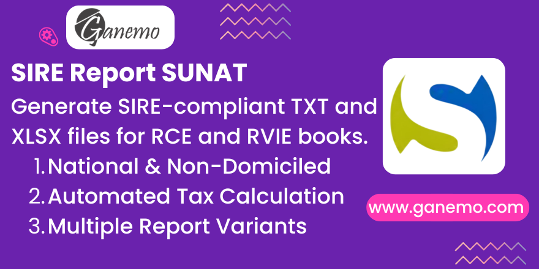

# **Format SIRE SUNAT (Book Sale and Purchase)**



## Overview

This module generates **SIRE SUNAT compliant** TXT and XLSX files for Peruvian purchase (RCE) and sales (RVIE) electronic registries directly from Odoo. The output files are ready to upload to the [SUNAT SIRE platform](https://e-menu.sunat.gob.pe/cl-ti-itmenu/MenuInternet.htm).

**SIRE** (Sistema Integrado de Registros Electrónicos) is SUNAT's electronic registry system that replaced the traditional PLE for managing purchase and sales books. It requires taxpayers to submit their purchase and sales records electronically in specific formats.

**Version**: `19.0.1.0.1` | **License**: `OPL-1` | **Author**: [Ganemo](https://www.ganemo.co)

---

## Features

### Sales Reports (RVIE)
- **General Format**: Complete sales registry in SUNAT-specified format.
- **Accept Proposed**: Accept SUNAT's proposed sales records.
- **Add to Proposed**: Add records to the proposed sales batch.
- **Replace Proposed**: Replace SUNAT's proposed records with custom ones.
- **Subsequent Adjustments**: Submit corrections to previously declared periods.

### Purchase Reports (RCE) — National
- **General Format**: Full registry for domestic supplier invoices.
- **Accept Proposed**: Accept SUNAT's proposed purchase records.
- **Add to Proposed**: Add records to the proposed purchase batch.
- **Replace Proposed**: Replace proposed records.
- **Include/Exclude Proposed**: Selectively include or exclude proposed records.
- **Modify Proposed**: Modify existing proposed records.
- **Subsequent Adjustments**: Submit corrections to previously declared periods.
- **Detailed Tax Breakdown**: IGV (gravada, mixta, no gravada), ISC, ICBP, other taxes.

### Purchase Reports (RCE) — Non-Domiciled
- **Informed**: Full registry for foreign supplier transactions.
- **General Format**: Complete data format for non-domiciled purchases.
- **Subsequent Adjustments**: Corrections for previously declared periods.
- **Specialized Fields**: Country code, income type (`type_rent`), linkage (`link_economic`), withholding data, exoneration codes, CDI (convenio para evitar doble imposición).

### Complement Reports
- **Purchase Complements**: Rate and general complement data for physical CPE documents.
- **Complements Rate**: Exchange rate supplement reports.

### Technical Highlights
- **High-Performance SQL**: Uses PostgreSQL functions (`get_tax`, `get_tax_purchase`, `validate_string`) for tax calculations at the database level.
- **Multi-Currency Support**: Automatically calculates exchange rates for non-PEN invoices using `1 / invoice_currency_rate`.
- **Dual Output**: Every report generates both TXT (for SUNAT upload) and XLSX (for review/audit), packaged in a downloadable ZIP.
- **Smart Defaults**: Wizard fields pre-populate with the previous month's period, the current year, and the most common configuration values.

---

## Module Architecture

```
l10n_pe_sire_sunat/
├── models/
│   ├── sire_sale_base.py          # Base model for all sales wizards (year, month, period logic)
│   ├── sire_purchase_base.py      # Base model for all purchase wizards (SQL queries, processing)
│   ├── account_move.py            # Adds `l10n_pe_is_complement_sire` field to invoices
│   └── res_company.py             # Adds `exceeds_1500_uit` field to companies
├── wizards/
│   ├── sire_sale_wizard.py        # RVIE main wizard
│   ├── sire_sale_add_proposed_wizard.py  # RVIE "Add to Proposed" wizard
│   ├── sire_purchase_national_wizard.py  # RCE National purchases wizard
│   ├── sire_purchase_not_domiciled_wizard.py  # RCE Non-domiciled wizard
│   ├── sire_purchase_complements_wizard.py    # RCE Complements wizard
│   └── sire_purchase_complements_rate_wizard.py  # RCE Complements Rate wizard
├── reports/                       # 16 report generators (XLSX + TXT per variant)
│   ├── sire_sale_*.py             # Sales: general, accept, add, replace, subsequent
│   ├── sire_purchase_*.py         # Purchases: general, accept, add, replace, include/exclude, modify, subsequent
│   ├── sire_purchase_not_domiciled_*.py  # Non-domiciled: informed, general, subsequent
│   └── sire_purchase_complements_rate.py # Complements rate
├── sql/
│   ├── get_tax.sql                # PostgreSQL function for sales tax calculations
│   ├── get_tax_purchase.sql       # PostgreSQL function for purchase tax calculations
│   └── validate_string.sql        # PostgreSQL function for string sanitization
├── views/
│   ├── account_move_views.xml     # Adds SIRE complement checkbox to invoice form
│   ├── account_menuitem.xml       # Menu entries under Accounting > Reports
│   └── res_company_views.xml      # Adds "Exceeds 1500 UIT" checkbox to company form
├── security/
│   └── ir.model.access.csv        # ACL rules for all 6 wizards
└── tests/
    └── test_l10n_pe_sire_sunat.py # Integration tests for report generation
```

### Inheritance Hierarchy

```
sire_sale_base (AbstractModel)
├── sire.sale.wizard                    → RVIE main report
└── sire.sale.add.proposed.wizard       → RVIE add to proposed

sire_purchase_base (AbstractModel)
├── sire.purchase.national.wizard       → RCE National purchases
├── sire.purchase.not.domiciled.wizard  → RCE Non-domiciled purchases
├── sire.purchase.complements.wizard    → RCE Complements
└── sire.purchase.complements.rate.wizard → RCE Complements Rate
```

---

## Dependencies

| Module | Purpose |
|--------|---------|
| `ple_sale_book` | Base sales book structure, PLE fields, tax tag configuration |
| `ple_purchase_book` | Base purchase book structure, PLE fields, `is_nodomicilied` flag |
| `base` | Core Odoo framework |

**Transitive dependencies** (available via `ple_sale_book` / `ple_purchase_book`):
- `account_origin_invoice` — Origin invoice fields for credit/debit notes.
- `dua_in_invoice` — DUA/DSI customs fields (`year_aduana`, `code_aduana`).
- `base_spot` — Detraction fields (replaced by native `l10n_pe_detraction_*` in V19).
- `l10n_pe_reports` — PLE state, correlative, and report helper fields.

---

## Configuration

### Prerequisites
1. Install **PLE Sale Book** and **PLE Purchase Book** modules.
2. Run the **PLE Tax Config Wizard** to link tax tags to your company's taxes. Without this step, **tax amounts will appear as zero** in reports.
3. Ensure currency rates are configured in **Accounting > Configuration > Currencies** for multi-currency invoices.

### Company Settings
- Navigate to **Settings > Companies > Your Company**.
- Enable the **Exceeds 1500 UIT** checkbox if your company's annual income exceeds 1500 UIT (Unidades Impositivas Tributarias). This activates the `classification_services` field in purchase reports as required by SUNAT.

### Invoice Preparation
- Invoices must have **PLE dates** assigned (via PLE Sale/Purchase Book).
- Enable the **SIRE Complement** checkbox (`l10n_pe_is_complement_sire`) on invoices that represent physical CPE documents to include them in complement reports.
- For non-domiciled purchases, set the **`is_nodomicilied`** flag on the `account.move` to route the invoice to the non-domiciled report.
- For credit/debit notes, fill in the **Origin Document** fields (`origin_l10n_latam_document_type_id`, `origin_number`, `origin_invoice_date`).

### Journal Configuration
- Journals with `ple_no_include = True` are **excluded** from all reports.
- Only `purchase` type journals are used for purchase reports; only `sale` type for sales reports.

---

## Usage

### Wizard Defaults

All wizards open with smart defaults to minimize manual input:

| Field | Default Value | Notes |
|-------|--------------|-------|
| **Year** | Current year (or previous year if current month is January) | Dynamic selection showing years from 2010 to next year, most recent first |
| **Month** | Previous month | January defaults to December (of previous year) |
| **Estado de envío** | `[1] Empresa o entidad operativa` | Most common value for active companies |
| **Código de oportunidad** | `[02] Cuando reemplaza la propuesta` | RVIE and RCE Nacional wizards |

### Generating Sales Reports (RVIE)
1. Go to **Accounting > Reports > Reporte SIRE > Reporte RVIE**.
2. The **Period** fields (Year + Month) default to the previous month.
3. Select the **Código de oportunidad** (defaults to `[02] Cuando reemplaza la propuesta`).
4. Click **Generar Reporte**.
5. Download the generated **Excel Report** (XLSX) and **TXT Report** (ZIP containing the TXT file).

### Generating Purchase Reports (RCE) — National
1. Go to **Accounting > Reports > Reporte SIRE > Reporte RCE - Compras nacionales**.
2. Verify the pre-filled period and adjust if needed.
3. Fill in the **Correlativo** if the opportunity code requires it (`03` or `04`).
4. Click **Generar Reporte**.
5. The report includes all domestic purchase invoices with complete tax breakdowns.

### Generating Purchase Reports (RCE) — Non-Domiciled
1. Go to **Accounting > Reports > Reporte SIRE > Reporte RCE - Compras no domiciliadas**.
2. Same workflow as national purchases.
3. The report includes: country code, partner address, income type, withholding data, CDI, exoneration, and all non-domiciled specific fields.

### Complement Reports
- **Complements Wizard**: Access via selecting invoices in the `account.move` list view (batch action). Year and month are auto-filled from the selected invoices.
- **Complements Rate Wizard**: Access via selecting currency rates in the `res.currency.rate` list view (batch action). Year and month are auto-filled from the selected rates.

### Report Variants (Opportunity Codes)

**RVIE (Sales)**:
| Code | Variant |
|------|---------|
| `01` | Acepta la propuesta |
| `02` | Reemplaza la propuesta |
| `03` | Ajustes posteriores |
| `04` | Ajustes de periodos anteriores — Formato general |

**RCE Nacional (Purchases)**:
| Code | Variant |
|------|---------|
| `01` | Acepta la propuesta |
| `02` | Reemplaza la propuesta |
| `03` | Ajustes posteriores |
| `04` | Ajustes de periodos anteriores — Formato general |

**RCE No Domiciliados**:
| Code | Variant |
|------|---------|
| `00` | No domiciliados informado |
| `03` | Ajustes posteriores |
| `06` | Ajustes de periodos anteriores — Formato general |

---

## Technical Notes

### Serie/Correlativo Priority (Purchases)

Both National and Non-Domiciled purchase reports determine the invoice **Serie del CDP** and **Nro CP** using a **3-level priority** resolved in `_process_query_results()`:

| Priority | Source | Description |
|----------|--------|-------------|
| **1st** | `l10n_latam_document_number` | Via ORM. Only used if the journal has `l10n_latam_use_documents = True`. |
| **2nd** | `account_move.ref` | Supplier reference (manual input on the invoice). |
| **3rd** | `account_move.name` | Journal entry name (e.g., `BILL/2024/05/0001`). |

The prioritized value is then split at the first `-` separator:
- **Before `-`** → `ref_serie` (Serie del CDP)
- **After `-`** → `ref_correlative` (Nro CP)

**Special cases:**
- Document type `46`: Serie is zero-padded to 4 characters.
- Non-Domiciled reports: Correlative has leading zeros stripped (`.lstrip('0')`).

### Non-Domiciled CF (Constancia de Retención) Fields

These fields come directly from the `account.move` record (not from the priority logic):

| Report Column | Source Field | Description |
|---------------|-------------|-------------|
| **Serie CP CF** | `account_move.inv_serie` | Serie of the withholding certificate |
| **Año CF** | `account_move.inv_year_dua_dsi` | Year of the DUA/DSI |
| **Nro CP CF** | `account_move.inv_correlative` | Correlative of the withholding certificate |
| **Monto Ret** | `account_move.inv_retention_igv` | IGV retention amount |
| **Tipo CP CF** | `inv_type_document.code` | Document type of the withholding certificate |

### Exchange Rate Handling
- Uses Odoo's native `invoice_currency_rate` with inverse formula: `1 / invoice_currency_rate`.
- PEN invoices show no exchange rate (empty).
- Non-PEN invoices display the direct rate rounded to 3 decimals (e.g., `3.750`).

### Detraction Fields
Purchase reports reference:
- `l10n_pe_detraction_date` — Detraction voucher payment date (V19 native field).
- `l10n_pe_detraction_number` — Detraction voucher number (V19 native field).
- `detraction_id` — Used to detect if the invoice has a detraction applied.

### SQL Functions

| Function | File | Purpose |
|----------|------|---------|
| `get_tax(move_id, move_type)` | `sql/get_tax.sql` | Calculates 12 sales tax values by matching tax tags on invoice lines |
| `get_tax_purchase(move_id, move_type)` | `sql/get_tax_purchase.sql` | Calculates 10 purchase tax values by matching tax tags on invoice lines |
| `validate_string(text, max_length)` | `sql/validate_string.sql` | Removes special characters and truncates text for SUNAT compliance |

These functions are installed/updated automatically when the module is upgraded.

### Query Filtering Logic

The base SQL WHERE clause filters invoices by:
1. **Company**: Matches the wizard's selected company.
2. **Move type**: `in_invoice` / `in_refund` (purchases) or `out_invoice` / `out_refund` (sales).
3. **Period**: Matches `DATE_PART('year/month', ple_date)` against the selected year/month.
4. **State**: Excludes `draft` and `cancel` invoices.
5. **Journal**: Excludes journals with `ple_no_include = True`.
6. **Journal type**: Only `purchase` (RCE) or `sale` (RVIE) journals.
7. **Complement flag**: Complements wizard adds `l10n_pe_is_complement_sire = True`.
8. **Non-domiciled flag**: Non-domiciled wizard adds `is_nodomicilied = True`.
9. **Declaration state**: Filters by `ple_its_declared` depending on the opportunity code.

---

## Security

### Access Control

| Group | Read | Write | Create | Delete |
|-------|------|-------|--------|--------|
| `account.group_account_readonly` | ✅ | ❌ | ❌ | ❌ |
| `account.group_account_invoice` | ✅ | ✅ | ✅ | ❌ |

All 6 wizards share the same ACL structure. No record rules are applied (transient models).

---

## Compatibility

| Platform | Supported |
|----------|-----------|
| Odoo Enterprise (Odoo.SH) | ✅ |
| Ganemo Online / Ganemo.SH | ✅ |
| Odoo Online | ❌ (custom code restrictions) |

**Odoo Version**: 19.0

---

## Troubleshooting

| Issue | Cause | Solution |
|-------|-------|----------|
| "Error al ejecutar la consulta" | SQL functions not installed | Update the module: **Apps > l10n_pe_sire_sunat > Upgrade** |
| Tax amounts are all zero | Tax tags not linked to company taxes | Run the **PLE Tax Config Wizard** |
| Exchange rate shows `1.000` for USD | Missing currency rates | Configure rates in **Accounting > Configuration > Currencies** |
| Non-domiciled invoices appear in national report | `is_nodomicilied` not set | Set the `is_nodomicilied` checkbox on the `account.move` |
| Complement invoices not included | Complement flag not set | Enable **SIRE Complement** checkbox on the invoice |
| "No hay contenido que presentar" warning | No invoices match the period/filters | Verify that invoices exist for the selected period with correct PLE dates and journal configuration |
| Report columns Serie/Nro CP are empty | Invoice has no `l10n_latam_document_number`, no `ref`, and `name` has no `-` separator | Ensure the invoice has a proper document number or fill the supplier reference (`ref`) field |

---

## Multi-Language Support

This module is available in **English** and **Spanish** (es_ES, es_PE, es_MX).

Translation file: `i18n/es.po`

---

## Testing

The module includes integration tests in `tests/test_l10n_pe_sire_sunat.py`:
- **Sales wizard test**: Creates invoices, generates RVIE report, validates output.
- **Purchase wizard test**: Creates domestic + non-domiciled invoices, generates RCE reports.
- **Complement wizard test**: Tests complement report generation from selected invoices.

Run tests with:
```bash
odoo-bin -d <database> -i l10n_pe_sire_sunat --test-enable --test-tags /l10n_pe_sire_sunat --stop-after-init
```

---

**Author**: [Ganemo](https://www.ganemo.co)
