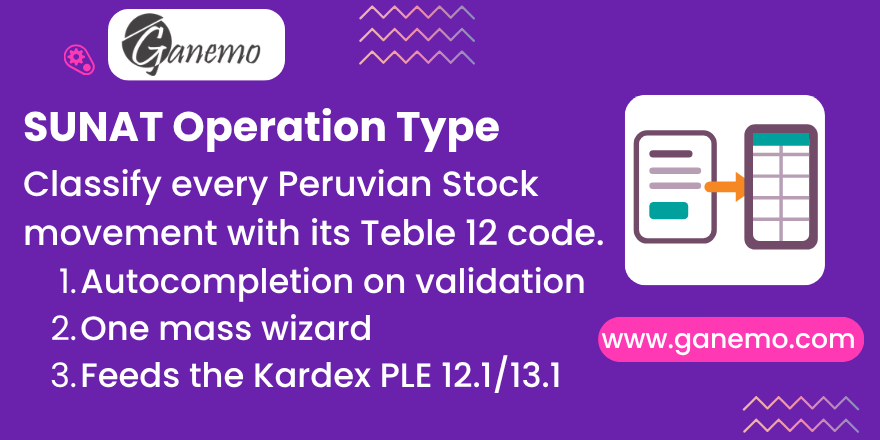

# **Peru SUNAT Operation Type per Stock Move**

Capture the **SUNAT "Tipo de Operación" (Table 12)** on **every stock movement**, so the Peruvian Kardex PLE (Formats 12.1 and 13.1) can classify each ledger line exactly as SUNAT expects — including movements that have no transfer behind them.

---

## What is SUNAT Table 12?

SUNAT Table 12 ("Tabla 12 — Tipo de Operación") is the official catalogue of inventory operation types that every line of the Peruvian electronic inventory books (Kardex PLE) must carry. It ranges over codes **1..38** (national sale, national purchase, consignment, returns, bonus, shrinkage, export, import, production entry/output, inventory adjustment, loans, custody, etc.) plus the generic **91..99 ("Others")**. Each Kardex line reports **which kind of operation** moved the stock, not just how much.

## The problem this module solves

Native `l10n_pe_reports_stock` stores the operation type on the **transfer (`stock.picking`)** — one single type per transfer. That has two limits:

1. **Wrong grain.** A Peruvian Kardex line is per **movement (`stock.move`)**, not per transfer. A transfer can carry several products/moves that legally belong to different operation types.
2. **Blind spots.** Many stock movements have **no picking at all** — inventory adjustments, scrap, and manufacturing (MRP) consumption/production. The picking-level field simply cannot classify them.

This module adds an **independent, stored** field on `stock.move`:

| Field | Purpose |
|---|---|
| `l10n_pe_operation_type` | The SUNAT Table 12 code for **this** movement (Selection, codes 1..38 / 91..99). |
| `l10n_pe_operation_type_manual` | Provenance flag: `True` once a human (or a deliberate mass assignment) sets the type by hand. |

It is **not** a related mirror of the picking — it is its own value, so it survives and can diverge from the transfer, and it can be set on picking-less moves.

> It feeds the **Peruvian Kardex PLE**: the separate bridge module `l10n_pe_reports_stock_transfer_document` reads this field with a soft guard — when a move has a value here, it **wins** over the picking-derived value; when left blank, the native behaviour stands.

---

## Autocompletion heuristic (smart default on validation)

When moves are validated (`_action_done`), the module infers a Table 12 code for each **empty, non-manual, Peruvian** move from native stock/sale/purchase/MRP signals only (never from the picking's SUNAT field). The inference order is:

| Signal detected on the move | Inferred code |
|---|---|
| Manufacturing (MRP) — incoming | **19** Production Entry |
| Manufacturing (MRP) — outgoing | **27** Output for Production Service |
| Scrap | **13** Shrinkage |
| Linked to a sale order line | **01** National Sale |
| Linked to a purchase order line | **02** National Purchase |
| Inventory adjustment (inventory location involved) | **28** Adjustment for Inventory Difference |
| Otherwise, by transfer direction — outgoing | **01** |
| Otherwise, by transfer direction — incoming | **02** |
| Otherwise, by transfer direction — internal | **21** Transfer Entry Between Warehouses |

The heuristic is only a **smart default**:
* It **never** overwrites a value that is already set (unless the wizard explicitly asks it to).
* It **never** clears a value when it cannot classify a move (anti-empty).
* It **skips** non-Peruvian companies entirely.

## Manual-edit protection (provenance gate)

Any time the operation type is changed by hand — directly on the form, or by the wizard's *fixed value* / *from the transfer* sources — the write path stamps `l10n_pe_operation_type_manual = True`. From then on, **automatic inference will not touch that move**. An accountant's deliberate classification is safe from being re-derived by a later validation or an *auto* mass run. Only the explicit *Overwrite everything* policy (below) can replace a manual value.

---

## The mass-assignment wizard

One wizard, **`Assign SUNAT Operation Type`**, combines a **SOURCE** with a **POLICY**, replacing a cluster of one-off actions. Launch it from the **Action menu** of either:

* a **Movements** list (`stock.move`), or
* a **Transfers** list (`stock.picking`) — it then targets every move of the selected transfers.

### The 3 sources (where the code comes from)

| Source | Behaviour |
|---|---|
| **Automatic (infer from the movement)** | Runs the heuristic above. Movements it cannot classify are skipped. |
| **From the transfer (picking)** | Copies the SUNAT operation type set on each move's picking. Movements whose transfer has no type are skipped. (Requires the PLE stock reports module for the picking field to exist.) |
| **A fixed value** | Stamps one Table 12 code — that you pick in the wizard — on every eligible movement. |

### The 3 policies (which movements are touched)

| Policy | Behaviour |
|---|---|
| **Only movements without a type** | Fills gaps only. Safest. |
| **Overwrite auto-filled (keep manual edits)** | Re-derives values, but **respects** anything set by hand. |
| **Overwrite everything (including manual edits)** | Also replaces manual classifications. |

> **Provenance note:** the *fixed value* and *from the transfer* sources are deliberate human choices, so applying them stamps the moves as **manual**. The *automatic* source writes as auto-provenance (so a later run can refine it).

### Dynamic banners and live preview

The wizard shows an **explanatory banner** that changes with the chosen source, and a **live preview** that counts, for the current source × policy:

* **Will be assigned** — movements eligible under the policy.
* **Already have a type** / **Manually set** — context counts.
* A one-line hint noting how many manual movements are respected, how many non-Peruvian movements are ignored, and which movements the source will skip.

Nothing is written until you press **Apply**. Large selections are processed in batches.

---

## Installation

1. Copy the module into your addons path.
2. Update the apps list and install **Peru SUNAT Operation Type**.
3. Dependencies: `l10n_pe`, `stock_account`. Country restricted to **Peru (pe)**.

## Where to see the field

The per-move field and its manual flag are shown on the stock move form under Developer mode (technical group). The everyday workflow is: validate transfers as usual (the heuristic fills the type), then use the **Assign SUNAT Operation Type** action for any bulk reclassification.

---

## Compatibility

* Odoo **19.0** — Enterprise / Odoo.SH / Ganemo Online.
* Peru localization only (`countries: ['pe']`).
* Multi-language: **English** and **Spanish** included.

---

**Author**: [Ganemo](https://www.ganemo.com)
