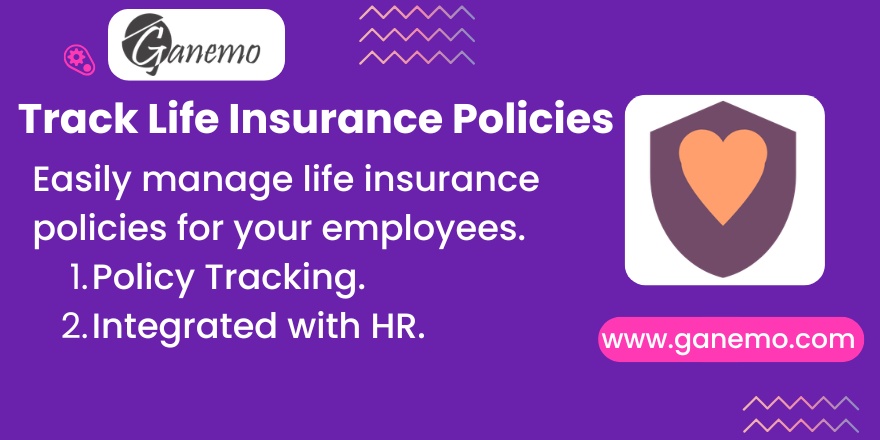

# Life insurance management

This module allows you to manage life insurance policies for your employees integrated with HR.

## Features
- Policy Tracking: Easily manage and track life insurance policies.
- Integrated with HR: Seamless integration with Odoo's employee database.

## Configuration
No specific configuration is required out of the box. Simply install the module and access the life insurance management from the HR menu.

## Usage
1. Go to the Employees app.
2. Open an employee record.
3. Navigate to the Life Insurance tab or related smart button to add policy details.

**Author**: [Ganemo](https://www.ganemo.com)
