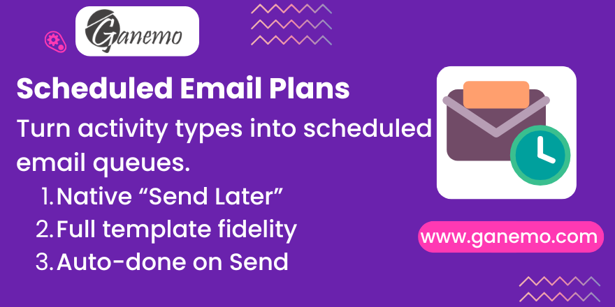

# **Activity Plans - Scheduled Email**

Turn an **Activity Type** into a *scheduled email* so an **Activity Plan** can
queue emails by date — the same way the chatter's **"Send Later"** does — with
the linked activity auto-completing when the email actually leaves.

Odoo 19 · depends on `mail` only.

**Author**: [Ganemo](https://www.ganemo.com)

## Why this module exists

Native Activity Plans schedule **activities** (to-dos). An Activity Type can
carry `mail_template_ids` natively, but those only produce the manual
*Preview / Send Now* buttons in the chatter — **nothing is ever sent by date**.
There is no native "plan of scheduled emails". This module adds exactly that,
without duplicating anything: it wires three native, documented Odoo extension
points together.

## How it works (and the exact Odoo references it leans on)

1. **Configuration — no new plan-line field.**
   We add one value to the native `category` selection of `mail.activity.type`:
   `send_mail`. The template to send is the type's existing `mail_template_ids`
   (constrained to exactly one). The *when* stays on the plan line
   (`delay_count/unit/from`, `mail/models/mail_activity_plan_template.py`); the
   only thing missing is a time-of-day, added as `send_mail_hour` on the type.

2. **Scheduling — hook `activity_schedule`.**
   The plan launcher (`mail/wizard/mail_activity_schedule.py::action_schedule_plan`)
   creates each line via `record.activity_schedule(...)`. We wrap that single
   stable seam: after the native activity is created, for a `send_mail` type we
   drive the **real mail composer** (`mail.compose.message`) and call its
   `_action_schedule_message()`. Driving the composer (instead of hand-building
   the message) is deliberate — the composer renders the template first, so the
   scheduled message is a faithful, already-rendered snapshot (subject, body,
   recipients, attachments, sender, layout), and stays correct if Odoo changes
   how templates render.

3. **Linking — `send_context`, for free.**
   `_action_schedule_message` stores `send_context = clean_context(self.env.context)`
   (`mail_compose_message.py` ~line 742). So a context key we pass to the composer
   is persisted on the `mail.scheduled.message` with no write-path override.
   `clean_context` only strips `default_*` keys, so our
   `plan_sent_activity_id` survives.

4. **Auto-done — hook `_message_created_hook`.**
   The native cron *"Mail: Post scheduled messages"* (`_post_messages_cron` →
   `_post_message`) posts the delayed message on the due date and then calls
   `mail.scheduled.message._message_created_hook(message)`. We override that
   named hook to read `plan_sent_activity_id` back from `send_context` and mark
   the activity done. **No custom cron.**

## Endless-loop protection (read before configuring a chained send)

Chaining a `send_mail` activity type to itself is a **legitimate** pattern — a
recurring follow-up. What is not legitimate is a chain that **does not advance
in time**. A production incident showed why: a `send_mail` type triggered
*itself* with `-2 days after the deadline`, so every chained activity was born
already overdue; the past instant got clamped to `now + 1 min`, the cron posted
it, the auto-done created the next link — also overdue — and the record got one
email per minute, endlessly. Native Odoo tolerates that configuration because a
human still has to mark each activity done; it is *our* automatic completion
that closes the circuit, so the module owns the guardrail. Two layers:

1. **At configuration time** (`mail_activity_type._check_send_mail_chain_advances`) —
   saving a "Trigger Next Activity" **loop** that contains a `send_mail` type and
   whose total delay is zero or negative raises a `ValidationError` naming the
   types involved. Loops without a `send_mail` type are left alone: they
   self-throttle on the human who marks each activity done.
2. **At runtime** (`mail_activity_mixin._schedule_activity_email`) — an activity
   **chained by an automatic send** whose send instant is already in the past is
   created but its email is **not** queued, and a `WARNING` is logged. That
   breaks the cycle (nothing to post → nothing auto-completes it → no next link)
   and leaves a visible open activity as the symptom. Loops assembled through
   paths that never write an activity type (an Automation Rule recreating the
   activity, for instance) are caught here.

The flag that tells a chained activity apart from a human one is
`plan_sent_from_autodone`, set on the `action_feedback` call of the auto-done
and carried into the chained `mail.activity.create` by the same `clean_context`
property the `plan_sent_activity_id` link relies on. A **first** link born
overdue (late plan launch, `before_plan_date` offset) is unaffected: it is
clamped and sent, exactly as before.

## Behaviour notes learned while building (read before "fixing" the tests)

- **"Done" == archived, not deleted.** For an activity whose record still
  exists, `mail/models/mail_activity.py::_action_done` posts a
  `mail.message_activity_done` message, stores the feedback, and **archives**
  the activity (`active=False`). It only *unlinks* activities whose related
  record was deleted. Tests therefore assert on `active`/`feedback`, not on
  `exists()`.
- **Past instants are clamped.** `mail.scheduled.message._check_scheduled_date`
  rejects a date in the past. `delay_from='before_plan_date'` or a late launch
  can produce one, so the computed instant is clamped to `now + 1 min`.
- **Manual completion does not cancel the send.** If a user completes/deletes
  the activity by hand before the send fires, the email still goes out (it was
  queued on purpose); the hook simply finds no activity to close.

## Tests

`tests/test_mail_activity_plan_scheduled_mail.py` — all green on real Odoo 19:
config constraints, the scheduling side-effect (future + linked +
template-rendered), the auto-done on post, a **full Activity Plan launch** via
the `mail.activity.schedule` wizard, activity chaining, a context that is not
JSON-serialisable (Automation Rules), the **endless-loop guardrails** (loop
rejected at config time, advancing loop still sending, chained-overdue send
skipped, late first send still sent), and a non-regression check that normal
activity types never queue an email.
