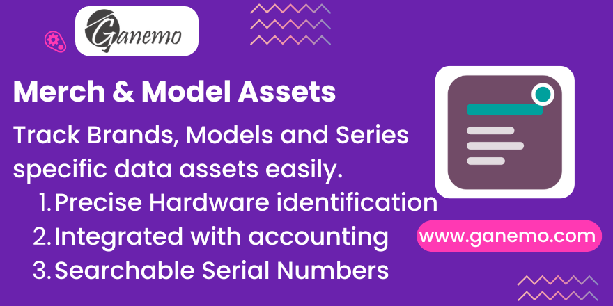

# Merch & Model Assets

**Detailed Hardware and Asset Identification for Odoo**

## Description

This module extends the **Assets** functionality in Odoo Accounting to allow for more precise identification of physical assets, particularly hardware and merchandise. 

It adds the following fields to the Asset form:
- **Brand (Marca)**: Identify the manufacturer (e.g., Dell, Apple, Toyota).
- **Model (Modelo)**: Identify the specific model (e.g., MacBook Pro M1, Corolla).
- **Series (Serie/Placa)**: Store unique identifiers such as Serial Numbers, Service Tags, or License Plates.

These fields are integrated directly into the `account.asset` views effectively, ensuring you don't lose track of *what* exactly the asset is, beyond just its financial value.

## Configuration

No special configuration is required. Just install the module and the fields will appear in the Asset form view.

## Usage

1. Go to **Accounting > Assets**.
2. Create or open an Asset.
3. Fill in the **Brand**, **Model**, and **Series** fields located below the Acquisition Date.
4. Use these fields to search for assets in the list view.

## Credits

**Author**: [Ganemo](https://www.ganemo.com)
**Maintainer**: Ganemo
