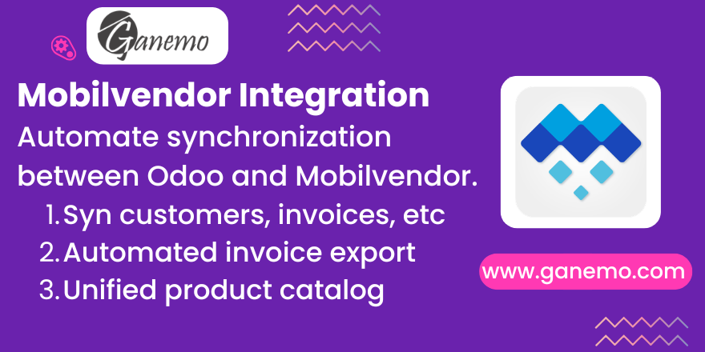

# Mobilvendor Integration

**Author**: [Ganemo](https://www.ganemo.co)

## Description

This module provides a robust, automated two-way synchronization between your Odoo ERP and the Mobilvendor external API. Mobilvendor integration allows you to sync your core operational data effortlessly, eliminating the need for manual dual-entry and ensuring your field sales and accounting teams are always acting on the same information.

## Key Features

- **Automated Customer Sync**: Pull and push customer records. Keep partner details, VAT numbers, and addresses synchronized in real time.
- **Product & Inventory Catalog**: Sync product templates, barcodes, weights, custom dimensions, and stock locations.
- **Pricelists Synchronization**: Ensure your pricing rules apply consistently across platforms to provide precise quotations.
- **Invoice Exporting**: Automatically export posted Odoo Customer Invoices to Mobilvendor.
- **Payment Tracking**: Send registered payments dynamically so your AR balances match in both systems.

## Configuration & Usage

### 1. Configure the API Credentials
- Navigate to **Settings > Users & Companies > Companies**.
- Choose your primary company and open the **Mobilvendor API** tab.
- Enter the provided **API Base URL**, **Route ID**, **Device ID**, **App Version**, and your secret **Token**.

### 2. Manual Synchronization (Wizards)
- Go to Sales or Contacts and look for the **Mobilvendor Sync** buttons.
- You can manually fetch newly created customers via the **Mobilvendor Sync Customer Wizard**.

### 3. Automated Synchronization (Crons)
- Background scheduled actions (crons) are automatically created upon installation.
- Navigate to **Settings > Technical > Scheduled Actions** to adjust the frequency of automated stock, customer, and product pushes according to your business needs limit.

### 4. Invoice Exporting
- Go to an open/posted Customer Invoice.
- If it hasn't been synced yet, click on the **Sync to Mobilvendor** action button in the document header.

## Support & Assistance

For any technical assistance, do not hesitate to contact our official support channels via [soporte@ganemo.com](mailto:soporte@ganemo.com).
