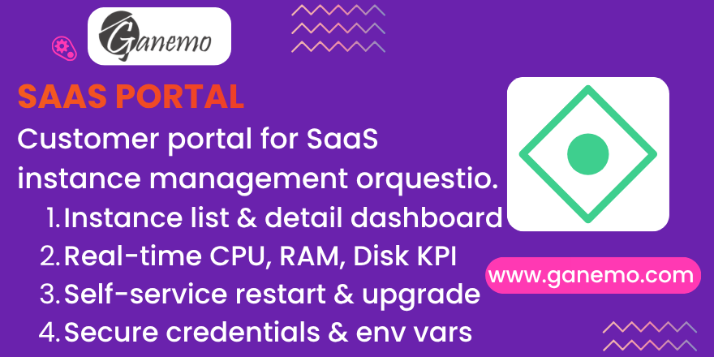

**Orquestio Portal**

## Overview

**Orquestio Portal** is an Odoo 19 module that provides a self-service customer portal for managing SaaS instances. It extends the standard Odoo portal (`/my`) so that authenticated customers can view, monitor, and control their SaaS instances without needing to contact support.

This module depends on **saas_orchestrator**, **portal**, and **website**.

## Features

- **Instance List** (`/my/instances`): Displays all active instances belonging to the logged-in customer, showing name, plan, status (with color-coded badges), and access URL.
- **Instance Detail** (`/my/instances/<id>`): Full dashboard for a single instance with:
  - Plan and status information
  - Direct "Connect" link to the instance URL
  - Real-time resource metrics: CPU, RAM, and Disk usage percentages
  - Last health check timestamp
- **Restart**: One-click restart button for running instances (with confirmation dialog).
- **Version Upgrade**: When a newer version is available, the portal shows an "Upgrade now" button. The customer can trigger the upgrade directly.
- **Credentials**: Instance password is hidden by default with a Show/Hide toggle for security.
- **Environment Variables**: Customers can add and delete environment variables within the limit defined by their plan. Values are masked in the table display.

## Security

- **Record Rules**: Portal users can only access instances and environment variables linked to their own tenant (partner). This is enforced at the database level via `ir.rule` records.
- **Access Rights**: Portal users have read-only access to instances, tenants, plans, blueprints, and task history. They have full CRUD access only to environment variables (on their own instances).
- **CSRF Protection**: All POST actions (restart, upgrade, add/delete env vars) include CSRF tokens.
- **Ownership Validation**: Every controller endpoint validates that the requested instance belongs to the current user before performing any action. Unauthorized access redirects to the instance list.

## Installation

1. Ensure the **saas_orchestrator** module is installed and configured.
2. Ensure the **Portal** and **Website** modules are active.
3. Install **orquestio_portal** from the Apps menu.
4. Grant portal access to your customers (via the partner form > Action > Grant Portal Access).
5. Link each customer's tenant record to their partner.

## Configuration

No additional configuration is required. Once installed, portal users with linked tenants will automatically see the "Instances" section in their portal home (`/my`).

### Plan Limits

The number of environment variables a customer can create is controlled by the `env_vars_included` field on the SaaS product plan. When the limit is reached, the portal displays an error message.

## Usage

### For Customers (Portal Users)

1. Log into the Odoo portal at `/my`.
2. Click **Instances** to see all your active SaaS instances.
3. Click an instance name to open its detail page.
4. From the detail page you can:
   - **Connect**: Opens the instance URL in a new tab.
   - **Restart**: Restarts a running instance (click the yellow button and confirm).
   - **Upgrade**: If a new version is available, click "Upgrade now" (the instance will be briefly unavailable for ~1 minute).
   - **View Credentials**: Click "Show" to reveal the instance password.
   - **Manage Environment Variables**: Add new variables (name + value) or delete existing ones.

### For Administrators

- Tenants must have their `partner_id` set correctly for portal visibility to work.
- Instance states: `running` (green badge), `stopped` (yellow badge), other (gray badge).
- Destroyed instances are excluded from the portal view.

## Dependencies

| Module | Purpose |
|---|---|
| `saas_orchestrator` | Core SaaS instance, tenant, plan, and blueprint models |
| `portal` | Odoo portal framework (CustomerPortal) |
| `website` | Website routing and rendering |

## Compatibility

- Odoo 19 (Enterprise, Odoo.SH, Ganemo Online)
- Not supported on Odoo Online (requires custom code)

## Languages

- English (default)
- Spanish (es)

**Author**: [Ganemo](https://www.ganemo.com)
