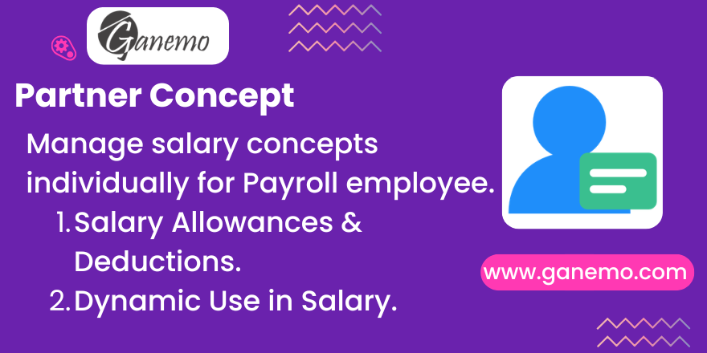

# Partner Concept
**Author**: [Ganemo](https://www.ganemo.com)

## Overview
This module expands the core HR Payroll capabilities by allowing you to manage salary concepts on an individual, per-employee basis. Sometimes, global salary rules are not enough when trying to assign unique allowances, specific custom bonuses, or unique deductions to a single employee. The Partner Concept module natively integrates inside the employee form to solve this.

## Key Features
* **Individualized Salary Concepts:** Easily assign and maintain completely independent salary concepts for specific employees directly from their HR profile.
* **Native Payroll Integration:** Readily accessible variables inside `hr_payroll` allow you to use these concepts dynamically in your Salary Rule computations.

## Installation & Configuration
1. Install the module `partner_concept`.
2. Go to **Payroll > Employees** and select the employee you wish to configure.
3. Access the **Partner Concepts** tab or fields to add specific concepts and their monetary value. 
(Note: Only users with sufficient Payroll Configuration/Manager access can establish these rules).

## Usage
1. Make sure you have assigned value(s) to the employee via the Partner Concepts section.
2. In your Salary Rules (`hr.salary.rule`), reference the specific concept.
3. Generate a Payslip. The specific amount defined for that employee will automatically correctly compute.

## FAQ
**Q: Where do I define the individual concepts?**  
A: Go directly to the employee's form in the Payroll application.

**Q: Why doesn't the concept appear on the generated payslip?**  
A: The individualized concept must be explicitly called within the Python code computation formula of the specific Salary Rule in your Salary Structure.
