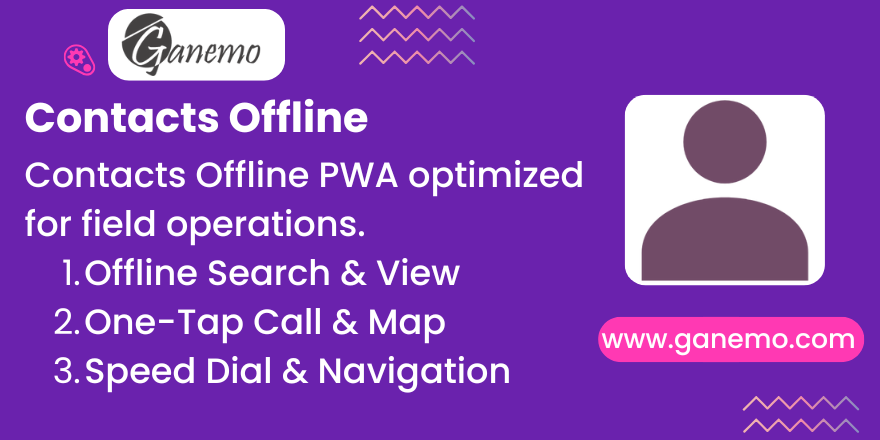

# **Partner Offline Portal**

The **Partner Offline Portal** module transforms the Odoo Portal into a powerful **Progressive Web App (PWA)**, designed specifically for field operations. It allows delivery drivers, sales representatives, and field technicians to access the full contact database (Partners) even without an active internet connection.

This module leverages modern web technologies like **IndexedDB** and **Service Workers** to cache contact data locally on the device, ensuring instant access to phone numbers, addresses, and maps.

---

## **Key Features**

-   **Offline Access**: Search and view contact details (Name, Phone, Address, Email) while completely offline or in airplane mode.
-   **Mobile-First Design**: A responsive interface optimized for smartphones and tablets.
-   **One-Tap Actions**:
    -   **Call**: Instantly dial the contact's number.
    -   **Navigate**: Open Google Maps, Waze, or Apple Maps with a single tap on the address.
-   **Instant Search**: Local caching means search results appear immediately, with no server latency.
-   **PWA Installable**: can be installed as a native-like app on Android and iOS devices.

---

## **Configuration**

1.  **Install the Module**:
    -   Go to **Apps**, search for `partner_offline`, and click **Install**.

2.  **Permissions**:
    -   The module uses standard Portal access rights. Ensure your field users have "Portal" access.
    -   To access specific contacts, normal Odoo record rules apply (users only see contacts they are allowed to see).

3.  **Initial Sync**:
    -   After installation, users must open the portal app **once while online**.
    -   The app will automatically download and cache the contact database in the background.
    -   A "Sync Complete" indicator (or similar visual feedback) confirms data is ready for offline use.

---

## **Usage Instructions**

### **1. Installing the App (PWA)**
-   **Android (Chrome)**: Open the portal, tap the menu (three dots), and select **"Add to Home Screen"** or **"Install App"**.
-   **iOS (Safari)**: Tap the **Share** button and select **"Add to Home Screen"**.

### **2. Using Offline**
-   Simply open the app from your home screen.
-   Use the search bar to find a customer.
-   Even if you have no signal, the customer's details will load from the local cache.

### **3. Actions**
-   **Call**: Tap the **Phone icon** next to a number to dial.
-   **Map**: Tap the **Address** or the **Map icon** to launch navigation.

---

## **FAQ & Troubleshooting**

**Q: Why don't I see any contacts when offline?**
A: You likely haven't completed the initial sync. Open the app while connected to Wi-Fi/Data and wait a few moments for the database to download.

**Q: Can I edit contacts offline?**
A: No, this version is **Read-Only** to ensure data integrity and prevent conflicts. You must be online to edit contact details via the standard Odoo backend or portal forms.

**Q: Does it work on iOS?**
A: Yes, it is fully compatible with iOS via Safari PWA installation.

---

**Author**: [Ganemo](https://www.ganemo.com)
