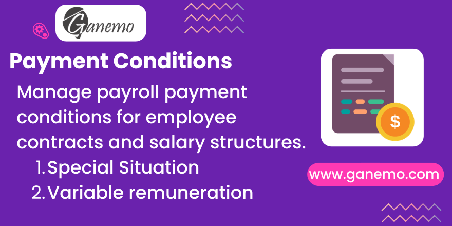

# **Payment Conditions**

## Overview

**Payment Conditions** is an Odoo 19 Enterprise module developed by [Ganemo](https://www.ganemo.com) that extends the Payroll module to manage payment conditions for employee contracts and salary structures. It introduces four master-data catalogs — **Payment Period**, **Payment Type**, **Special Situation**, and **Variable Payment** — and links them to employee contracts, salary structures, and the employee form itself.

This module is designed specifically for **Peruvian labor law compliance** but is compatible with any Odoo 19 Enterprise installation that uses `hr_payroll`.

---

## Features

- **Payment Period catalog** — Define the remuneration periodicity (e.g., Monthly, Biweekly, Weekly) with a code, abbreviation, and description. Linkable to salary structures and structure types.
- **Payment Type catalog** — Classify the modality of payment (e.g., Bank Transfer, Cash) per employee contract.
- **Special Situation catalog** — Track special employment situations (e.g., disability, maternity, micro-enterprise regime) required by labor regulations.
- **Variable Payment catalog** — Formalize the variable remuneration scheme for employees whose pay includes commissions or performance bonuses.
- All four catalogs include **Code**, **Description**, and **Abbreviation** fields.
- Fields are exposed on the **employee form** (HR Manager restricted) via related fields from the active contract version (`hr.version`).
- Fields are also editable on the **contract version form** directly.
- Salary structures and structure types can be linked to a **Payment Period**.

---

## Dependencies

- `l10n_pe_localization_menu`
- `hr_payroll`

Make sure both modules are installed before installing Payment Conditions.

---

## Installation

1. Copy the `payment_conditions` folder to your Odoo addons directory.
2. Restart the Odoo server.
3. Go to **Settings > Apps**, search for "Payment Conditions", and click **Install**.

---

## Configuration

### Step 1 — Set up catalogs

Navigate to **Payroll > Configuration** and create records for each catalog:

| Menu | Description |
|------|-------------|
| **Payment Periods** | Define periodicity codes (e.g., MEN = Monthly) |
| **Payment Types** | Define payment modalities (e.g., TRA = Bank Transfer) |
| **Special Situations** | Define special situation codes per regulation |
| **Variable Payments** | Define variable remuneration categories |

Each catalog record includes:
- **Code** — Short identifier used in reports.
- **Description** — Full descriptive name.
- **Abbreviation** — Display name shown in contract and employee forms.

### Step 2 — Assign to Employee Contracts

1. Open an employee record and go to their **Contract**.
2. In the contract version, set the **Payment Period**, **Payment Type**, **Special Situation**, and **Variable Remuneration** fields.
3. Save. The values will automatically be reflected on the employee form (visible to HR Managers).

### Step 3 — Assign to Salary Structures (Optional)

1. Go to **Payroll > Configuration > Salary Structures** or **Salary Structure Types**.
2. Set the **Payment Period** field to link the structure to a specific payment frequency.

---

## Access Control

Payment condition fields on the **employee form** are protected by the **HR / Manager** group. Only HR Managers can view and edit these fields. The underlying contract version fields are accessible through the normal contract workflow.

---

## Frequently Asked Questions

**Q: Fields not visible on the employee form?**  
A: You need to be logged in with the **HR Manager** role. These fields are hidden for other user groups for data security.

**Q: Change on employee form not reflected on contract?**  
A: The employee fields are related to the active `hr.version`. Ensure the employee has an active contract with a valid version record.

**Q: Is this compatible with Odoo Multi-company?**  
A: Yes. The payment condition catalogs are global master data and can be shared across companies.

**Q: Does this module work without the Peru localization?**  
A: The module depends on `l10n_pe_localization_menu`. If you don't use the Peru localization, contact Ganemo for a customized version.

---

## Support

| Channel | Contact |
|---------|---------|
| 💬 WhatsApp (Sales) | [+1 (828) 672-6150](https://wa.me/18286726150) |
| 📧 Sales Email | [leads@ganemo.com](mailto:leads@ganemo.com) |
| 🛠️ Technical Support | [ayuda@ganemo.com](mailto:ayuda@ganemo.com) |
| 📅 Book a Demo | [ganemo.co/appointment/5](https://www.ganemo.co/appointment/5) |

---

**Author**: [Ganemo](https://www.ganemo.com)  
**License**: OPL-1  
**Compatible with**: Odoo 19 Enterprise (Odoo.SH, Ganemo Online, Ganemo.SH)
