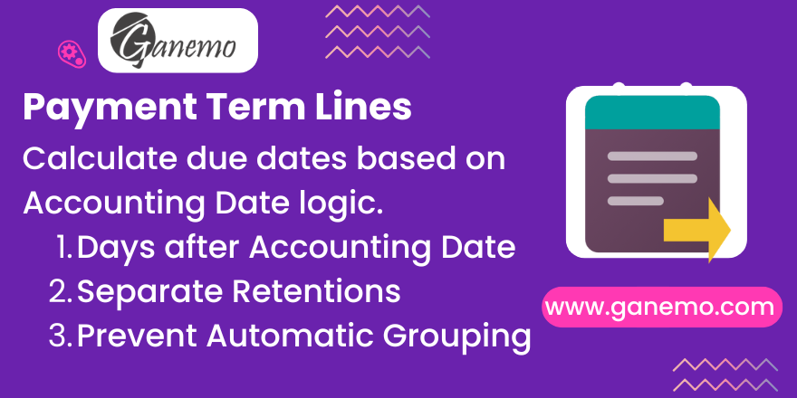

# Payment Term Lines

**Author**: [Ganemo](https://www.ganemo.com)

## Overview

Advanced Payment Terms for Odoo. This module empowers your accounting logic by allowing due date calculations based on the **Accounting Date** (instead of just the Invoice Date) and enabling the separation of **Detractions/Retentions** into distinct journal items.

## Key Features

*   **Accounting Date Logic**: Calculate payment due dates relative to the Accounting Date. Perfect for businesses where the fiscal booking date drives the payment schedule (e.g., "30 days after the end of the booking month").
*   **Detraction Separation**: Flag specific payment term lines as "Detractions" or "Retentions". Odoo will generate separate journal items for these lines, even if they have the same due date as the net payment, ensuring clear account reconciliation.
*   **Prevent Grouping**: Special handling to prevent Odoo from merging multiple lines into a single installment when they share a maturity date.

## Setup & User Manual

### 1. Prerequisites
*   User with **Accounting / Billing Administrator** access rights.
*   Odoo **Invoicing** or **Accounting** app installed.

### 2. Configuration
Follow these steps to configure your advanced payment terms:

1.  **Navigate**: Go to *Accounting > Configuration > Payment Terms*.
2.  **Create/Edit**: Open an existing term or create a new one (e.g., "60 Days after Accounting Date").
3.  **Line Configuration**: In the Terms tab, add a line.
    *   **Due Date Computation**: Select **"Days after accounting date"** in the *Days After* dropdown field.
    *   **Detractions**: If this line represents a tax withholding, check the box **"Is Detraction/Retention?"**.

**Note:** The "Days after accounting date" option appears automatically after installing this module.

## QA / User Testing Scenarios

### Scenario 1: Accounting Date Calculation
1.  Create an Invoice with **Invoice Date: Jan 15**.
2.  Set **Accounting Date: Feb 01**.
3.  Select Payment Term configured with "30 Days after Accounting Date".
4.  **Result:** Due Date SHOULD be **Mar 03** (Feb 01 + 30 days), NOT Feb 14 (Jan 15 + 30 days). The system respects the booking date.

### Scenario 2: Detraction Separation
1.  Configure a term with 2 lines: **90% Immediate** and **10% Immediate (Detraction)**.
2.  Create an Invoice for $1000.
3.  **Result:** Check the *Journal Items* tab. You SHOULD see TWO distinct journal items on the Payable account (one for $900, one for $100). They are NOT merged into a single $1000 line, allowing for separate reconciliation.

### Scenario 3: Credit Notes & Refunds
1.  Create a Credit Note for an invoice that used Accounting Date logic.
2.  Ensure the Credit Note also has an **Accounting Date** set.
3.  **Result:** The payment term logic applies equally to refunds, calculating the "Due Date" (maturity) of the refund based on its own Accounting Date, ensuring accurate aging reports.

## FAQ & Troubleshooting

**Q: Why didn't the due date update when I changed the Invoice Date?**
A: If the term is configured to use "Days after accounting date", it relies specifically on the *Accounting Date* field. Ensure that field is set before recomputing terms.

**Q: What if no Accounting Date is set?**
A: If the Accounting Date field is empty on the invoice, the logic falls back to the standard **Invoice Date** to prevent errors.

**Q: How to use Detractions?**
A: You need to identify which line is the detraction. In the Payment Term configuration, check the box **"Is Detraction/Retention?"** for the specific line.

**Q: Does it work with Multi-Currency?**
A: Yes. The logic is strictly date-based. Amount calculations in foreign currencies are handled by standard Odoo logic; only the date and grouping behavior are modified by this module.

## Support
For commercial inquiries or technical support, please contact us:

*   **Email**: [leads@ganemo.com](mailto:leads@ganemo.com)
*   **WhatsApp**: [+1 (828) 672-6150](https://wa.me/18286726150)
*   **Website**: [ganemo.co](https://www.ganemo.com)
